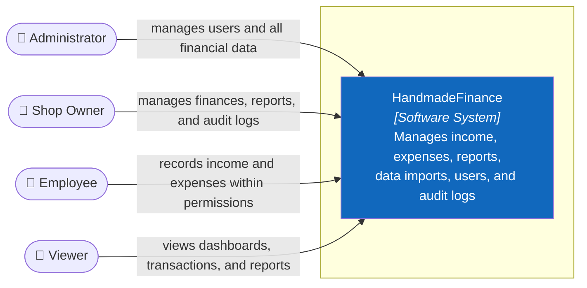
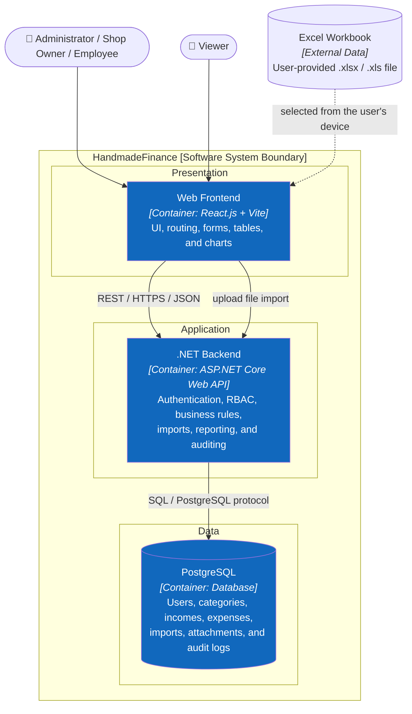
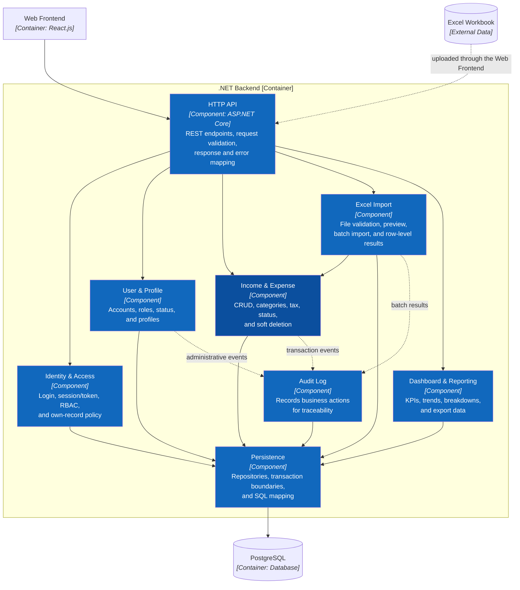

# HandmadeFinance

Income and expense management web app for a handmade shop: record money in, money out, track total revenue, total expenses, and net profit over time and by category. Amounts are stored in USD; the interface can convert them to EUR for display.

The target stack is a **React.js** frontend (**HandmadeFinance**), a **.NET (C#)** backend, and **PostgreSQL** for data storage. The mock version in this repository still runs entirely in the browser (API integration is not implemented yet).


## Main features

- Login, logout, and role-based access control in the UI
- Dashboard: total revenue, total expenses, net profit, transaction count, charts, revenue by income category, and recent transactions
- Income management: full-column list (show/hide columns), add/edit modal, detail modal; product name, order code, EU region, sales channel, quantity, unit price, Item / Discount / Subtotal / Shipping / Tax, pre-tax amount / tax rate / post-tax amount, and record status
- Expense management: same workflow; payee, domestic/international scope, payment method, tax rate, and post-tax amount
- Reports & analytics: overview, by day, by month, by income category, by expense category, report export (print)
- Excel data import: file selection, preview, and import history in the UI
- Activity log
- User management (Admin): add/edit, enable/disable, avatar
- Profile: account (phone number, avatar), security, roles & permissions

## Roles

There are four roles. Menus and buttons are shown only when the user has permission.

| | Admin | Shop Owner | Employee | Viewer |
|---|---|---|---|---|
| Dashboard | Yes | Yes | Yes | Yes |
| View income / expenses | Yes | Yes | Yes | Yes |
| Add income / expenses | Yes | Yes | Yes | |
| Edit income / expenses | Yes | Yes | Own records | |
| Soft-delete income / expenses | Yes | Yes | | |
| Import Excel data | Yes | Yes | Yes | |
| Reports | Yes | Yes | | Yes |
| Activity log | Yes | Yes | | |
| Users | Yes | | | |
| Personal profile | Yes | Yes | Yes | Yes |

Demo accounts (password `123456`):

- `admin@demo.local` — Administrator
- `owner@demo.local` — Shop Owner
- `staff@demo.local` — Employee
- `viewer@demo.local` — Viewer

## Mind map


## C4 Architecture

The three C4 levels below describe the system context, containers, and main components of the .NET backend. See the complete documentation and C4 Level 4 diagrams in [docs/architecture/c4](docs/architecture/c4/README.md).

### C1 — System Context



### C2 — Container



### C3 — Component (.NET Backend)



## Interface

After login (sidebar + top bar):

- Dashboard
- Income Management
- Expense Management
- Reports & Analytics
- Excel Data Import
- Activity Log
- User Management
- Personal Profile

Screenshots by role:

- [admin](docs/images/admin/)
- [shop-owner](docs/images/chu-shop/)
- [employee](docs/images/nhan-vien/)
- [viewer](docs/images/nguoi-xem/)

Viewer — income list (no add / edit / delete buttons):


Employee — no Reports, Activity Log, or Users menu items:


## Data

The PostgreSQL design (`database/shop_finance.sql`, `database/shop_finance.dbml`) includes:

- users (phone number, avatar, status)
- income categories and income records (sales channel, record status, pre/post-tax amounts)
- expense categories and expense records (payment method, status)
- attachments
- import batches
- audit logs

The UI data comes from `app/src/lib/data.js` (including sample Etsy order `4154185113`). There is one USD dataset; the currency toolbar displays either USD or EUR using a mock exchange rate.

## Repository structure

```text
finance-manager/
  README.md
  app/               React.js mock (Vite)
  docs/              product documentation
  docs/images/       UI screenshots by role
  database/          shop_finance.sql, shop_finance.dbml
  scripts/           serve.sh, serve.bat
```

## Documentation

- [Scope](docs/01-scope.md)
- [Features](docs/02-features.md)
- [Use cases](docs/03-use-cases.md)
- [Use Case Diagram](docs/03-use-cases.md#use-case-diagram)
- [Information architecture](docs/04-information-architecture.md)
- [Data model](docs/05-data-model.md)
- [ER diagram](docs/DATABASE.md)
- [Acceptance criteria](docs/06-acceptance-criteria.md)
- [Mind map](docs/mindmap.png)
- [C4 architecture (C1 → C2 → C3 → C4)](docs/architecture/c4/README.md)
- [arc42 architecture handbook](docs/architecture/arc42/README.md)
