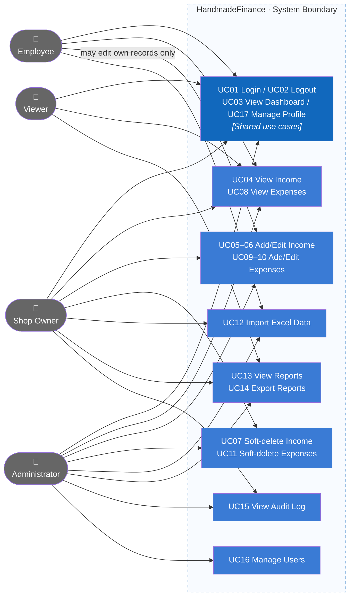
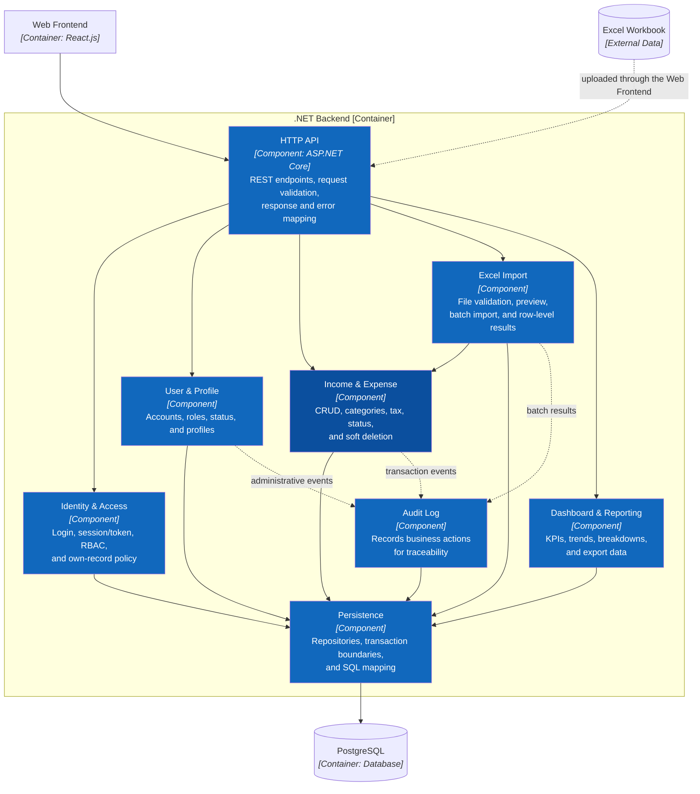

# HandmadeFinance

Ứng dụng quản lý thu–chi cho cửa hàng đồ thủ công. Stack mục tiêu gồm **React.js**, **ASP.NET Core/C#** và **PostgreSQL**. Repository hiện có UI mock và thiết kế database/kiến trúc; backend cùng OpenAPI 3.0 chưa được triển khai.

## Giao diện

### Tổng quan


### Khoản thu


### Khoản chi


## Mind map


## Use Case Diagram



Chi tiết actor, quyền và luồng nghiệp vụ: [Actors, roles và use cases](docs/03-use-cases.md).

## C4 Architecture

README chỉ trình bày C1–C3. C4 Level 4 và UML chi tiết được giữ trong thư mục tài liệu kiến trúc.

### C1 — System Context


### C2 — Container


### C3 — Component



Tài liệu đầy đủ: [C4 Architecture](docs/architecture/c4/README.md) và [arc42 Architecture Handbook](docs/architecture/arc42/README.md).

## Phân quyền

| Chức năng | Admin | Shop Owner | Employee | Viewer |
|---|---:|---:|---:|---:|
| Xem dashboard và thu/chi | Có | Có | Có | Có |
| Tạo khoản thu/chi | Có | Có | Có | Không |
| Sửa khoản thu/chi | Có | Có | Bản ghi của mình | Không |
| Xóa mềm khoản thu/chi | Có | Có | Không | Không |
| Import Excel | Có | Có | Có | Không |
| Báo cáo | Có | Có | Không | Có |
| Nhật ký hoạt động | Có | Có | Không | Không |
| Quản lý người dùng | Có | Không | Không | Không |

Backend phải kiểm tra RBAC và own-record policy; việc ẩn nút ở frontend chỉ phục vụ UI/UX.

## Tài liệu

- Requirements: [Scope](docs/01-scope.md), [Features](docs/02-features.md), [Acceptance criteria](docs/06-acceptance-criteria.md).
- UI/UX: [Information architecture](docs/04-information-architecture.md).
- Database: [Data model](docs/05-data-model.md), [ER diagram](docs/DATABASE.md), [PostgreSQL schema](database/shop_finance.sql).
- Folder structure: [React và backend three-tier](docs/07-folder-structure.md).
- Code-level design: [Class diagrams](docs/architecture/uml/01-class-diagrams.md), [Sequence diagrams](docs/architecture/uml/02-sequence-diagrams.md).
- API contract: OpenAPI 3.0/Swagger **chưa có**; các endpoint hiện tại chỉ là provisional contract.

## Chạy UI mock

```bash
cd app
npm install
npm run dev
```

Tài khoản demo dùng mật khẩu `123456`: `admin@demo.local`, `owner@demo.local`, `staff@demo.local`, `viewer@demo.local`.
