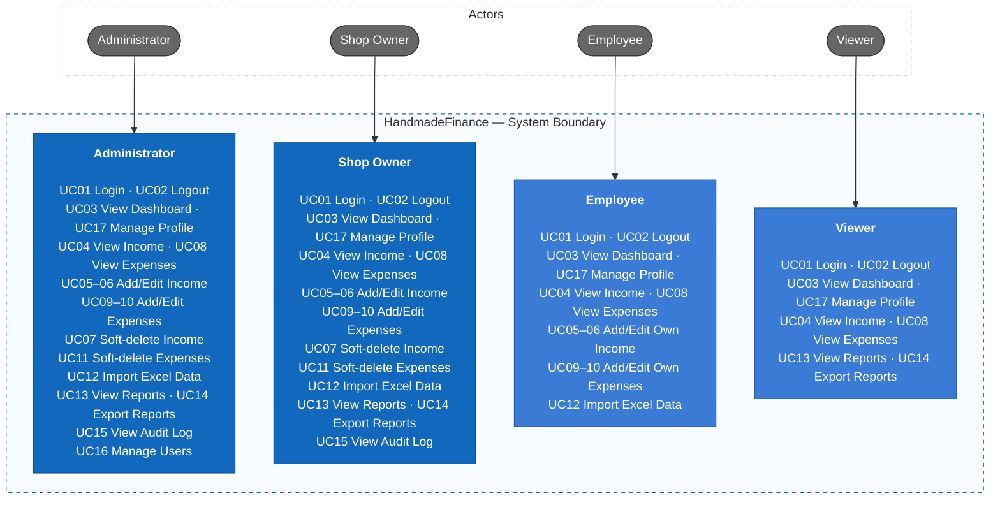
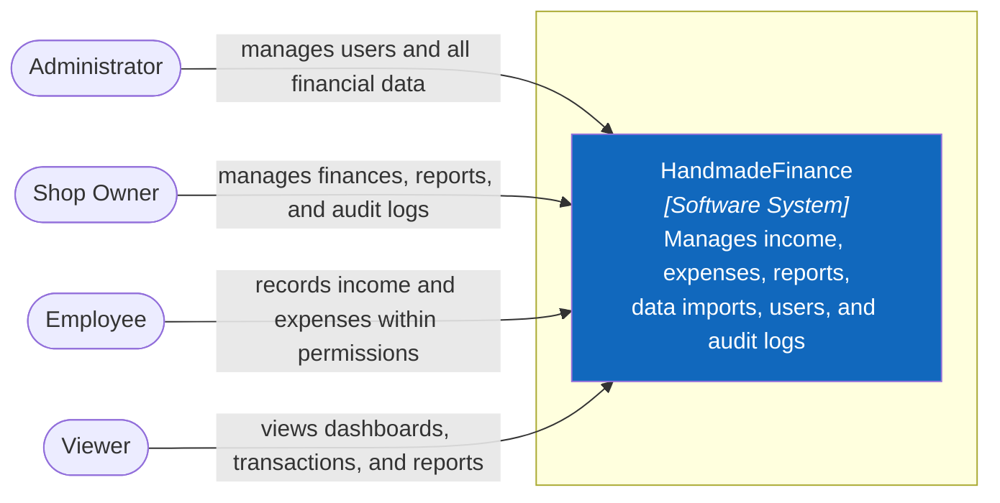
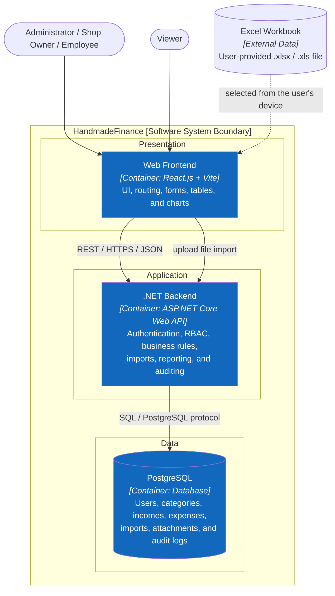
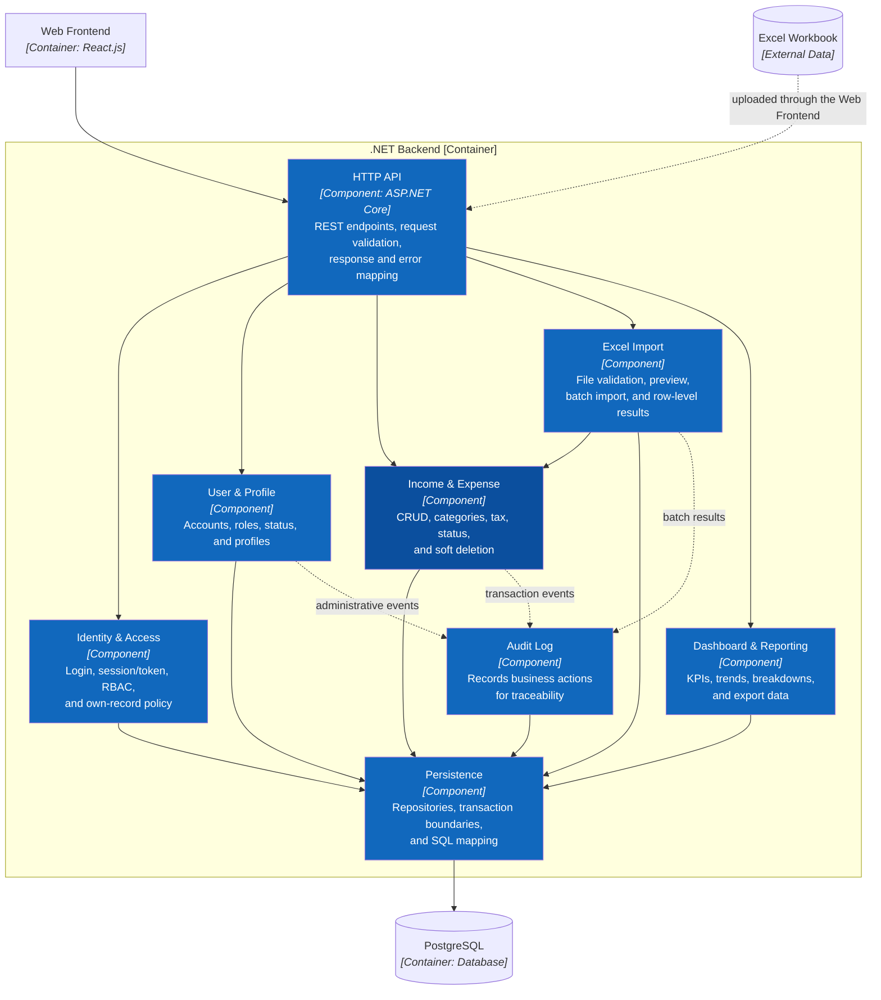
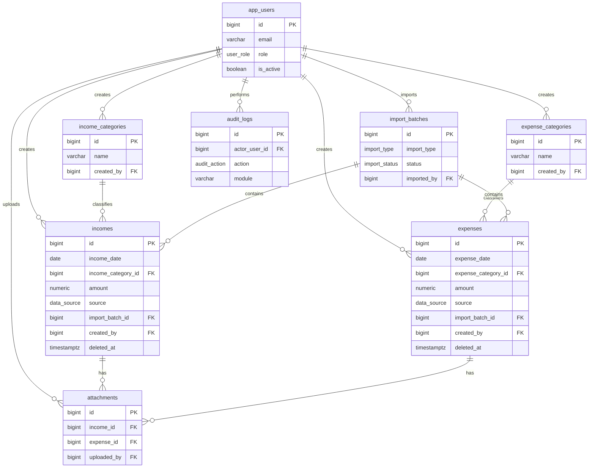
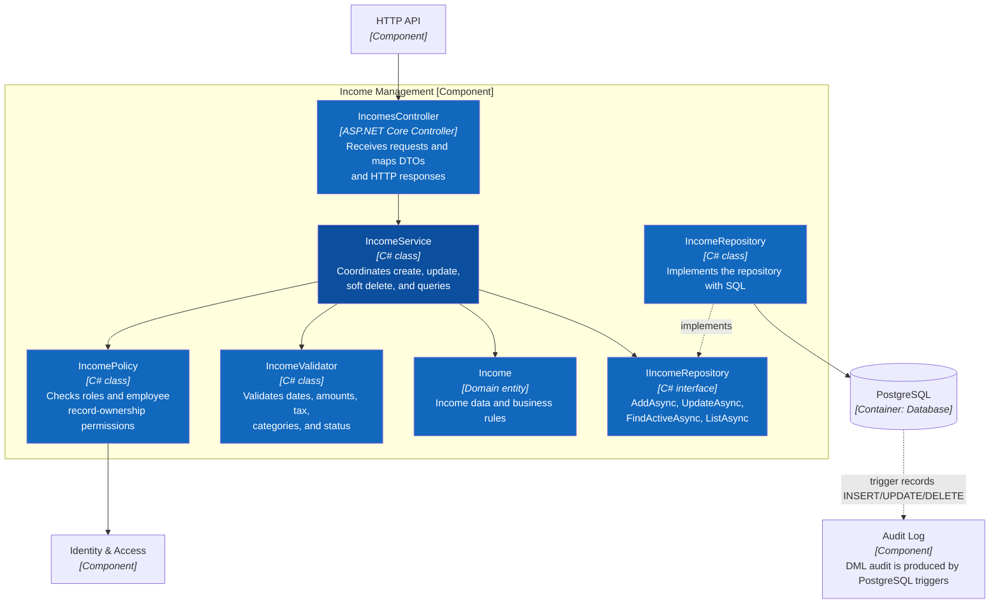
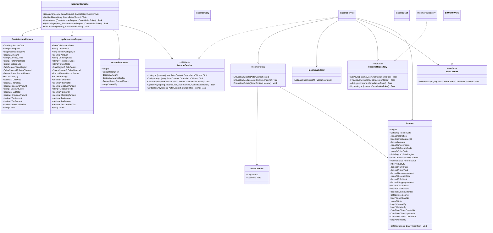

# HandmadeFinance

HandmadeFinance helps handmade shop owners manage income and expenses in one place, understand cash flow, and make better day-to-day financial decisions. It brings together transaction tracking, dashboards, reports, Excel imports, activity history, and role-based access for the whole team.

## Source layout

```text
finance-manager/
├── src/
│   ├── frontend/                     # React 19 + Vite prototype
│   │   ├── src/
│   │   │   ├── components/           # Login and authenticated application shell
│   │   │   ├── pages/                # Dashboard, ledger, reports, import, audit, users, profile
│   │   │   └── lib/                  # Mock data, browser state, permissions, formatting, UI helpers
│   │   ├── public/                   # Static assets and sample Excel workbooks
│   │   └── package.json              # Frontend scripts and dependencies
│   ├── backend/                      # Target ASP.NET Core three-tier scaffold
│   │   ├── src/
│   │   │   ├── HandmadeFinance.Api/  # Planned presentation/API layer
│   │   │   ├── HandmadeFinance.Application/
│   │   │   └── HandmadeFinance.Infrastructure/
│   │   └── tests/                    # Planned application, API, and infrastructure tests
│   └── database/
│       ├── shop_finance.sql          # PostgreSQL target schema, constraints, views, triggers, seeds
│       └── shop_finance.dbml         # Database relationship model
├── docs/
│   ├── api/                          # OpenAPI contract and API usage documentation
│   ├── architecture/                 # C4, arc42, class diagrams, and sequence diagrams
│   ├── requirements/                 # Business rules and non-functional requirements
│   ├── traceability/                 # Cross-step master traceability matrix
│   ├── images/                       # Role-based UI screenshots
│   └── 01-scope.md … 09-step-7-readiness.md
└── README.md
```

The frontend is currently an intentional mock-data prototype for interface development and demonstration. The backend directories are design scaffolds only—no ASP.NET Core application has been implemented yet. The PostgreSQL and OpenAPI files define target contracts and are not connected to the current frontend runtime.

## User Interface

### Overview


### Income


### Expenses


## Mind map


## Use Case Diagram




For detailed actors, permissions, and business flows, see [Actors, roles, and use cases](docs/03-use-cases.md).

## C4 Architecture

This README presents only C1–C3. C4 Level 4 and detailed UML are maintained in the architecture documentation directory.

### C1 — System Context




### C2 — Container




### C3 — Component




Complete documentation: [C4 Architecture](docs/architecture/c4/README.md) and [arc42 Architecture Handbook](docs/architecture/arc42/README.md).

## Data Architecture

The target PostgreSQL model keeps users, financial transactions, imports, attachments, and audit events connected while preserving separate income and expense categories.



See the [detailed database diagram](docs/DATABASE.md), [data model](docs/05-data-model.md), and [PostgreSQL schema](src/database/shop_finance.sql).

### C4 Level 4 — Code

#### L4.1 Income Management



#### L4.2 Expense Management


Source: [C4 Level 4 — Code](docs/architecture/c4/04-code.md)

### Core Class Diagrams

#### 1. Authentication

```mermaid
classDiagram
    direction TB

    class AuthController {
        +LoginAsync(LoginRequest, CancellationToken) Task
        +LogoutAsync(CancellationToken) Task
    }

    class LoginRequest {
        +string Email
        +string Password
    }

    class LoginResponse {
        +string AccessToken
        +string TokenType
        +DateTimeOffset ExpiresAt
        +UserResponse User
    }

    class UserResponse {
        +long Id
        +string Username
        +string FullName
        +string? Email
        +string? Phone
        +string? AvatarUrl
        +string Timezone
        +UserRole Role
        +bool IsActive
        +DateTimeOffset? LastLoginAt
        +DateTimeOffset CreatedAt
        +DateTimeOffset UpdatedAt
    }

    class IAuthService {
        <<interface>>
        +LoginAsync(string, string, CancellationToken) Task
        +LogoutAsync(ActorContext, CancellationToken) Task
    }

    class AuthService {
        +LoginAsync(string, string, CancellationToken) Task
        +LogoutAsync(ActorContext, CancellationToken) Task
    }

    class AuthResult {
        +string AccessToken
        +DateTimeOffset ExpiresAt
        +AppUser User
    }

    class AppUser {
        +long Id
        +string Username
        +string? Email
        +string PasswordHash
        +string FullName
        +UserRole Role
        +bool IsActive
        +DateTimeOffset? LastLoginAt
        +DateTimeOffset? DeletedAt
    }

    class IUserRepository {
        <<interface>>
        +FindActiveByEmailAsync(string, CancellationToken) Task
        +UpdateLastLoginAsync(long, DateTimeOffset, CancellationToken) Task
    }

    class IPasswordHasher {
        <<interface>>
        +Verify(string, string) bool
    }

    class ITokenIssuer {
        <<interface>>
        +Issue(AppUser) TokenResult
    }

    class IAuditLogRepository {
        <<interface>>
        +AddAsync(AuditEntry, CancellationToken) Task
    }

    class IUnitOfWork {
        <<interface>>
        +ExecuteAsync(long actorUserId, Func, CancellationToken) Task
    }

    class UserRepository {
        +FindActiveByEmailAsync(string, CancellationToken) Task
        +UpdateLastLoginAsync(long, DateTimeOffset, CancellationToken) Task
    }

    class PasswordHasher
    class JwtTokenIssuer
    class AuditLogRepository
    class EfUnitOfWork

    AuthController --> LoginRequest
    AuthController --> LoginResponse
    AuthController --> IAuthService
    AuthService ..|> IAuthService
    AuthService --> IUserRepository
    AuthService --> IPasswordHasher
    AuthService --> ITokenIssuer
    AuthService --> IAuditLogRepository
    AuthService --> IUnitOfWork
    AuthService --> AuthResult
    AuthResult --> AppUser
    UserRepository ..|> IUserRepository
    PasswordHasher ..|> IPasswordHasher
    JwtTokenIssuer ..|> ITokenIssuer
    AuditLogRepository ..|> IAuditLogRepository
    EfUnitOfWork ..|> IUnitOfWork
```



#### 2. Income



#### 3. Expense

```mermaid
classDiagram
    direction TB

    class ExpensesController {
        +ListAsync(ExpenseQueryRequest, CancellationToken) Task
        +GetByIdAsync(long, CancellationToken) Task
        +CreateAsync(CreateExpenseRequest, CancellationToken) Task
        +UpdateAsync(long, UpdateExpenseRequest, CancellationToken) Task
        +SoftDeleteAsync(long, CancellationToken) Task
    }

    class CreateExpenseRequest {
        +DateOnly ExpenseDate
        +string Description
        +long ExpenseCategoryId
        +decimal Amount
        +string CurrencyCode
        +string? Payee
        +OriginScope OriginScope
        +PaymentMethod? PaymentMethod
        +RecordStatus RecordStatus
        +decimal TaxPercent
        +decimal AmountAfterTax
        +string? Note
    }

    class UpdateExpenseRequest {
        +DateOnly ExpenseDate
        +string Description
        +long ExpenseCategoryId
        +decimal Amount
        +string CurrencyCode
        +string? Payee
        +OriginScope OriginScope
        +PaymentMethod? PaymentMethod
        +RecordStatus RecordStatus
        +decimal TaxPercent
        +decimal AmountAfterTax
        +string? Note
    }

    class ExpenseResponse {
        +long Id
        +string Description
        +decimal Amount
        +decimal AmountAfterTax
        +RecordStatus RecordStatus
        +long CreatedBy
    }

    class ExpenseQuery

    class IExpenseService {
        <<interface>>
        +ListAsync(ExpenseQuery, ActorContext, CancellationToken) Task
        +GetByIdAsync(long, ActorContext, CancellationToken) Task
        +CreateAsync(ExpenseDraft, ActorContext, CancellationToken) Task
        +UpdateAsync(long, ExpenseDraft, ActorContext, CancellationToken) Task
        +SoftDeleteAsync(long, ActorContext, CancellationToken) Task
    }

    class ExpenseService

    class ExpensePolicy {
        +EnsureCanCreate(ActorContext) void
        +EnsureCanUpdate(ActorContext, Expense) void
        +EnsureCanDelete(ActorContext, Expense) void
    }

    class ExpenseValidator {
        +Validate(ExpenseDraft) ValidationResult
    }

    class Expense {
        +long Id
        +DateOnly ExpenseDate
        +string Description
        +long ExpenseCategoryId
        +decimal Amount
        +string CurrencyCode
        +string? Payee
        +OriginScope OriginScope
        +PaymentMethod? PaymentMethod
        +RecordStatus RecordStatus
        +decimal TaxPercent
        +decimal AmountAfterTax
        +DataSource Source
        +long? ImportBatchId
        +string? Note
        +long? CreatedBy
        +long? UpdatedBy
        +DateTimeOffset CreatedAt
        +DateTimeOffset UpdatedAt
        +DateTimeOffset? DeletedAt
        +long? DeletedBy
        +SoftDelete(long, DateTimeOffset) void
    }

    class ExpenseDraft

    class ActorContext {
        +long UserId
        +UserRole Role
    }

    class IExpenseRepository {
        <<interface>>
        +ListAsync(ExpenseQuery, CancellationToken) Task
        +FindActiveAsync(long, CancellationToken) Task
        +AddAsync(Expense, CancellationToken) Task
        +UpdateAsync(Expense, CancellationToken) Task
    }

    class ExpenseRepository
    class EfUnitOfWork

    class IUnitOfWork {
        <<interface>>
        +ExecuteAsync(long actorUserId, Func, CancellationToken) Task
    }

    ExpensesController --> CreateExpenseRequest
    ExpensesController --> UpdateExpenseRequest
    ExpensesController --> ExpenseResponse
    ExpensesController --> IExpenseService
    ExpenseService ..|> IExpenseService
    ExpenseService --> ExpensePolicy
    ExpenseService --> ExpenseValidator
    ExpenseService --> IExpenseRepository
    ExpenseService --> IUnitOfWork
    ExpenseService --> Expense
    ExpensePolicy --> ActorContext
    ExpensePolicy --> Expense
    ExpenseRepository ..|> IExpenseRepository
    EfUnitOfWork ..|> IUnitOfWork
```



Source: [Core Class Diagrams](docs/architecture/uml/01-class-diagrams.md)

## Permissions


| Capability | Admin | Shop Owner | Employee | Viewer |
| ------------------------ | ----- | ---------- | ---------------- | ------ |
| View dashboard and transactions | Yes | Yes | Yes | Yes |
| Create income/expenses | Yes | Yes | Yes | No |
| Edit income/expenses | Yes | Yes | Own records only | No |
| Soft-delete income/expenses | Yes | Yes | No | No |
| Import Excel | Yes | Yes | Yes | No |
| Reports | Yes | Yes | No | Yes |
| Activity log | Yes | Yes | No | No |
| User management | Yes | No | No | No |


The backend must enforce RBAC and the own-record policy; hiding frontend controls serves UI/UX only.

## Documentation

- Requirements: [Scope](docs/01-scope.md), [Features](docs/02-features.md), [INVEST backlog](docs/08-invest-requirements.md), [Acceptance criteria](docs/06-acceptance-criteria.md).
- Requirements catalogs: [Business rules](docs/requirements/business-rules.md) and [Non-functional requirements](docs/requirements/non-functional-requirements.md).
- UI/UX: [Information architecture](docs/04-information-architecture.md).
- Database: [Data model](docs/05-data-model.md), [ER diagram](docs/DATABASE.md), [PostgreSQL schema](src/database/shop_finance.sql).
- Folder structure: [React and three-tier backend](docs/07-folder-structure.md).
- Code-level design: [Core class diagrams](docs/architecture/uml/01-class-diagrams.md), [remaining module classes](docs/architecture/uml/03-additional-class-diagrams.md), [core sequences](docs/architecture/uml/02-sequence-diagrams.md), and [API traceability/sequences](docs/architecture/uml/03-api-traceability.md).
- API contract: [OpenAPI 3.0.4 specification](docs/api/openapi.yaml) and [API documentation](docs/api/README.md).
- Cross-step coverage: [Master traceability matrix](docs/traceability/master-traceability.md).
- Implementation handoff: [Step 7 readiness and test plan](docs/09-step-7-readiness.md).
