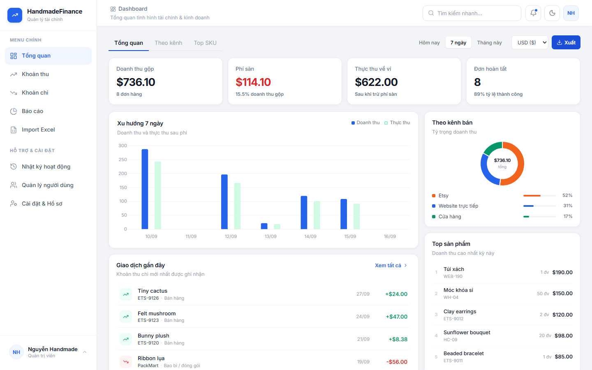
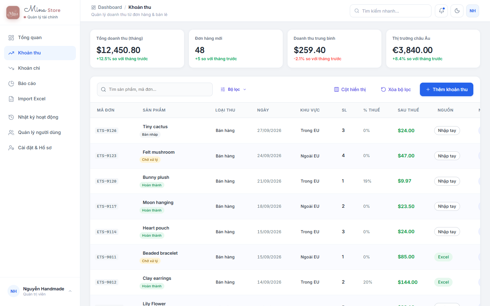
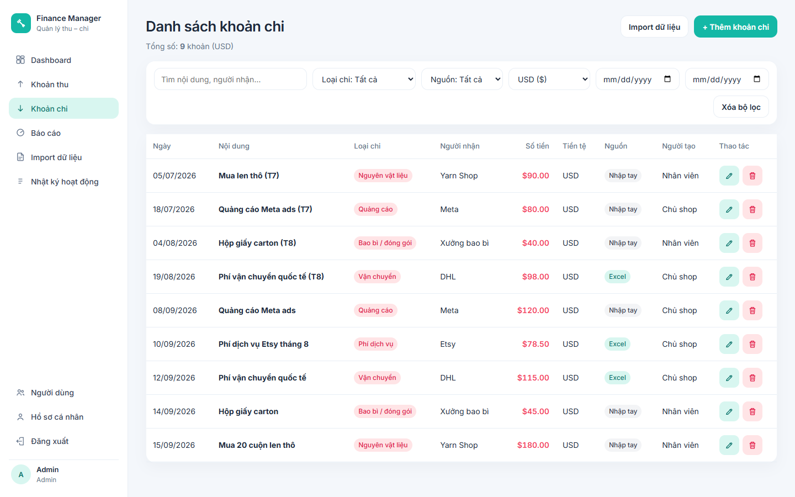
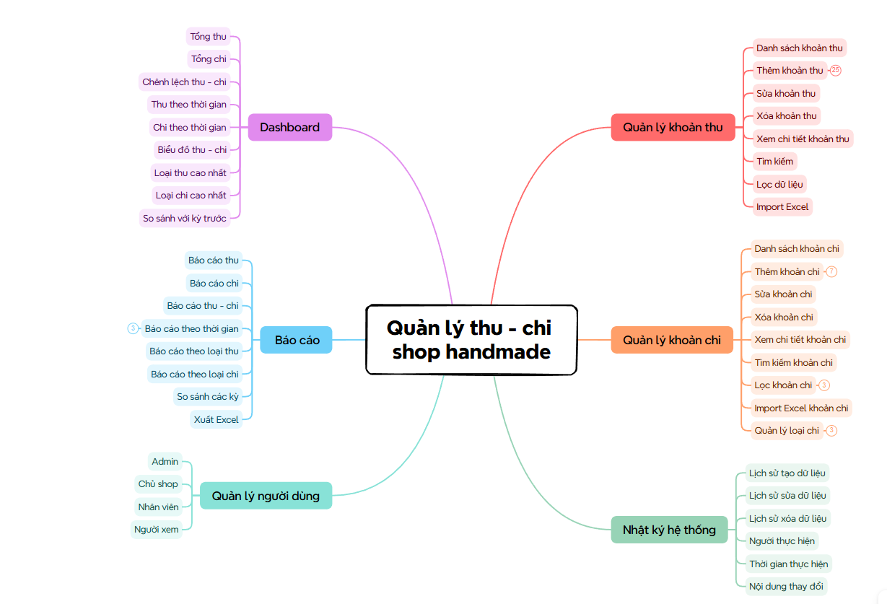
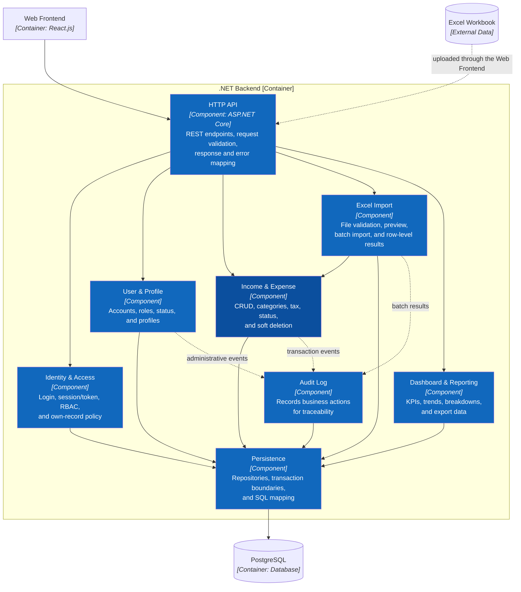

# HandmadeFinance

HandmadeFinance helps handmade shop owners manage income and expenses in one place, understand cash flow, and make better day-to-day financial decisions. It brings together transaction tracking, dashboards, reports, Excel imports, activity history, and role-based access for the whole team.

## User Interface

### Overview

### Income

### Expenses

## Mind map

## Use Case Diagram

For detailed actors, permissions, and business flows, see [Actors, roles, and use cases](docs/03-use-cases.md).

## C4 Architecture

This README presents only C1–C3. C4 Level 4 and detailed UML are maintained in the architecture documentation directory.

### C1 — System Context

### C2 — Container

### C3 — Component

Complete documentation: [C4 Architecture](docs/architecture/c4/README.md) and [arc42 Architecture Handbook](docs/architecture/arc42/README.md).

## Permissions

| Capability | Admin | Shop Owner | Employee | Viewer |
| ------------------------ | ----- | ---------- | ---------------- | ------ |
| View dashboard and transactions | Yes | Yes | Yes | Yes |
| Create income/expenses | Yes | Yes | Yes | No |
| Edit income/expenses | Yes | Yes | Own records only | No |
| Soft-delete income/expenses | Yes | Yes | No | No |
| Import Excel | Yes | Yes | Yes | No |
| Reports | Yes | Yes | No | Yes |
| Activity log | Yes | Yes | No | No |
| User management | Yes | No | No | No |

The backend must enforce RBAC and the own-record policy; hiding frontend controls serves UI/UX only.

## Documentation

- Requirements: [Scope](docs/01-scope.md), [Features](docs/02-features.md), [INVEST backlog](docs/08-invest-requirements.md), [Acceptance criteria](docs/06-acceptance-criteria.md).
- UI/UX: [Information architecture](docs/04-information-architecture.md).
- Database: [Data model](docs/05-data-model.md), [ER diagram](docs/DATABASE.md), [PostgreSQL schema](database/shop_finance.sql).
- Folder structure: [React and three-tier backend](docs/07-folder-structure.md).
- Code-level design: [Core class diagrams](docs/architecture/uml/01-class-diagrams.md), [remaining module classes](docs/architecture/uml/03-additional-class-diagrams.md), [core sequences](docs/architecture/uml/02-sequence-diagrams.md), and [API traceability/sequences](docs/architecture/uml/03-api-traceability.md).
- API contract: [OpenAPI 3.0.4 specification](docs/api/openapi.yaml) and [API documentation](docs/api/README.md).
- Implementation handoff: [Step 7 readiness and test plan](docs/09-step-7-readiness.md).
