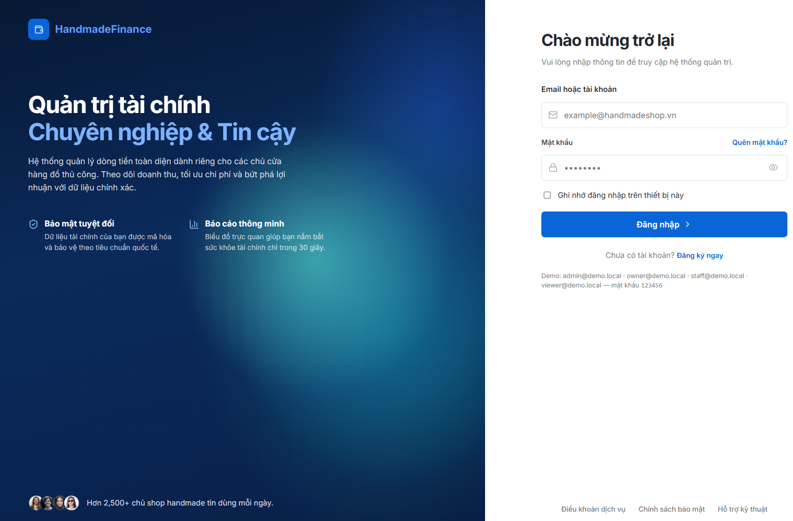
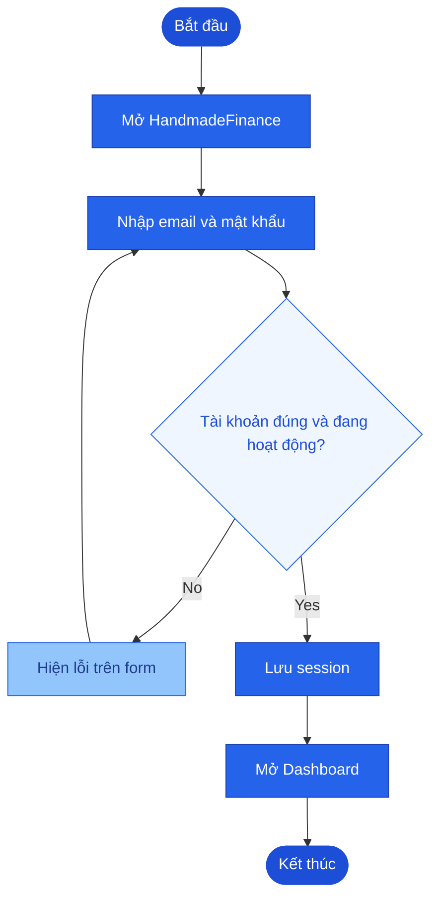
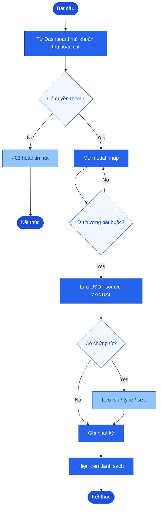
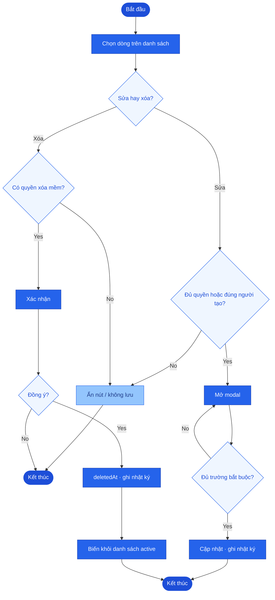
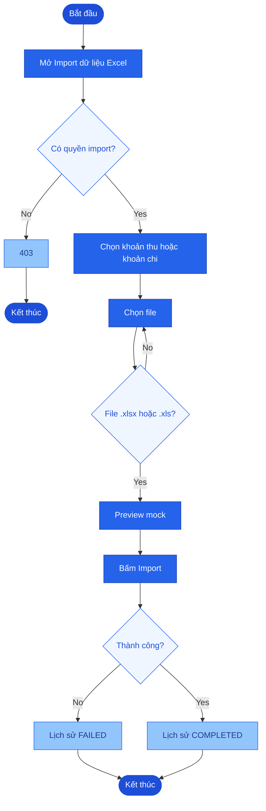
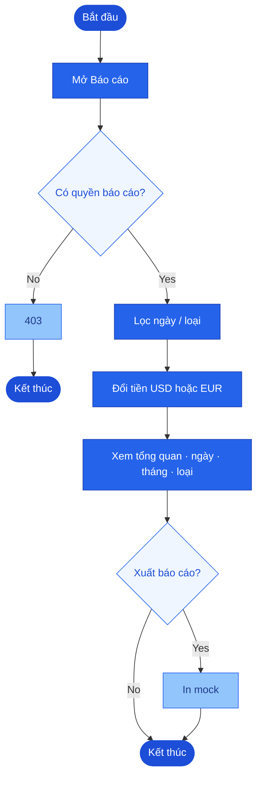
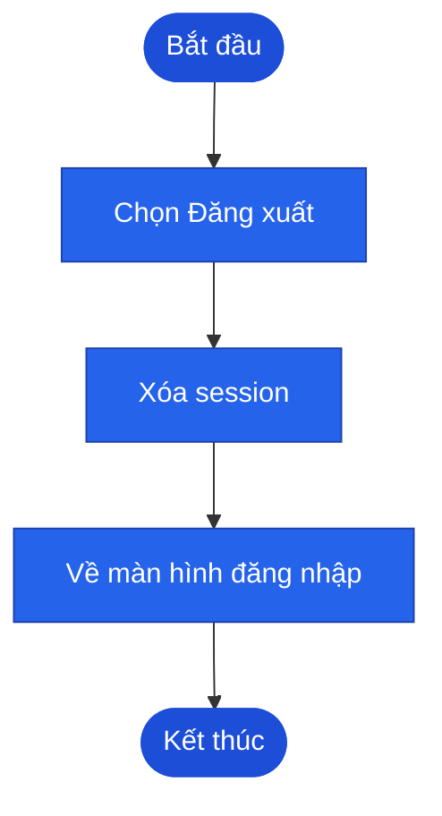
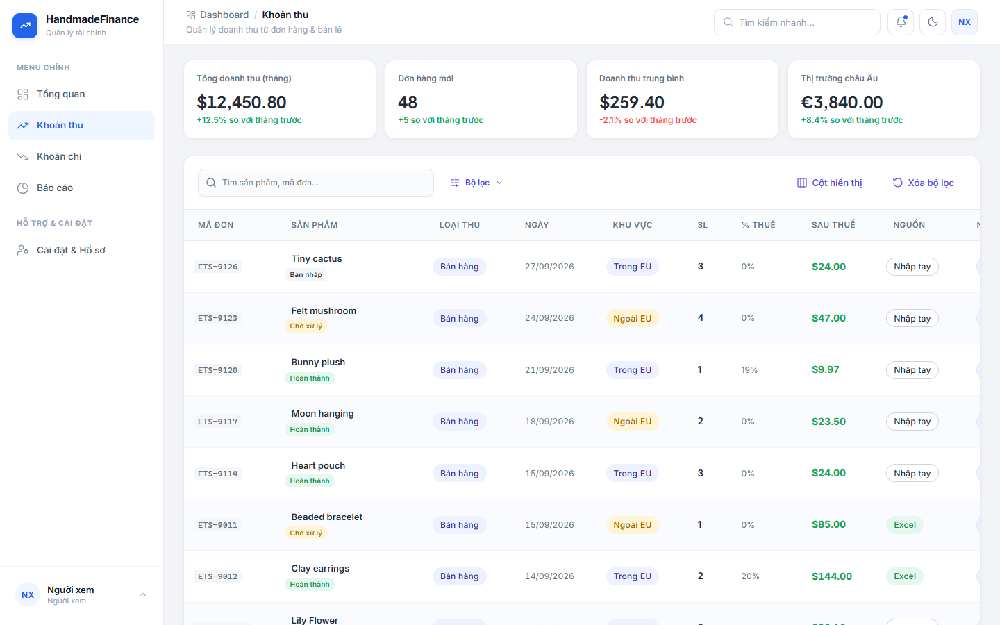
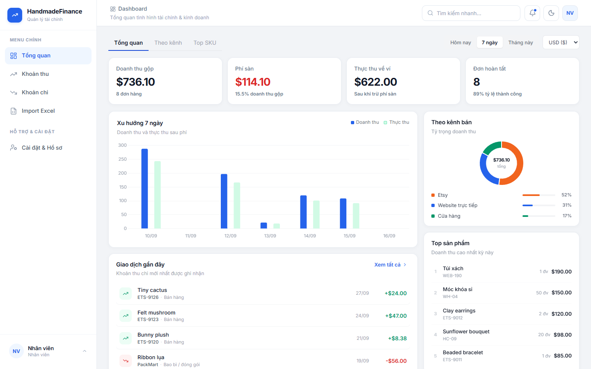

# HandmadeFinance

Web quản lý thu – chi cho shop handmade: ghi nhận tiền vào, tiền ra, theo dõi tổng doanh thu, tổng chi phí và lợi nhuận ròng theo thời gian và theo loại. Số liệu lưu USD; trên giao diện đổi sang EUR lúc xem.

Giao diện HTML/CSS/JS tĩnh (**HandmadeFinance**), dữ liệu chạy trên trình duyệt. Repository có thiết kế PostgreSQL cho cùng mô hình.


## Chức năng chính

- Đăng nhập, đăng xuất, phân quyền theo vai trò trên giao diện
- Dashboard: tổng doanh thu, tổng chi phí, lợi nhuận ròng, số giao dịch, biểu đồ, theo loại thu, giao dịch gần đây
- Quản lý khoản thu: danh sách đủ cột (ẩn/hiện cột), modal thêm/sửa, modal chi tiết; tên sản phẩm, mã đơn, khu vực EU, kênh bán, SL, đơn giá, Item / Discount / Subtotal / Shipping / Tax, trước thuế / % thuế / sau thuế, trạng thái hồ sơ
- Quản lý khoản chi: cùng luồng; người nhận, phạm vi nội địa/quốc tế, phương thức thanh toán, % thuế, tiền sau thuế
- Báo cáo & phân tích: tổng quan, theo ngày, theo tháng, theo loại thu, theo loại chi, xuất báo cáo (in)
- Import dữ liệu Excel: chọn file, xem trước, lịch sử trên giao diện
- Nhật ký hoạt động
- Người dùng (Admin): thêm/sửa, bật/tắt, avatar
- Hồ sơ: tài khoản (SĐT, avatar), bảo mật, vai trò & quyền hạn

## Vai trò

Có bốn vai trò. Menu và nút chỉ hiện khi có quyền.

| | Admin | Chủ shop | Nhân viên | Người xem |
|---|---|---|---|---|
| Dashboard | Có | Có | Có | Có |
| Xem thu / chi | Có | Có | Có | Có |
| Thêm thu / chi | Có | Có | Có | |
| Sửa thu / chi | Có | Có | Bản mình tạo | |
| Xóa mềm thu / chi | Có | Có | | |
| Import dữ liệu Excel | Có | Có | Có | |
| Báo cáo | Có | Có | | Có |
| Nhật ký hoạt động | Có | Có | | |
| Người dùng | Có | | | |
| Hồ sơ cá nhân | Có | Có | Có | Có |

Tài khoản demo (mật khẩu `123456`):

- `admin@demo.local` — Quản trị viên
- `owner@demo.local` — Chủ shop
- `staff@demo.local` — Nhân viên
- `viewer@demo.local` — Người xem



## Mind map


## Workflow

Nhiều luồng riêng, cùng khung: hình viên thuốc = bắt đầu/kết thúc, chữ nhật = bước, thoi = Yes / No. Nút không hiện nếu thiếu quyền; URL không đủ quyền → `#/403`.

### 1. Đăng nhập



### 2. Ghi khoản thu hoặc chi

Admin, Chủ shop, Nhân viên. Người xem không có nút thêm.



### 3. Sửa hoặc xóa mềm

Nhân viên chỉ sửa bản mình tạo. Chỉ Admin và Chủ shop được xóa mềm.



### 4. Import Excel

Admin, Chủ shop, Nhân viên. Không đọc nội dung file thật.



### 5. Báo cáo

Admin, Chủ shop, Người xem. Nhân viên không vào được.



### 6. Đăng xuất



Số liệu lưu USD; EUR chỉ đổi lúc xem.

## Giao diện

Sau khi đăng nhập (sidebar + topbar):

- Dashboard
- Quản lý khoản thu
- Quản lý khoản chi
- Báo cáo & Phân tích
- Import dữ liệu Excel
- Nhật ký hoạt động
- Quản lý người dùng
- Hồ sơ cá nhân

Ảnh theo từng vai trò:

- [chung](docs/images/chung/) — đăng nhập
- [admin](docs/images/admin/)
- [chu-shop](docs/images/chu-shop/)
- [nhan-vien](docs/images/nhan-vien/)
- [nguoi-xem](docs/images/nguoi-xem/)

Người xem — danh sách khoản thu (không nút thêm / sửa / xóa):



Nhân viên — không có Báo cáo, Nhật ký, Người dùng trên menu:



## Dữ liệu

Thiết kế PostgreSQL (`database/shop_finance.sql`, `database/shop_finance.dbml`) gồm:

- người dùng (SĐT, avatar, trạng thái)
- loại thu, khoản thu (kênh bán, trạng thái hồ sơ, trước/sau thuế)
- loại chi, khoản chi (phương thức thanh toán, trạng thái)
- chứng từ
- đợt import
- nhật ký

Số liệu trên giao diện lấy từ `frontend/js/data.js` (có mẫu đơn Etsy `4154185113`). Một bộ dữ liệu USD; toolbar Đổi tiền xem USD hoặc EUR (tỷ giá mock).

## Cấu trúc repository

```text
finance-manager/
  README.md
  frontend/          index.html, css/, js/
  docs/              tài liệu sản phẩm
  docs/images/       ảnh UI theo vai trò
  database/          shop_finance.sql, shop_finance.dbml
  scripts/           serve.sh, serve.bat
```

## Tài liệu

- [Phạm vi](docs/01-scope.md)
- [Chức năng](docs/02-features.md)
- [Use case](docs/03-use-cases.md)
- [Kiến trúc thông tin](docs/04-information-architecture.md)
- [Mô hình dữ liệu](docs/05-data-model.md)
- [Sơ đồ ER](docs/DATABASE.md)
- [Tiêu chí chấp nhận](docs/06-acceptance-criteria.md)
- [Mind map](docs/mindmap.png)
- [C4 kiến trúc (C1–C2)](docs/architecture/c4/README.md)
