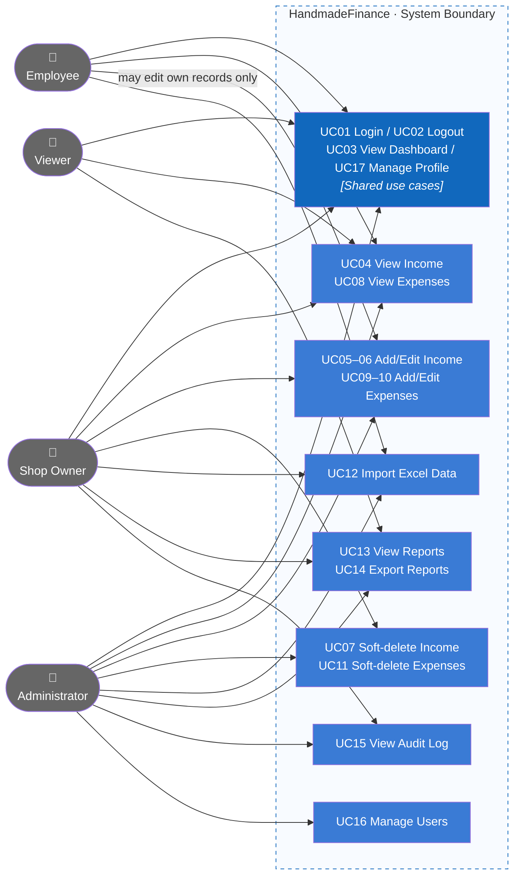
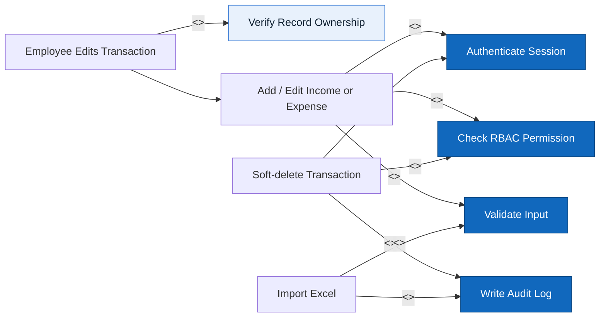

# Actors, roles, use cases

Product name: **HandmadeFinance**.

## Actors / roles

| Role | Display name in UI |
|---|---|
| `ADMIN` | Administrator |
| `SHOP_OWNER` | Shop Owner |
| `EMPLOYEE` | Employee |
| `VIEWER` | Viewer |

Do not add any other roles.

## Role × feature matrix

| Feature | Admin | Shop Owner | Employee | Viewer |
|---|---|---|---|---|
| Dashboard | ✓ | ✓ | ✓ | ✓ |
| View income | ✓ | ✓ | ✓ | ✓ |
| Add income | ✓ | ✓ | ✓ | |
| Edit income | ✓ | ✓ | Own records | |
| Soft-delete income | ✓ | ✓ | | |
| View expenses | ✓ | ✓ | ✓ | ✓ |
| Add expense | ✓ | ✓ | ✓ | |
| Edit expense | ✓ | ✓ | Own records | |
| Soft-delete expense | ✓ | ✓ | | |
| Import Excel data | ✓ | ✓ | ✓ | |
| View reports | ✓ | ✓ | | ✓ |
| Export reports | ✓ | ✓ | | ✓ |
| Activity log | ✓ | ✓ | | |
| Users | ✓ | | | |
| Personal profile | ✓ | ✓ | ✓ | ✓ |

Menus / buttons are **not displayed** when the user lacks permission. Unauthorized URL access → `#/403`.

## Use Case Diagram

The diagram groups use cases by capability and connects each actor directly to the capabilities available to that role.

### Include relationships and constraints

Employees may edit income/expense records only if they created them. Employees cannot delete records.

All four roles: login, logout, dashboard, view income/expenses, profile.

## Use cases

### UC01 Login

- **Actor:** all roles
- **Preconditions:** an active mock account exists
- **Main flow:** enter email/password → match mock user → store session → Dashboard
- **Alternative:** invalid credentials → show error and remain on login screen
- **Permission:** public
- **Result:** mock session

### UC02 Logout

- **Actor:** all roles
- **Preconditions:** user is logged in
- **Main flow:** clear session → login
- **Permission:** authenticated
- **Result:** internal pages are no longer accessible

### UC03 View Dashboard

- **Actor:** all roles
- **Preconditions:** user is logged in
- **Main flow:** choose USD/EUR display + date range → KPIs + charts + category breakdown + recent transactions (records not soft-deleted)
- **Permission:** `dashboard`
- **Result:** one dataset; EUR is display-only conversion

### UC04 View income

- **Actor:** all roles
- **Main flow:** list `deletedAt == null` + filters + visible columns + detail modal
- **Permission:** `incomeRead`
- **Result:** Viewer has no add / edit / delete buttons

### UC05 Add income

- **Actor:** Admin, Shop Owner, Employee
- **Main flow:** modal form → validate → add mock record, `source = MANUAL`, create mock audit entry. Product name, pre-tax amount / tax rate / post-tax amount; order details (code, EU region, quantity, unit price, fees).
- **Permission:** `incomeCreate`
- **Result:** appears in the list

### UC06 Edit income

- **Actor:** Admin, Shop Owner; Employee if `createdBy` = current user
- **Main flow:** modal form → update
- **Permission:** `incomeUpdate` (+ own-record restriction for employee)
- **Result:** list/audit is updated

### UC07 Soft-delete income

- **Actor:** Admin, Shop Owner
- **Main flow:** confirm → set `deletedAt`, `deletedBy`; do not `splice`
- **Permission:** `incomeDelete`
- **Result:** disappears from active list; audit remains

### UC08–UC11 Expenses

Same model as UC04–UC07. Adds payee, domestic/international scope, payment method, tax rate, and post-tax amount. Permission `expense*`.

### UC12 Import data

- **Actor:** Admin, Shop Owner, Employee
- **Main flow:** choose income/expense → choose `.xlsx`/`.xls` → mock preview → Import → loading → mock success/error + history
- **Permission:** `importData`
- **Result:** actual Excel contents are not read

### UC13 View reports

- **Actor:** Admin, Shop Owner, Viewer
- **Main flow:** switch USD/EUR display, choose date range, choose category (prefix `INCOME:` / `EXPENSE:`)
- **Permission:** `reportRead`
- **Result:** aggregates all records (stored in USD). Employee → 403

### UC14 Export reports

- **Actor:** Admin, Shop Owner, Viewer
- **Main flow:** print the report window using the current filters (mock)
- **Permission:** `reportRead`
- **Result:** this is not an electronic invoice

### UC15 View audit log

- **Actor:** Admin, Shop Owner
- **Permission:** `auditRead`

### UC16 Manage users

- **Actor:** Admin
- **Main flow:** list, add/edit (name, email, password, phone in profile, role, status), enable/disable
- **Permission:** `userManagement`

### UC17 Personal profile

- **Actor:** all roles
- **Main flow:** account tab (name, phone number, avatar), security (mock password change), role (read-only)
- **Permission:** authenticated
