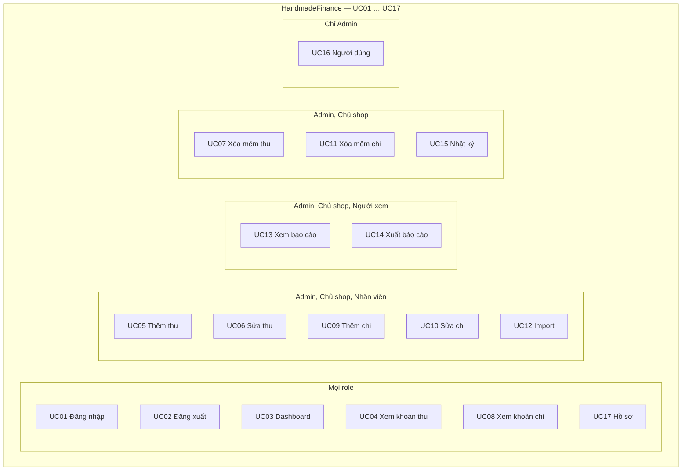

# Actors, roles, use cases

Tên sản phẩm: **HandmadeFinance**.

## Actors / roles

| Role | Tên hiển thị trên UI |
|---|---|
| `ADMIN` | Quản trị viên |
| `SHOP_OWNER` | Chủ shop |
| `EMPLOYEE` | Nhân viên |
| `VIEWER` | Người xem |

Không thêm role khác.

## Role × feature matrix

| Chức năng | Admin | Chủ shop | Nhân viên | Người xem |
|---|---|---|---|---|
| Dashboard | ✓ | ✓ | ✓ | ✓ |
| Xem khoản thu | ✓ | ✓ | ✓ | ✓ |
| Thêm khoản thu | ✓ | ✓ | ✓ | |
| Sửa khoản thu | ✓ | ✓ | của mình | |
| Xóa mềm khoản thu | ✓ | ✓ | | |
| Xem khoản chi | ✓ | ✓ | ✓ | ✓ |
| Thêm khoản chi | ✓ | ✓ | ✓ | |
| Sửa khoản chi | ✓ | ✓ | của mình | |
| Xóa mềm khoản chi | ✓ | ✓ | | |
| Import dữ liệu Excel | ✓ | ✓ | ✓ | |
| Xem báo cáo | ✓ | ✓ | | ✓ |
| Xuất báo cáo | ✓ | ✓ | | ✓ |
| Nhật ký hoạt động | ✓ | ✓ | | |
| Người dùng | ✓ | | | |
| Hồ sơ cá nhân | ✓ | ✓ | ✓ | ✓ |

Menu / nút **không hiển thị** nếu không có quyền. Truy cập URL không đủ quyền → `#/403`.

## Sơ đồ use case (17 UC, một hình)

Gom theo quyền. Không vẽ 17 sơ đồ riêng.

Nhân viên sửa thu/chi: chỉ bản mình tạo. Nhân viên không xóa.

Cả bốn: đăng nhập, đăng xuất, dashboard, xem thu/chi, hồ sơ.

## Use cases

### UC01 Đăng nhập

- **Actor:** tất cả
- **Preconditions:** có tài khoản mock active
- **Main flow:** nhập email/mật khẩu → khớp mock user → lưu session → Dashboard
- **Alternative:** sai thông tin → báo lỗi, ở lại login
- **Permission:** public
- **Result:** mock session

### UC02 Đăng xuất

- **Actor:** tất cả
- **Preconditions:** đã login
- **Main flow:** xóa session → login
- **Permission:** authenticated
- **Result:** không còn vào trang nội bộ

### UC03 Xem Dashboard

- **Actor:** tất cả
- **Preconditions:** đã login
- **Main flow:** chọn đổi tiền USD/EUR + khoảng ngày → KPI + biểu đồ + theo loại + giao dịch gần đây (bản ghi chưa xóa mềm)
- **Permission:** `dashboard`
- **Result:** cùng một bộ dữ liệu; EUR chỉ là quy đổi hiển thị

### UC04 Xem khoản thu

- **Actor:** tất cả
- **Main flow:** list `deletedAt == null` + lọc + cột hiển thị + modal chi tiết
- **Permission:** `incomeRead`
- **Result:** Viewer không nút thêm / sửa / xóa

### UC05 Thêm khoản thu

- **Actor:** Admin, Chủ shop, Nhân viên
- **Main flow:** modal form → validate → thêm mock, `source = MANUAL`, audit mock. Tên sản phẩm, trước thuế / % thuế / sau thuế; chi tiết đơn (mã, EU, SL, đơn giá, phí).
- **Permission:** `incomeCreate`
- **Result:** xuất hiện trên list

### UC06 Sửa khoản thu

- **Actor:** Admin, Chủ shop; Nhân viên nếu `createdBy` = mình
- **Main flow:** modal form → cập nhật
- **Permission:** `incomeUpdate` (+ own cho employee)
- **Result:** list/audit cập nhật

### UC07 Xóa mềm khoản thu

- **Actor:** Admin, Chủ shop
- **Main flow:** confirm → `deletedAt`, `deletedBy`; không `splice`
- **Permission:** `incomeDelete`
- **Result:** biến mất list active; audit còn

### UC08–UC11 Khoản chi

Cùng mô hình UC04–UC07. Thêm người nhận, phạm vi nội địa/quốc tế, phương thức thanh toán, % thuế, tiền sau thuế. Permission `expense*`.

### UC12 Import dữ liệu

- **Actor:** Admin, Chủ shop, Nhân viên
- **Main flow:** chọn thu/chi → chọn `.xlsx`/`.xls` → preview mock → Import → loading → success/error mock + lịch sử
- **Permission:** `importData`
- **Result:** không đọc nội dung Excel thật

### UC13 Xem báo cáo

- **Actor:** Admin, Chủ shop, Người xem
- **Main flow:** đổi tiền USD/EUR, khoảng ngày, loại (prefix `INCOME:` / `EXPENSE:`)
- **Permission:** `reportRead`
- **Result:** tổng trên toàn bộ bản ghi (lưu USD). Employee → 403

### UC14 Xuất báo cáo

- **Actor:** Admin, Chủ shop, Người xem
- **Main flow:** in cửa sổ báo cáo theo bộ lọc hiện tại (mock)
- **Permission:** `reportRead`
- **Result:** không phải hóa đơn điện tử

### UC15 Xem nhật ký

- **Actor:** Admin, Chủ shop
- **Permission:** `auditRead`

### UC16 Quản lý người dùng

- **Actor:** Admin
- **Main flow:** list, thêm/sửa (tên, email, mật khẩu, SĐT trên hồ sơ, role, trạng thái), bật/tắt
- **Permission:** `userManagement`

### UC17 Hồ sơ cá nhân

- **Actor:** tất cả
- **Main flow:** tab tài khoản (tên, SĐT, avatar), bảo mật (đổi mật khẩu mock), vai trò (chỉ xem)
- **Permission:** authenticated
