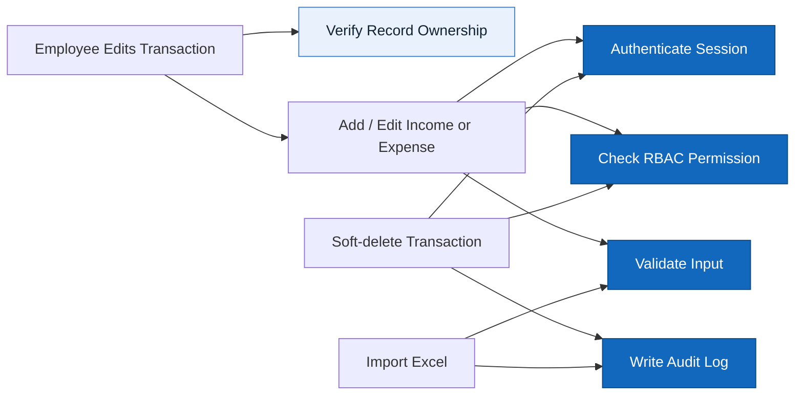

# Actors, roles, use cases

> Design status: TARGET V1
>
> Current implementation: React mock prototype

Product name: **HandmadeFinance**.

## Actors / roles

| Role | Display name in UI |
|---|---|
| `ADMIN` | Administrator |
| `SHOP_OWNER` | Shop Owner |
| `EMPLOYEE` | Employee |
| `VIEWER` | Viewer |

## Role × feature matrix

| Feature | Admin | Shop Owner | Employee | Viewer |
|---|---|---|---|---|
| Dashboard | ✓ | ✓ | ✓ | ✓ |
| View income | ✓ | ✓ | ✓ | ✓ |
| Add income | ✓ | ✓ | ✓ | |
| Edit income | ✓ | ✓ | Own records | |
| Soft-delete income | ✓ | ✓ | | |
| View expenses | ✓ | ✓ | ✓ | ✓ |
| Add expense | ✓ | ✓ | ✓ | |
| Edit expense | ✓ | ✓ | Own records | |
| Soft-delete expense | ✓ | ✓ | | |
| Import Excel data | ✓ | ✓ | ✓ | |
| View reports | ✓ | ✓ | | ✓ |
| Export reports | ✓ | ✓ | | ✓ |
| Activity log | ✓ | ✓ | | |
| Users | ✓ | | | |
| Personal profile | ✓ | ✓ | ✓ | ✓ |

Menus / buttons are **not displayed** when the user lacks permission. Unauthorized URL access → `#/403`.

## Use Case Diagram

Every use case is a separate node. Administrator and Shop Owner are placed on the left; Employee and Viewer are placed on the right to keep the system boundary readable.

```mermaid
flowchart LR
    subgraph left["Actors"]
        direction TB
        admin(["Administrator"])
        owner(["Shop Owner"])
    end

    subgraph system["HandmadeFinance — System Boundary"]
        direction TB
        subgraph common["Access and overview"]
            direction LR
            uc01["UC01 Login"]
            uc02["UC02 Logout"]
            uc03["UC03 View Dashboard"]
            uc17["UC17 Manage Profile"]
        end
        subgraph ledger["Transactions"]
            direction LR
            uc04["UC04 View Income"]
            uc05["UC05 Add Income"]
            uc06["UC06 Edit Income"]
            uc07["UC07 Soft-delete Income"]
            uc08["UC08 View Expenses"]
            uc09["UC09 Add Expenses"]
            uc10["UC10 Edit Expenses"]
            uc11["UC11 Soft-delete Expenses"]
        end
        subgraph operations["Operations and governance"]
            direction LR
            uc12["UC12 Import Excel Data"]
            uc13["UC13 View Reports"]
            uc14["UC14 Export Reports"]
            uc15["UC15 View Audit Log"]
            uc16["UC16 Manage Users"]
        end
    end

    subgraph right["Actors"]
        direction TB
        employee(["Employee"])
        viewer(["Viewer"])
    end

    admin --> uc01 & uc02 & uc03 & uc04 & uc05 & uc06 & uc07 & uc08 & uc09 & uc10 & uc11 & uc12 & uc13 & uc14 & uc15 & uc16 & uc17
    owner --> uc01 & uc02 & uc03 & uc04 & uc05 & uc06 & uc07 & uc08 & uc09 & uc10 & uc11 & uc12 & uc13 & uc14 & uc15 & uc17
    employee --> uc01 & uc02 & uc03 & uc04 & uc05 & uc06 & uc08 & uc09 & uc10 & uc12 & uc17
    viewer --> uc01 & uc02 & uc03 & uc04 & uc08 & uc13 & uc14 & uc17

    classDef actor fill:#666,color:#fff,stroke:#333
    classDef usecase fill:#1168bd,color:#fff,stroke:#0b4f9e
    class admin,owner,employee,viewer actor
    class uc01,uc02,uc03,uc04,uc05,uc06,uc07,uc08,uc09,uc10,uc11,uc12,uc13,uc14,uc15,uc16,uc17 usecase
    style left fill:#fff,stroke:#bbb,stroke-dasharray:5 5
    style right fill:#fff,stroke:#bbb,stroke-dasharray:5 5
    style system fill:#f8fbff,stroke:#1168bd,stroke-dasharray:5 5
```

### Shared rules and constraints

Employees may edit income/expense records only if they created them. Employees cannot delete records.

All four roles: login, logout, dashboard, view income/expenses, profile.

## Use cases

### UC01 Login

- **Actor:** all roles
- **Preconditions:** an active account exists
- **Main flow:** enter email/password → submit `login` → backend verifies credentials and account status → return Bearer access token and safe profile → Dashboard
- **Alternative:** invalid credentials → show error and remain on login screen
- **Permission:** public
- **Result:** an authenticated client session backed by the returned access token

### UC02 Logout

- **Actor:** all roles
- **Preconditions:** user is logged in
- **Main flow:** invoke `logout` → clear client authentication state → login
- **Permission:** authenticated
- **Result:** internal pages are no longer accessible from the logged-out client

#### Logout Token Semantics

**Status:** ACCEPTED FOR V1

The client discards the 30-minute JWT access token and all cached private state after the authenticated logout acknowledgement. V1 has no refresh token and no server-side blacklist/revocation store; an already issued token expires naturally. Server-side revocation is a possible future evolution, not a V1 requirement.

### UC03 View Dashboard

- **Actor:** all roles
- **Preconditions:** user is logged in
- **Main flow:** choose USD/EUR display + date range → KPIs + charts + category breakdown + recent transactions (records not soft-deleted)
- **Permission:** `dashboard`
- **Result:** one dataset; EUR is display-only conversion

### UC04 View income

- **Actor:** all roles
- **Main flow:** list `deletedAt == null` + filters + visible columns + detail modal
- **Permission:** `incomeRead`
- **Result:** Viewer has no add / edit / delete buttons

### UC05 Add income

- **Actor:** Admin, Shop Owner, Employee
- **Main flow:** modal form → client validation → `createIncome` → backend authorization and validation → persist with `source = MANUAL` and actor identity → audit → return the created record. Product name, pre-tax amount / tax rate / post-tax amount; order details (code, EU region, quantity, unit price, fees).
- **Permission:** `incomeCreate`
- **Result:** appears in the list

### UC06 Edit income

- **Actor:** Admin, Shop Owner; Employee if `createdBy` = current user
- **Main flow:** modal form → update
- **Permission:** `incomeUpdate` (+ own-record restriction for employee)
- **Result:** list/audit is updated

### UC07 Soft-delete income

- **Actor:** Admin, Shop Owner
- **Main flow:** confirm → set `deletedAt`, `deletedBy`; do not `splice`
- **Permission:** `incomeDelete`
- **Result:** disappears from active list; audit remains

### UC08 View expenses

- **Actor:** all roles
- **Main flow:** list active expenses → filter/search/page → open details
- **Permission:** `expenseRead`
- **Result:** soft-deleted expenses are excluded; Viewer has no write controls

### UC09 Add expense

- **Actor:** Admin, Shop Owner, Employee
- **Main flow:** submit expense form → validate payee, category, origin, payment method, tax, and amounts → persist with `source = MANUAL` → audit
- **Permission:** `expenseCreate`
- **Result:** created expense appears in the active list

### UC10 Edit expense

- **Actor:** Admin, Shop Owner; Employee if `createdBy` equals the current user
- **Main flow:** open active expense → submit changes → authorize ownership → validate → update → audit
- **Permission:** `expenseUpdate` plus Employee own-record restriction
- **Result:** updated expense is returned and active views are refreshed

### UC11 Soft-delete expense

- **Actor:** Admin, Shop Owner
- **Main flow:** confirm → set `deletedAt` and `deletedBy`; do not physically remove the row
- **Permission:** `expenseDelete`
- **Result:** expense leaves active views while audit history remains

### UC12 Import data

- **Actor:** Admin, Shop Owner, Employee
- **Main flow:** choose income/expense → choose `.xlsx`/`.xls` (maximum 10 MB and 5,000 data rows) → upload for validation and preview → confirm synchronous atomic import → receive the final summary (`totalRows`, `validRows`, `importedRows`, `failedRows`, `validationErrors`)
- **Permission:** `importData`
- **Result:** any severe validation error commits zero ledger rows; otherwise all validated rows commit before the response. The current prototype simulates this TARGET flow only.

### UC13 View reports

- **Actor:** Admin, Shop Owner, Viewer
- **Main flow:** switch USD/EUR display, choose date range, choose category (prefix `INCOME:` / `EXPENSE:`)
- **Permission:** `reportRead`
- **Result:** aggregates all records (stored in USD). Employee → 403

### UC14 Export reports

- **Actor:** Admin, Shop Owner, Viewer
- **Main flow:** request PDF or XLSX export using the current report filters
- **Permission:** `reportRead`
- **Result:** this is not an electronic invoice

### UC15 View audit log

- **Actor:** Admin, Shop Owner
- **Permission:** `auditRead`

### UC16 Manage users

- **Actor:** Admin
- **Main flow:** list, add/edit (name, email, password, phone in profile, role, status), enable/disable
- **Permission:** `userManagement`

### UC17 Personal profile

- **Actor:** all roles
- **Main flow:** account tab updates allowed profile fields; security verifies the current password before changing it; role remains read-only
- **Permission:** authenticated
