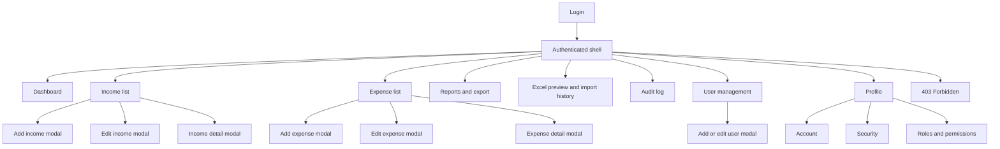
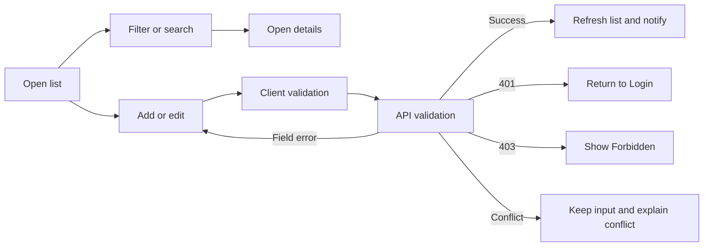

# Information architecture

```text
HandmadeFinance
│
├── Public
│   └── Login (two-column layout)
│
└── Authenticated (sidebar + topbar)
    ├── Dashboard
    ├── Income Management
    │   ├── List (table, filters, columns, pagination)
    │   ├── Add / edit modal
    │   └── Detail modal
    ├── Expense Management
    │   ├── List
    │   ├── Add / edit modal
    │   └── Detail modal
    ├── Reports & Analytics
    │   ├── Overview
    │   ├── By day
    │   ├── By month
    │   ├── By income category
    │   └── By expense category
    ├── Excel Data Import
    ├── Activity Log
    ├── User Management
    ├── Personal Profile
    │   ├── Account
    │   ├── Security
    │   └── Roles & Permissions
    └── 403
```

Hash routes: `#/login` `#/dashboard` `#/incomes` `#/incomes/new` `#/incomes/edit/:id` `#/expenses` … `#/reports` `#/import` `#/audit` `#/users` `#/profile` `#/403`.

Income/expense forms open as a **modal** on the list page (hash `/new` and `/edit/:id` are still allowed, then return to the list and open the modal).

**Currency** toolbar: USD / EUR. There is one dataset (USD); EUR is display-only conversion.

## Page permissions

| Page | Who can access |
|---|---|
| Dashboard, profile | all roles |
| Income / expenses (view) | all roles |
| Add/edit income/expenses | according to matrix; employee can edit own records |
| Reports | ADMIN, SHOP_OWNER, VIEWER |
| Excel Data Import | ADMIN, SHOP_OWNER, EMPLOYEE |
| Activity Log | ADMIN, SHOP_OWNER |
| Users | ADMIN only |
| Unauthorized | `#/403` |

Unauthorized items are **not rendered** in the sidebar.

## Screen hierarchy



## Primary task flows



## UI/UX state contract

| State | Required behavior |
|---|---|
| Initial loading | Preserve the page shell; show a skeleton for the affected panel or table. |
| Empty | Explain that no records match; distinguish an empty dataset from filtered-out results; show a permitted primary action. |
| Validation error | Keep entered values, associate text with the invalid field, and focus the first error. |
| API error | Show a concise message derived from `ProblemDetails.traceId`; do not expose technical details. |
| Unauthorized | Clear invalid authentication and return to Login. |
| Forbidden | Keep authentication and render `#/403` with a safe route back. |
| Saving/importing | Disable duplicate submission and show progress without blocking unrelated navigation unless data loss is possible. |
| Success | Confirm the action, close the modal when appropriate, and refresh the affected query. |
| Destructive confirmation | Name the record and state that deletion removes it from active views but retains audit history. |

## Responsive and accessibility rules

- Desktop tables retain full-column controls; narrow screens use horizontal scrolling or prioritized summary cards without hiding data permanently.
- Modals fit within the viewport, keep actions visible, trap keyboard focus, close with `Escape` only when no submission is running, and restore focus to the trigger.
- Every input has a visible label; icon-only buttons have accessible names; status is never communicated by color alone.
- Keyboard users can reach navigation, filters, rows, modal actions, and pagination in a predictable order.
- Dates and money have explicit formats and the active display currency is always visible.

## Screen-to-API mapping

| Screen | API operations |
|---|---|
| Login | `login`, `logout` |
| Dashboard | `getDashboard` |
| Income | `listIncomes`, `getIncome`, `createIncome`, `updateIncome`, `softDeleteIncome`, `uploadIncomeAttachment`, `deleteAttachment` |
| Expenses | `listExpenses`, `getExpense`, `createExpense`, `updateExpense`, `softDeleteExpense`, `uploadExpenseAttachment`, `deleteAttachment` |
| Reports | `getReport`, `exportReport` |
| Import | `previewImport`, `createImport`, `listImports`, `getImport` |
| Audit | `listAuditLogs` |
| Users | `listUsers`, `getUser`, `createUser`, `updateUser`, `updateUserStatus` |
| Profile | `getProfile`, `updateProfile`, `changePassword` |
