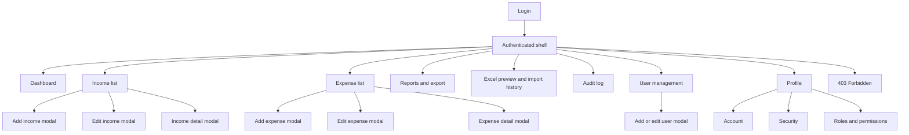
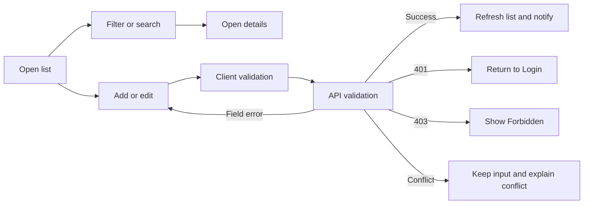

# Information architecture

> Design status: TARGET V1
>
> Current implementation: React mock prototype; no real API integration

```text
HandmadeFinance
│
├── Public
│   └── Login (two-column layout)
│
└── Authenticated (sidebar + topbar)
    ├── Dashboard
    ├── Income Management
    │   ├── List (table, filters, columns, pagination)
    │   ├── Add / edit modal
    │   └── Detail modal
    ├── Expense Management
    │   ├── List
    │   ├── Add / edit modal
    │   └── Detail modal
    ├── Reports & Analytics
    │   ├── Overview
    │   ├── By day
    │   ├── By month
    │   ├── By income category
    │   └── By expense category
    ├── Excel Data Import
    ├── Activity Log
    ├── User Management
    ├── Personal Profile
    │   ├── Account
    │   ├── Security
    │   └── Roles & Permissions
    └── 403
```

Hash routes: `#/login` `#/dashboard` `#/incomes` `#/incomes/new` `#/incomes/edit/:id` `#/expenses` … `#/reports` `#/import` `#/audit` `#/users` `#/profile` `#/403`.

Income/expense forms open as a **modal** on the list page (hash `/new` and `/edit/:id` are still allowed, then return to the list and open the modal).

The current prototype opens these forms through local modal state and does not implement every target hash route. Route-level modal URLs are target design and must be confirmed during real API integration; the mock UI is intentionally unchanged by this documentation decision.

**Currency** toolbar: USD / EUR. There is one dataset (USD); EUR is display-only conversion.

## Page permissions

| Page | Who can access |
|---|---|
| Dashboard, profile | all roles |
| Income / expenses (view) | all roles |
| Add/edit income/expenses | according to matrix; employee can edit own records |
| Reports | ADMIN, SHOP_OWNER, VIEWER |
| Excel Data Import | ADMIN, SHOP_OWNER, EMPLOYEE |
| Activity Log | ADMIN, SHOP_OWNER |
| Users | ADMIN only |
| Unauthorized | `#/403` |

Unauthorized items are **not rendered** in the sidebar.

## Screen inventory

| Screen ID | Screen | Presentation | Related stories | Status |
|---|---|---|---|---|
| `SCR-01` | Login | Page | US01, US02 | Current mock and target |
| `SCR-02` | Dashboard | Page | US03 | Current mock and target |
| `SCR-10` | Income list | Page | US04, US07 | Current mock and target |
| `SCR-11` | Income create | Modal on income list | US05 | Current mock and target |
| `SCR-12` | Income edit | Modal on income list | US06 | Current mock and target |
| `SCR-13` | Income detail | Modal on income list | US04 | Current mock and target |
| `SCR-20` | Expense list | Page | US08, US11 | Current mock and target |
| `SCR-21` | Expense create | Modal on expense list | US09 | Current mock and target |
| `SCR-22` | Expense edit | Modal on expense list | US10 | Current mock and target |
| `SCR-23` | Expense detail | Modal on expense list | US08 | Current mock and target |
| `SCR-30` | Reports and export | Page | US13, US14 | Current mock and target |
| `SCR-40` | Import preview/history | Page | US12 | Current mock; target integration pending |
| `SCR-50` | Audit log | Page | US15 | Current mock and target |
| `SCR-60` | User management | Page with form modal | US16 | Current mock and target |
| `SCR-70` | Personal profile | Tabbed page | US17 | Current mock and target |
| `SCR-90` | Forbidden | Page | Cross-cutting authorization | Current mock and target |

## Requirement-to-screen mapping

| Requirement | Primary screen/action |
|---|---|
| US01 | `SCR-01` submit login |
| US02 | Authenticated shell logout action, returning to `SCR-01` |
| US03 | `SCR-02` change date range/display currency |
| US04 | `SCR-10` filter/list and `SCR-13` inspect income |
| US05 | `SCR-11` submit income creation |
| US06 | `SCR-12` submit income update |
| US07 | `SCR-10` confirm income soft deletion |
| US08 | `SCR-20` filter/list and `SCR-23` inspect expense |
| US09 | `SCR-21` submit expense creation |
| US10 | `SCR-22` submit expense update |
| US11 | `SCR-20` confirm expense soft deletion |
| US12 | `SCR-40` preview, submit, and inspect import status/history |
| US13 | `SCR-30` filter and inspect report |
| US14 | `SCR-30` export the currently filtered report |
| US15 | `SCR-50` filter and inspect audit events |
| US16 | `SCR-60` list/create/edit/enable/disable users |
| US17 | `SCR-70` update profile or change password |

## Screen hierarchy



## Primary task flows



## UI/UX state contract

| State | Required behavior |
|---|---|
| Initial loading | Preserve the page shell; show a skeleton for the affected panel or table. |
| Empty | Explain that no records match; distinguish an empty dataset from filtered-out results; show a permitted primary action. |
| Validation error | Keep entered values, associate text with the invalid field, and focus the first error. |
| API error | Show a concise message derived from `ProblemDetails.traceId`; do not expose technical details. |
| Unauthorized | Clear invalid authentication and return to Login. |
| Forbidden | Keep authentication and render `#/403` with a safe route back. |
| Saving/importing | Disable duplicate submission and show progress without blocking unrelated navigation unless data loss is possible. |
| Success | Confirm the action, close the modal when appropriate, and refresh the affected query. |
| Destructive confirmation | Name the record and state that deletion removes it from active views but retains audit history. |

## Responsive and accessibility rules

- Desktop tables retain full-column controls; narrow screens use horizontal scrolling or prioritized summary cards without hiding data permanently.
- Modals fit within the viewport, keep actions visible, trap keyboard focus, close with `Escape` only when no submission is running, and restore focus to the trigger.
- Every input has a visible label; icon-only buttons have accessible names; status is never communicated by color alone.
- Keyboard users can reach navigation, filters, rows, modal actions, and pagination in a predictable order.
- Dates and money have explicit formats and the active display currency is always visible.

## Screen-to-API mapping

| Screen | API operations |
|---|---|
| Login | `login`, `logout` |
| Dashboard | `getDashboard` |
| Income | `listIncomes`, `getIncome`, `createIncome`, `updateIncome`, `softDeleteIncome`, `uploadIncomeAttachment`, `deleteAttachment` |
| Expenses | `listExpenses`, `getExpense`, `createExpense`, `updateExpense`, `softDeleteExpense`, `uploadExpenseAttachment`, `deleteAttachment` |
| Reports | `getReport`, `exportReport` |
| Import | `previewImport`, `createImport`, `listImports`, `getImport` |
| Audit | `listAuditLogs` |
| Users | `listUsers`, `getUser`, `createUser`, `updateUser`, `updateUserStatus` |
| Profile | `getProfile`, `updateProfile`, `changePassword` |

Category operations `listIncomeCategories` and `listExpenseCategories` supply lookup choices to income/expense create, edit, and filter interactions; they do not own a standalone screen.

## Current mock UI versus target V1

The current mock UI is intentionally retained for UI development and demonstration. Target V1 adds real API, persistence, and backend authorization behind the same user-facing capabilities.

### Target V1 field coverage

OpenAPI remains the target contract for fields such as `salesChannel`, `recordStatus`, `paymentMethod`, and `username`. A field absent from a current mock screen is not removed from the target contract and is not added to the prototype by this documentation task.

**Status:** TODO before real API integration. A field-by-field UI contract review must be performed when each feature replaces its mock adapter with the HTTP API adapter.
