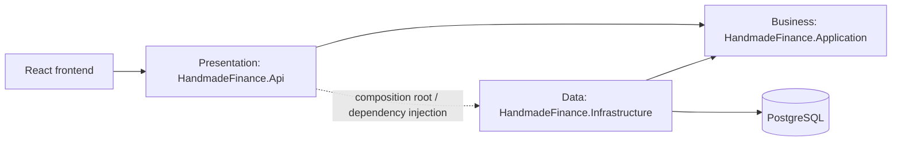

# Target Folder Structure — React and ASP.NET Core

> **Scope:** Step 5 · **Status:** Design only; not implemented source code  
> **Detailed modules:** All HandmadeFinance V1 capabilities

This document defines source-code locations and dependency directions before the API is implemented. The current `src/frontend/` directory is a mock interface backed by JavaScript data; the `.NET` backend scaffold is under `src/backend/` but its projects are not implemented yet.

## 1. General Principles

1. The UI does not contain authoritative authorization or financial rules.
2. Controllers contain neither SQL nor business logic.
3. Services depend on repository interfaces, not directly on PostgreSQL.
4. Infrastructure implements interfaces defined by Application.
5. Resource, DTO, and endpoint names must follow the [OpenAPI contract](api/openapi.yaml).

## 2. Frontend React

### 2.1 Current Structure

```text
src/frontend/src/
├── components/       # Shell and Login
├── lib/              # mock data, store, auth, formatting, icons, theme
├── pages/            # screens and forms
├── App.jsx
├── index.css
└── main.jsx
```

`lib/store.jsx` currently holds state and performs mock business operations. It is a temporary data source, not an API access layer.

### 2.2 Target Structure

```text
src/frontend/src/
├── app/
│   ├── App.jsx
│   ├── routes.jsx
│   └── providers.jsx
├── assets/
├── components/                    # shared UI components
│   ├── layout/
│   ├── feedback/
│   └── data-display/
├── features/                      # business feature modules
│   ├── auth/
│   │   ├── components/LoginForm.jsx
│   │   ├── hooks/useAuth.js
│   │   ├── services/authService.js
│   │   ├── auth.contracts.js
│   │   └── auth.validation.js
│   ├── incomes/
│   │   ├── components/
│   │   ├── hooks/useIncomes.js
│   │   ├── pages/IncomeListPage.jsx
│   │   ├── services/incomeService.js
│   │   ├── income.contracts.js
│   │   └── income.validation.js
│   └── expenses/
│       ├── components/
│       ├── hooks/useExpenses.js
│       ├── pages/ExpenseListPage.jsx
│       ├── services/expenseService.js
│       ├── expense.contracts.js
│       └── expense.validation.js
├── pages/                         # route-level pages outside a specific feature
├── services/
│   ├── apiClient.js               # HTTP client, token, error mapping
│   └── endpoints.js
├── hooks/                         # shared hooks
├── lib/                           # pure functions: money, date, formatting
├── styles/
├── test/
│   ├── setup.js
│   └── fixtures/
└── main.jsx
```

### 2.3 Frontend Responsibilities

| Directory | Term | Responsibility |
|---|---|---|
| `components/` | Shared components | Reusable UI that does not call APIs directly |
| `features/` | Feature modules | Groups UI, hooks, services, and contracts by business feature |
| `services/` | Infrastructure services | HTTP and token configuration plus normalized errors |
| `*.contracts.js` | Data contracts | JSDoc/schema descriptions of OpenAPI requests and responses |
| `hooks/` | Custom hooks | Coordinates client loading, error, and cache state |
| `lib/` | Utilities | Pure functions with no state or HTTP access |

Target frontend flow:

```text
Page/Component → Feature Hook → Feature Service → apiClient → ASP.NET Core API
```

No physical directories are moved in Step 5. Migration begins with API integration to avoid breaking the mock UI.

### 2.4 Complete Feature Inventory

Every target feature follows `components/`, `hooks/`, `pages/`, `services/`, `*.contracts.js`, and `*.validation.js` where those responsibilities apply.

```text
src/frontend/src/features/
├── auth/           # Login/logout, auth context, route and role guards
├── dashboard/      # KPI cards, charts, recent transactions, date filters
├── categories/     # Income/expense category lookup hooks
├── incomes/        # List, detail, create/edit, delete, attachments
├── expenses/       # List, detail, create/edit, delete, attachments
├── reports/        # Report filters, charts, PDF/XLSX export
├── imports/        # File selection, preview, processing, history/status
├── audit/          # Filtered and paginated audit log
├── users/          # Admin list, create/edit, activate/disable
└── profile/        # Account, password, read-only permission matrix
```

Shared code is limited to code used by at least two features:

```text
src/frontend/src/
├── components/
│   ├── layout/          # AppShell, Sidebar, Topbar, ProtectedLayout
│   ├── forms/           # Field, FormError, FilePicker
│   ├── feedback/        # Alert, EmptyState, ErrorState, LoadingSkeleton
│   └── data-display/    # DataTable, Pagination, Money, StatusBadge
├── services/
│   ├── apiClient.js     # base URL, Bearer token, ProblemDetails mapping
│   ├── endpoints.js     # OpenAPI path constants
│   └── fileDownload.js
├── hooks/               # useDebounce, usePagination, useAsyncAction
├── lib/                 # date, USD money, display conversion, validation helpers
└── test/
    ├── setup.js
    ├── fixtures/
    ├── handlers/        # API mocks by operationId
    └── renderWithProviders.jsx
```

Feature code may depend on shared code; shared code must not import a feature. A feature service is the only code in that feature allowed to call `apiClient`.

## 3. Three-Tier ASP.NET Core Backend

### 3.1 Target Solution

```text
src/backend/
├── HandmadeFinance.sln
├── src/
│   ├── HandmadeFinance.Api/                 # Presentation layer
│   │   ├── Controllers/
│   │   │   ├── AuthController.cs
│   │   │   ├── IncomesController.cs
│   │   │   └── ExpensesController.cs
│   │   ├── Contracts/
│   │   │   ├── Auth/
│   │   │   ├── Incomes/
│   │   │   ├── Expenses/
│   │   │   └── Common/
│   │   ├── Middleware/
│   │   │   ├── ExceptionHandlingMiddleware.cs
│   │   │   └── RequestContextMiddleware.cs
│   │   ├── Mapping/
│   │   ├── Authorization/
│   │   ├── Program.cs
│   │   └── appsettings.json
│   ├── HandmadeFinance.Application/         # Application/Business layer
│   │   ├── Abstractions/
│   │   │   ├── Authentication/
│   │   │   │   ├── IAuthService.cs
│   │   │   │   ├── IPasswordHasher.cs
│   │   │   │   └── ITokenIssuer.cs
│   │   │   ├── Persistence/
│   │   │   │   ├── IUserRepository.cs
│   │   │   │   ├── IIncomeRepository.cs
│   │   │   │   ├── IExpenseRepository.cs
│   │   │   │   ├── IAuditLogRepository.cs
│   │   │   │   └── IUnitOfWork.cs
│   │   │   └── Time/
│   │   ├── Authentication/
│   │   │   ├── AuthService.cs
│   │   │   └── AuthResult.cs
│   │   ├── Incomes/
│   │   │   ├── Income.cs
│   │   │   ├── IIncomeService.cs
│   │   │   ├── IncomeService.cs
│   │   │   ├── IncomePolicy.cs
│   │   │   ├── IncomeValidator.cs
│   │   │   └── IncomeQuery.cs
│   │   ├── Expenses/
│   │   │   ├── Expense.cs
│   │   │   ├── IExpenseService.cs
│   │   │   ├── ExpenseService.cs
│   │   │   ├── ExpensePolicy.cs
│   │   │   ├── ExpenseValidator.cs
│   │   │   └── ExpenseQuery.cs
│   │   └── Common/
│   │       ├── ActorContext.cs
│   │       ├── PagedResult.cs
│   │       └── ApplicationException.cs
│   └── HandmadeFinance.Infrastructure/      # Infrastructure/Data layer
│       ├── Authentication/
│       │   ├── PasswordHasher.cs
│       │   └── JwtTokenIssuer.cs
│       ├── Persistence/
│       │   ├── ShopFinanceDbContext.cs
│       │   ├── Configurations/
│       │   ├── Repositories/
│       │   │   ├── UserRepository.cs
│       │   │   ├── IncomeRepository.cs
│       │   │   ├── ExpenseRepository.cs
│       │   │   └── AuditLogRepository.cs
│       │   └── Transactions/
│       └── DependencyInjection.cs
└── tests/
    ├── HandmadeFinance.Application.Tests/   # unit tests
    │   ├── Authentication/
    │   ├── Incomes/
    │   └── Expenses/
    └── HandmadeFinance.Api.Tests/           # integration tests
        ├── Authentication/
        ├── Incomes/
        └── Expenses/
```

### 3.2 Three-Tier Responsibilities

| Layer | Term | Allowed | Not allowed |
|---|---|---|---|
| `Api` | Presentation layer | HTTP, model binding, authentication middleware, DTO mapping, status codes | SQL, tax calculation, ownership decisions |
| `Application` | Application/Business layer | Use case, validation, RBAC, own-record policy, entity, repository interface | ASP.NET HTTP objects, PostgreSQL driver |
| `Infrastructure` | Infrastructure/Data layer | EF Core/SQL, PostgreSQL mapping, password hashing, token implementation, transactions | Business decisions or HTTP responses |

### 3.3 Dependency Direction



- `Application` does not reference `Api` or `Infrastructure`.
- `Infrastructure` implements `IUserRepository`, `IIncomeRepository`, `IExpenseRepository`, and `IAuditLogRepository`.
- `Api/Program.cs` is the composition root and registers implementations through dependency injection.

### 3.4 Complete Backend Module Inventory

The three projects remain the three tiers. Folders below are mandatory implementation locations for the V1 OpenAPI operations.

```text
src/backend/src/
├── HandmadeFinance.Api/
│   ├── Controllers/
│   │   ├── AuthController.cs
│   │   ├── DashboardController.cs
│   │   ├── CategoriesController.cs
│   │   ├── IncomesController.cs
│   │   ├── ExpensesController.cs
│   │   ├── ReportsController.cs
│   │   ├── ImportsController.cs
│   │   ├── AttachmentsController.cs
│   │   ├── AuditLogsController.cs
│   │   ├── UsersController.cs
│   │   └── ProfileController.cs
│   ├── Contracts/{Auth,Dashboard,Categories,Incomes,Expenses,Reports,Imports,Attachments,Audit,Users,Profile,Common}/
│   ├── Authorization/        # policies and ActorContext construction
│   ├── Mapping/              # HTTP contract ↔ Application model
│   ├── Middleware/           # ProblemDetails and request context
│   └── OpenApi/              # x-roles and schema configuration
├── HandmadeFinance.Application/
│   ├── Abstractions/
│   │   ├── Authentication/   # hasher and token issuer
│   │   ├── Persistence/      # repositories and unit of work
│   │   ├── Files/            # IFileStorage and IExcelParser
│   │   ├── Reports/          # IReportExporter
│   │   └── Time/             # IClock
│   ├── Authentication/
│   ├── Dashboard/
│   ├── Categories/
│   ├── Incomes/
│   ├── Expenses/
│   ├── Reports/
│   ├── Imports/
│   ├── Attachments/
│   ├── Audit/
│   ├── Users/
│   ├── Profile/
│   └── Common/               # ActorContext, Result, paging, exceptions
└── HandmadeFinance.Infrastructure/
    ├── Authentication/       # PasswordHasher, JwtTokenIssuer
    ├── Persistence/
    │   ├── ShopFinanceDbContext.cs
    │   ├── Configurations/   # one configuration per database entity
    │   ├── Repositories/     # one implementation per repository interface
    │   └── Transactions/     # EfUnitOfWork and audit actor context
    ├── Files/                # LocalFileStorage
    ├── Imports/              # NpoiExcelParser
    ├── Reports/              # PdfReportExporter, XlsxReportExporter
    └── DependencyInjection.cs
```

```text
src/backend/tests/
├── HandmadeFinance.Application.Tests/
│   ├── Authentication/
│   ├── Dashboard/
│   ├── Categories/
│   ├── Incomes/
│   ├── Expenses/
│   ├── Reports/
│   ├── Imports/
│   ├── Attachments/
│   ├── Audit/
│   ├── Users/
│   └── Profile/
├── HandmadeFinance.Api.Tests/       # authorization, binding, status, ProblemDetails
└── HandmadeFinance.Infrastructure.Tests/ # PostgreSQL mapping, triggers, transactions
```

Unit tests isolate Application services with fake/mock abstractions. API tests use a test host. Infrastructure tests use a real disposable PostgreSQL database so enum, view, constraint, and trigger behavior is verified.

## 4. C3-to-Folder Mapping

| C3 component | Primary location |
|---|---|
| HTTP API | `HandmadeFinance.Api/Controllers`, `Contracts`, `Middleware` |
| Identity & Access | `Application/Authentication`, `Api/Authorization`, `Infrastructure/Authentication` |
| Income & Expense | `Application/Incomes`, `Application/Expenses` |
| Dashboard & Categories | `Application/Dashboard`, `Application/Categories` |
| Reports | `Application/Reports`, `Infrastructure/Reports` |
| Imports & Attachments | `Application/Imports`, `Application/Attachments`, `Infrastructure/Imports`, `Infrastructure/Files` |
| Audit Log | The application writes `LOGIN` through `IAuditLogRepository`; PostgreSQL triggers record Income/Expense DML |
| Users & Profile | `Application/Users`, `Application/Profile`, `Infrastructure/Persistence/Repositories/UserRepository.cs` |
| Persistence | `Infrastructure/Persistence` |

## 5. Naming Conventions

- Controllers use plural nouns: `IncomesController`, `ExpensesController`.
- Entities use singular nouns: `Income`, `Expense`.
- Request/response DTOs use explicit suffixes: `CreateIncomeRequest`, `IncomeResponse`.
- Repository interfaces start with `I`: `IIncomeRepository`.
- Income/Expense services do not insert DML audit records directly; `IUnitOfWork` sets `app.current_user_id`, and PostgreSQL triggers record `INSERT/UPDATE/DELETE` within the same transaction.
- Endpoints are versioned as `/api/v1/...` and defined by the [OpenAPI 3.0.4 contract](api/openapi.yaml).
- SQL columns use `snake_case`; C# uses `PascalCase`; JSON uses `camelCase`.

## 6. OpenAPI-to-Folder Ownership

Every OpenAPI operation has exactly one frontend feature owner, one API controller, and one Application module. Shared infrastructure supports the operation but does not own it.

| OpenAPI operations | React feature | API controller | Application module |
|---|---|---|---|
| `login`, `logout` | `features/auth` | `AuthController` | `Authentication` |
| `getDashboard` | `features/dashboard` | `DashboardController` | `Dashboard` |
| `listIncomeCategories`, `listExpenseCategories` | `features/categories` | `CategoriesController` | `Categories` |
| `listIncomes`, `getIncome`, `createIncome`, `updateIncome`, `softDeleteIncome` | `features/incomes` | `IncomesController` | `Incomes` |
| `listExpenses`, `getExpense`, `createExpense`, `updateExpense`, `softDeleteExpense` | `features/expenses` | `ExpensesController` | `Expenses` |
| `getReport`, `exportReport` | `features/reports` | `ReportsController` | `Reports` |
| `previewImport`, `listImports`, `createImport`, `getImport` | `features/imports` | `ImportsController` | `Imports` |
| `uploadIncomeAttachment`, `uploadExpenseAttachment`, `deleteAttachment` | `features/incomes`, `features/expenses` | `AttachmentsController` | `Attachments` |
| `listAuditLogs` | `features/audit` | `AuditLogsController` | `Audit` |
| `listUsers`, `getUser`, `createUser`, `updateUser`, `updateUserStatus` | `features/users` | `UsersController` | `Users` |
| `getProfile`, `updateProfile`, `changePassword` | `features/profile` | `ProfileController` | `Profile` |

Attachment UI remains inside the owning transaction feature. Shared upload rules and server orchestration belong to the backend `Attachments` module; the frontend must not create a second generic attachment page.

## 7. Concrete Feature Templates

### 7.1 React Feature Template

Create only the folders required by a feature. The complete template is:

```text
features/<feature>/
├── components/                 # feature-only presentational components
├── hooks/                      # loading, mutation, and query coordination
├── pages/                      # route entry points
├── services/
│   └── <feature>Service.js     # calls apiClient; functions use operationId names
├── <feature>.contracts.js      # request/response shapes derived from OpenAPI
├── <feature>.validation.js     # client UX validation, never authoritative
├── <feature>.permissions.js    # UI visibility rules where applicable
└── index.js                    # explicit public exports only
```

Example for Income:

```text
features/incomes/
├── components/
│   ├── IncomeFilters.jsx
│   ├── IncomeTable.jsx
│   ├── IncomeFormModal.jsx
│   ├── IncomeDetailModal.jsx
│   └── IncomeAttachmentList.jsx
├── hooks/
│   ├── useIncomes.js
│   └── useIncomeMutation.js
├── pages/
│   └── IncomeListPage.jsx
├── services/
│   └── incomeService.js
├── income.contracts.js
├── income.validation.js
├── income.permissions.js
└── index.js
```

Rules:

- Other features import only from a feature's `index.js`, never its internal files.
- Feature components do not call `fetch` or Axios directly.
- `apiClient` is the only owner of base URL, Bearer header, JSON parsing, and `ProblemDetails` normalization.
- Server state is coordinated by feature hooks; components receive data and callbacks through props.
- Client validation improves usability but never replaces API validation.
- OpenAPI `operationId` is used as the feature-service function name.
- Tests are colocated as `*.test.jsx`/`*.test.js` for feature behavior; cross-feature fixtures and handlers live under `src/test`.

### 7.2 Backend Module Template

Each Application module follows one predictable layout:

```text
HandmadeFinance.Application/<Module>/
├── Models/                     # domain/application models, no HTTP attributes
├── Commands/                   # create/update/delete command models and handlers/services
├── Queries/                    # list/detail query models and handlers/services
├── Validation/                 # business and input rules
├── Policies/                   # RBAC and ownership decisions
├── Mapping/                    # internal model transformations when needed
└── I<Module>Service.cs         # use-case boundary consumed by Api
```

The API contract for the same module follows:

```text
HandmadeFinance.Api/
├── Controllers/<Module>Controller.cs
├── Contracts/<Module>/
│   ├── Requests/
│   └── Responses/
└── Mapping/<Module>Mappings.cs
```

Persistence follows:

```text
HandmadeFinance.Infrastructure/Persistence/
├── Configurations/<Entity>Configuration.cs
├── Repositories/<Module>Repository.cs
└── Transactions/EfUnitOfWork.cs
```

The Application project owns repository interfaces under `Abstractions/Persistence`; Infrastructure owns only their implementations.

## 8. Project References and Enforcement

Allowed project references:

```text
HandmadeFinance.Api             → HandmadeFinance.Application
HandmadeFinance.Api             → HandmadeFinance.Infrastructure
HandmadeFinance.Infrastructure  → HandmadeFinance.Application
HandmadeFinance.Application     → no project in this solution
```

The `Api → Infrastructure` reference is allowed only for composition in `Program.cs`/dependency registration. Controllers must not instantiate or call Infrastructure types.

Forbidden dependencies:

- `Application → Api`
- `Application → Infrastructure`
- `Infrastructure → Api`
- Controller → `DbContext` or repository implementation
- React component → raw HTTP client
- Shared React directory → a business feature
- Infrastructure repository → HTTP DTO

These rules should be enforced in Step 7 with architecture tests or project-reference tests in addition to code review.

## 9. Configuration and Secret Placement

```text
backend/src/HandmadeFinance.Api/
├── appsettings.json                 # safe defaults only
├── appsettings.Development.json     # local non-secret settings
└── Properties/launchSettings.json

repository root/
├── .env.example                     # documented local variable names
└── docker-compose.yml
```

- Passwords, JWT signing keys, and production connection strings are never committed.
- ASP.NET Core configuration/environment variables provide secrets at runtime.
- The React bundle contains only public configuration such as API base URL; it never contains a database credential or JWT signing key.
- Uploaded binaries are stored outside the web root; PostgreSQL stores metadata and generated storage keys.

## 10. Step 5 Verification Checklist

Step 5 is complete when all of the following are true:

- [x] Current React structure and its mock-data status are documented.
- [x] Target React feature-based structure covers all V1 screens.
- [x] Shared-versus-feature ownership rules are explicit.
- [x] Frontend dependency flow is defined.
- [x] Three backend projects correspond to Presentation, Application/Business, and Infrastructure/Data tiers.
- [x] All 33 OpenAPI operations have a frontend, controller, and Application owner.
- [x] All C3 components map to folders.
- [x] Project reference directions and forbidden dependencies are explicit.
- [x] Unit, API integration, and PostgreSQL infrastructure test locations are defined.
- [x] Naming, configuration, secrets, files, audit, and transaction ownership are defined.
- [x] The document clearly distinguishes target structure from implemented source code.

## 11. Future Implementation Scope

Step 5 defines structure and repository placement. The frontend and database now live under `src/`, and the backend directory scaffold exists. The `.NET` solution, frontend feature migration, and API implementation do not exist yet. Step 7 will create source code according to this structure, the approved [OpenAPI contract](api/openapi.yaml), and the detailed diagrams.
