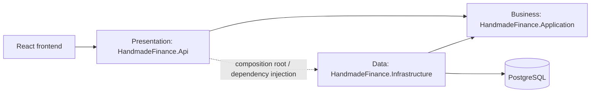

# Cấu trúc thư mục mục tiêu — React và ASP.NET Core

> **Phạm vi:** Bước 5 · **Trạng thái:** Thiết kế, chưa phải mã nguồn đã triển khai  
> **Module chi tiết:** Xác thực (Authentication), khoản thu (Income), khoản chi (Expense)

Tài liệu này xác định nơi đặt mã nguồn và hướng phụ thuộc trước khi viết API. Cấu trúc hiện tại trong `app/` là giao diện mock chạy bằng dữ liệu JavaScript; backend `.NET` chưa tồn tại.

## 1. Nguyên tắc chung

1. Giao diện không chứa quy tắc phân quyền hoặc quy tắc tài chính có tính quyết định.
2. Controller không chứa SQL hoặc nghiệp vụ.
3. Service phụ thuộc repository interface, không phụ thuộc trực tiếp PostgreSQL.
4. Infrastructure triển khai các interface do Application định nghĩa.
5. Tên resource, DTO và endpoint phải được đồng bộ với OpenAPI khi bước 4 hoàn tất.

## 2. Frontend React

### 2.1 Cấu trúc hiện tại

```text
app/src/
├── components/       # Shell và Login
├── lib/              # mock data, store, auth, format, icon, theme
├── pages/            # màn hình và form
├── App.jsx
├── index.css
└── main.jsx
```

`lib/store.jsx` hiện vừa giữ trạng thái (state), vừa thực hiện nghiệp vụ mock. Đây là nguồn dữ liệu tạm thời, không phải lớp gọi API.

### 2.2 Cấu trúc mục tiêu

```text
app/src/
├── app/
│   ├── App.jsx
│   ├── routes.jsx
│   └── providers.jsx
├── assets/
├── components/                    # shared UI components (UI dùng chung)
│   ├── layout/
│   ├── feedback/
│   └── data-display/
├── features/                      # feature modules (module theo nghiệp vụ)
│   ├── auth/
│   │   ├── components/LoginForm.jsx
│   │   ├── hooks/useAuth.js
│   │   ├── services/authService.js
│   │   ├── auth.contracts.js
│   │   └── auth.validation.js
│   ├── incomes/
│   │   ├── components/
│   │   ├── hooks/useIncomes.js
│   │   ├── pages/IncomeListPage.jsx
│   │   ├── services/incomeService.js
│   │   ├── income.contracts.js
│   │   └── income.validation.js
│   └── expenses/
│       ├── components/
│       ├── hooks/useExpenses.js
│       ├── pages/ExpenseListPage.jsx
│       ├── services/expenseService.js
│       ├── expense.contracts.js
│       └── expense.validation.js
├── pages/                         # route-level pages không thuộc một feature
├── services/
│   ├── apiClient.js               # HTTP client, token, error mapping
│   └── endpoints.js
├── hooks/                         # shared hooks (hook dùng chung)
├── lib/                           # hàm thuần: money, date, format
├── styles/
├── test/
│   ├── setup.js
│   └── fixtures/
└── main.jsx
```

### 2.3 Trách nhiệm frontend

| Thư mục | Thuật ngữ tiếng Anh | Trách nhiệm |
|---|---|---|
| `components/` | Shared components | UI dùng lại, không gọi API trực tiếp |
| `features/` | Feature modules | Gom UI, hook, service và contract theo nghiệp vụ |
| `services/` | Infrastructure services | Cấu hình HTTP, token và chuẩn hóa lỗi |
| `*.contracts.js` | Data contracts | JSDoc/schema mô tả request-response theo OpenAPI |
| `hooks/` | Custom hooks | Điều phối trạng thái tải, lỗi và cache phía client |
| `lib/` | Utilities | Hàm thuần, không chứa state hoặc HTTP |

Luồng frontend mục tiêu:

```text
Page/Component → Feature Hook → Feature Service → apiClient → ASP.NET Core API
```

Không chuyển thư mục thật trong bước 5. Việc di chuyển chỉ thực hiện khi bắt đầu tích hợp API để tránh làm hỏng giao diện mock.

## 3. Backend ASP.NET Core ba tầng

### 3.1 Solution mục tiêu

```text
backend/
├── HandmadeFinance.sln
├── src/
│   ├── HandmadeFinance.Api/                 # Presentation layer
│   │   ├── Controllers/
│   │   │   ├── AuthController.cs
│   │   │   ├── IncomesController.cs
│   │   │   └── ExpensesController.cs
│   │   ├── Contracts/
│   │   │   ├── Auth/
│   │   │   ├── Incomes/
│   │   │   ├── Expenses/
│   │   │   └── Common/
│   │   ├── Middleware/
│   │   │   ├── ExceptionHandlingMiddleware.cs
│   │   │   └── RequestContextMiddleware.cs
│   │   ├── Mapping/
│   │   ├── Authorization/
│   │   ├── Program.cs
│   │   └── appsettings.json
│   ├── HandmadeFinance.Application/         # Application/Business layer
│   │   ├── Abstractions/
│   │   │   ├── Authentication/
│   │   │   │   ├── IAuthService.cs
│   │   │   │   ├── IPasswordHasher.cs
│   │   │   │   └── ITokenIssuer.cs
│   │   │   ├── Persistence/
│   │   │   │   ├── IUserRepository.cs
│   │   │   │   ├── IIncomeRepository.cs
│   │   │   │   ├── IExpenseRepository.cs
│   │   │   │   ├── IAuditLogRepository.cs
│   │   │   │   └── IUnitOfWork.cs
│   │   │   └── Time/
│   │   ├── Authentication/
│   │   │   ├── AuthService.cs
│   │   │   └── AuthResult.cs
│   │   ├── Incomes/
│   │   │   ├── Income.cs
│   │   │   ├── IIncomeService.cs
│   │   │   ├── IncomeService.cs
│   │   │   ├── IncomePolicy.cs
│   │   │   ├── IncomeValidator.cs
│   │   │   └── IncomeQuery.cs
│   │   ├── Expenses/
│   │   │   ├── Expense.cs
│   │   │   ├── IExpenseService.cs
│   │   │   ├── ExpenseService.cs
│   │   │   ├── ExpensePolicy.cs
│   │   │   ├── ExpenseValidator.cs
│   │   │   └── ExpenseQuery.cs
│   │   └── Common/
│   │       ├── ActorContext.cs
│   │       ├── PagedResult.cs
│   │       └── ApplicationException.cs
│   └── HandmadeFinance.Infrastructure/      # Infrastructure/Data layer
│       ├── Authentication/
│       │   ├── PasswordHasher.cs
│       │   └── JwtTokenIssuer.cs
│       ├── Persistence/
│       │   ├── ShopFinanceDbContext.cs
│       │   ├── Configurations/
│       │   └── Transactions/
│       ├── Repositories/
│       │   ├── UserRepository.cs
│       │   ├── IncomeRepository.cs
│       │   ├── ExpenseRepository.cs
│       │   └── AuditLogRepository.cs
│       └── DependencyInjection.cs
└── tests/
    ├── HandmadeFinance.Application.Tests/   # unit tests (kiểm thử đơn vị)
    │   ├── Authentication/
    │   ├── Incomes/
    │   └── Expenses/
    └── HandmadeFinance.Api.Tests/           # integration tests (kiểm thử tích hợp)
        ├── Authentication/
        ├── Incomes/
        └── Expenses/
```

### 3.2 Trách nhiệm ba tầng

| Tầng | Tiếng Anh | Được làm | Không được làm |
|---|---|---|---|
| `Api` | Presentation layer | HTTP, model binding, authentication middleware, DTO mapping, status code | SQL, tính thuế, quyết định quyền sở hữu |
| `Application` | Application/Business layer | Use case, validation, RBAC, own-record policy, entity, repository interface | ASP.NET HTTP objects, PostgreSQL driver |
| `Infrastructure` | Infrastructure/Data layer | EF Core/SQL, PostgreSQL mapping, password hash, token implementation, transaction | Quyết định nghiệp vụ hoặc HTTP response |

### 3.3 Hướng phụ thuộc



- `Application` không tham chiếu `Api` hoặc `Infrastructure`.
- `Infrastructure` triển khai `IUserRepository`, `IIncomeRepository`, `IExpenseRepository`, `IAuditLogRepository`.
- `Api/Program.cs` là composition root (điểm lắp ghép phụ thuộc), đăng ký implementation bằng dependency injection (tiêm phụ thuộc).

## 4. Mapping từ C3 sang thư mục

| C3 component | Vị trí chính |
|---|---|
| HTTP API | `HandmadeFinance.Api/Controllers`, `Contracts`, `Middleware` |
| Identity & Access | `Application/Authentication`, `Api/Authorization`, `Infrastructure/Authentication` |
| Income & Expense | `Application/Incomes`, `Application/Expenses` |
| Audit Log | App ghi `LOGIN` qua `IAuditLogRepository`; PostgreSQL trigger ghi DML của Income/Expense |
| Persistence | `Infrastructure/Persistence`, `Infrastructure/Repositories` |

## 5. Quy ước tên

- Controller dùng danh từ số nhiều: `IncomesController`, `ExpensesController`.
- Entity dùng số ít: `Income`, `Expense`.
- Request/response DTO dùng hậu tố rõ ràng: `CreateIncomeRequest`, `IncomeResponse`.
- Repository interface bắt đầu bằng `I`: `IIncomeRepository`.
- Income/Expense Service không chèn trực tiếp audit DML; `IUnitOfWork` đặt `app.current_user_id`, còn PostgreSQL trigger ghi `INSERT/UPDATE/DELETE` trong cùng transaction.
- Endpoint dự kiến có version: `/api/v1/...`; đây là provisional contract (hợp đồng tạm thời) cho tới khi có OpenAPI 3.0.
- Cột SQL dùng `snake_case`; C# dùng `PascalCase`; JSON dùng `camelCase`.

## 6. Phạm vi triển khai sau này

Bước 5 chỉ chốt cấu trúc. Chưa tạo solution `.NET`, chưa di chuyển frontend và chưa viết API. Bước 7 sẽ tạo mã nguồn theo cấu trúc này sau khi OpenAPI và sơ đồ chi tiết đã được duyệt.
