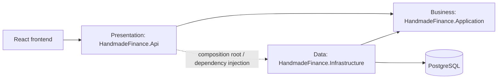

# Target Folder Structure — React and ASP.NET Core

> **Scope:** Step 5 · **Status:** Design only; not implemented source code  
> **Detailed modules:** All HandmadeFinance V1 capabilities

This document defines source-code locations and dependency directions before the API is implemented. The current `app/` directory is a mock interface backed by JavaScript data; the `.NET` backend does not exist yet.

## 1. General Principles

1. The UI does not contain authoritative authorization or financial rules.
2. Controllers contain neither SQL nor business logic.
3. Services depend on repository interfaces, not directly on PostgreSQL.
4. Infrastructure implements interfaces defined by Application.
5. Resource, DTO, and endpoint names must follow the [OpenAPI contract](api/openapi.yaml).

## 2. Frontend React

### 2.1 Current Structure

```text
app/src/
├── components/       # Shell and Login
├── lib/              # mock data, store, auth, formatting, icons, theme
├── pages/            # screens and forms
├── App.jsx
├── index.css
└── main.jsx
```

`lib/store.jsx` currently holds state and performs mock business operations. It is a temporary data source, not an API access layer.

### 2.2 Target Structure

```text
app/src/
├── app/
│   ├── App.jsx
│   ├── routes.jsx
│   └── providers.jsx
├── assets/
├── components/                    # shared UI components
│   ├── layout/
│   ├── feedback/
│   └── data-display/
├── features/                      # business feature modules
│   ├── auth/
│   │   ├── components/LoginForm.jsx
│   │   ├── hooks/useAuth.js
│   │   ├── services/authService.js
│   │   ├── auth.contracts.js
│   │   └── auth.validation.js
│   ├── incomes/
│   │   ├── components/
│   │   ├── hooks/useIncomes.js
│   │   ├── pages/IncomeListPage.jsx
│   │   ├── services/incomeService.js
│   │   ├── income.contracts.js
│   │   └── income.validation.js
│   └── expenses/
│       ├── components/
│       ├── hooks/useExpenses.js
│       ├── pages/ExpenseListPage.jsx
│       ├── services/expenseService.js
│       ├── expense.contracts.js
│       └── expense.validation.js
├── pages/                         # route-level pages outside a specific feature
├── services/
│   ├── apiClient.js               # HTTP client, token, error mapping
│   └── endpoints.js
├── hooks/                         # shared hooks
├── lib/                           # pure functions: money, date, formatting
├── styles/
├── test/
│   ├── setup.js
│   └── fixtures/
└── main.jsx
```

### 2.3 Frontend Responsibilities

| Directory | Term | Responsibility |
|---|---|---|
| `components/` | Shared components | Reusable UI that does not call APIs directly |
| `features/` | Feature modules | Groups UI, hooks, services, and contracts by business feature |
| `services/` | Infrastructure services | HTTP and token configuration plus normalized errors |
| `*.contracts.js` | Data contracts | JSDoc/schema descriptions of OpenAPI requests and responses |
| `hooks/` | Custom hooks | Coordinates client loading, error, and cache state |
| `lib/` | Utilities | Pure functions with no state or HTTP access |

Target frontend flow:

```text
Page/Component → Feature Hook → Feature Service → apiClient → ASP.NET Core API
```

No physical directories are moved in Step 5. Migration begins with API integration to avoid breaking the mock UI.

### 2.4 Complete Feature Inventory

Every target feature follows `components/`, `hooks/`, `pages/`, `services/`, `*.contracts.js`, and `*.validation.js` where those responsibilities apply.

```text
app/src/features/
├── auth/           # Login/logout, auth context, route and role guards
├── dashboard/      # KPI cards, charts, recent transactions, date filters
├── categories/     # Income/expense category lookup hooks
├── incomes/        # List, detail, create/edit, delete, attachments
├── expenses/       # List, detail, create/edit, delete, attachments
├── reports/        # Report filters, charts, PDF/XLSX export
├── imports/        # File selection, preview, processing, history/status
├── audit/          # Filtered and paginated audit log
├── users/          # Admin list, create/edit, activate/disable
└── profile/        # Account, password, read-only permission matrix
```

Shared code is limited to code used by at least two features:

```text
app/src/
├── components/
│   ├── layout/          # AppShell, Sidebar, Topbar, ProtectedLayout
│   ├── forms/           # Field, FormError, FilePicker
│   ├── feedback/        # Alert, EmptyState, ErrorState, LoadingSkeleton
│   └── data-display/    # DataTable, Pagination, Money, StatusBadge
├── services/
│   ├── apiClient.js     # base URL, Bearer token, ProblemDetails mapping
│   ├── endpoints.js     # OpenAPI path constants
│   └── fileDownload.js
├── hooks/               # useDebounce, usePagination, useAsyncAction
├── lib/                 # date, USD money, display conversion, validation helpers
└── test/
    ├── setup.js
    ├── fixtures/
    ├── handlers/        # API mocks by operationId
    └── renderWithProviders.jsx
```

Feature code may depend on shared code; shared code must not import a feature. A feature service is the only code in that feature allowed to call `apiClient`.

## 3. Three-Tier ASP.NET Core Backend

### 3.1 Target Solution

```text
backend/
├── HandmadeFinance.sln
├── src/
│   ├── HandmadeFinance.Api/                 # Presentation layer
│   │   ├── Controllers/
│   │   │   ├── AuthController.cs
│   │   │   ├── IncomesController.cs
│   │   │   └── ExpensesController.cs
│   │   ├── Contracts/
│   │   │   ├── Auth/
│   │   │   ├── Incomes/
│   │   │   ├── Expenses/
│   │   │   └── Common/
│   │   ├── Middleware/
│   │   │   ├── ExceptionHandlingMiddleware.cs
│   │   │   └── RequestContextMiddleware.cs
│   │   ├── Mapping/
│   │   ├── Authorization/
│   │   ├── Program.cs
│   │   └── appsettings.json
│   ├── HandmadeFinance.Application/         # Application/Business layer
│   │   ├── Abstractions/
│   │   │   ├── Authentication/
│   │   │   │   ├── IAuthService.cs
│   │   │   │   ├── IPasswordHasher.cs
│   │   │   │   └── ITokenIssuer.cs
│   │   │   ├── Persistence/
│   │   │   │   ├── IUserRepository.cs
│   │   │   │   ├── IIncomeRepository.cs
│   │   │   │   ├── IExpenseRepository.cs
│   │   │   │   ├── IAuditLogRepository.cs
│   │   │   │   └── IUnitOfWork.cs
│   │   │   └── Time/
│   │   ├── Authentication/
│   │   │   ├── AuthService.cs
│   │   │   └── AuthResult.cs
│   │   ├── Incomes/
│   │   │   ├── Income.cs
│   │   │   ├── IIncomeService.cs
│   │   │   ├── IncomeService.cs
│   │   │   ├── IncomePolicy.cs
│   │   │   ├── IncomeValidator.cs
│   │   │   └── IncomeQuery.cs
│   │   ├── Expenses/
│   │   │   ├── Expense.cs
│   │   │   ├── IExpenseService.cs
│   │   │   ├── ExpenseService.cs
│   │   │   ├── ExpensePolicy.cs
│   │   │   ├── ExpenseValidator.cs
│   │   │   └── ExpenseQuery.cs
│   │   └── Common/
│   │       ├── ActorContext.cs
│   │       ├── PagedResult.cs
│   │       └── ApplicationException.cs
│   └── HandmadeFinance.Infrastructure/      # Infrastructure/Data layer
│       ├── Authentication/
│       │   ├── PasswordHasher.cs
│       │   └── JwtTokenIssuer.cs
│       ├── Persistence/
│       │   ├── ShopFinanceDbContext.cs
│       │   ├── Configurations/
│       │   └── Transactions/
│       ├── Repositories/
│       │   ├── UserRepository.cs
│       │   ├── IncomeRepository.cs
│       │   ├── ExpenseRepository.cs
│       │   └── AuditLogRepository.cs
│       └── DependencyInjection.cs
└── tests/
    ├── HandmadeFinance.Application.Tests/   # unit tests
    │   ├── Authentication/
    │   ├── Incomes/
    │   └── Expenses/
    └── HandmadeFinance.Api.Tests/           # integration tests
        ├── Authentication/
        ├── Incomes/
        └── Expenses/
```

### 3.2 Three-Tier Responsibilities

| Layer | Term | Allowed | Not allowed |
|---|---|---|---|
| `Api` | Presentation layer | HTTP, model binding, authentication middleware, DTO mapping, status codes | SQL, tax calculation, ownership decisions |
| `Application` | Application/Business layer | Use case, validation, RBAC, own-record policy, entity, repository interface | ASP.NET HTTP objects, PostgreSQL driver |
| `Infrastructure` | Infrastructure/Data layer | EF Core/SQL, PostgreSQL mapping, password hashing, token implementation, transactions | Business decisions or HTTP responses |

### 3.3 Dependency Direction



- `Application` does not reference `Api` or `Infrastructure`.
- `Infrastructure` implements `IUserRepository`, `IIncomeRepository`, `IExpenseRepository`, and `IAuditLogRepository`.
- `Api/Program.cs` is the composition root and registers implementations through dependency injection.

### 3.4 Complete Backend Module Inventory

The three projects remain the three tiers. Folders below are mandatory implementation locations for the V1 OpenAPI operations.

```text
backend/src/
├── HandmadeFinance.Api/
│   ├── Controllers/
│   │   ├── AuthController.cs
│   │   ├── DashboardController.cs
│   │   ├── CategoriesController.cs
│   │   ├── IncomesController.cs
│   │   ├── ExpensesController.cs
│   │   ├── ReportsController.cs
│   │   ├── ImportsController.cs
│   │   ├── AttachmentsController.cs
│   │   ├── AuditLogsController.cs
│   │   ├── UsersController.cs
│   │   └── ProfileController.cs
│   ├── Contracts/{Auth,Dashboard,Categories,Incomes,Expenses,Reports,Imports,Attachments,Audit,Users,Profile,Common}/
│   ├── Authorization/        # policies and ActorContext construction
│   ├── Mapping/              # HTTP contract ↔ Application model
│   ├── Middleware/           # ProblemDetails and request context
│   └── OpenApi/              # x-roles and schema configuration
├── HandmadeFinance.Application/
│   ├── Abstractions/
│   │   ├── Authentication/   # hasher and token issuer
│   │   ├── Persistence/      # repositories and unit of work
│   │   ├── Files/            # IFileStorage and IExcelParser
│   │   ├── Reports/          # IReportExporter
│   │   └── Time/             # IClock
│   ├── Authentication/
│   ├── Dashboard/
│   ├── Categories/
│   ├── Incomes/
│   ├── Expenses/
│   ├── Reports/
│   ├── Imports/
│   ├── Attachments/
│   ├── Audit/
│   ├── Users/
│   ├── Profile/
│   └── Common/               # ActorContext, Result, paging, exceptions
└── HandmadeFinance.Infrastructure/
    ├── Authentication/       # PasswordHasher, JwtTokenIssuer
    ├── Persistence/
    │   ├── ShopFinanceDbContext.cs
    │   ├── Configurations/   # one configuration per database entity
    │   ├── Repositories/     # one implementation per repository interface
    │   └── Transactions/     # EfUnitOfWork and audit actor context
    ├── Files/                # LocalFileStorage
    ├── Imports/              # NpoiExcelParser
    ├── Reports/              # PdfReportExporter, XlsxReportExporter
    └── DependencyInjection.cs
```

```text
backend/tests/
├── HandmadeFinance.Application.Tests/
│   ├── Authentication/
│   ├── Dashboard/
│   ├── Categories/
│   ├── Incomes/
│   ├── Expenses/
│   ├── Reports/
│   ├── Imports/
│   ├── Attachments/
│   ├── Audit/
│   ├── Users/
│   └── Profile/
├── HandmadeFinance.Api.Tests/       # authorization, binding, status, ProblemDetails
└── HandmadeFinance.Infrastructure.Tests/ # PostgreSQL mapping, triggers, transactions
```

Unit tests isolate Application services with fake/mock abstractions. API tests use a test host. Infrastructure tests use a real disposable PostgreSQL database so enum, view, constraint, and trigger behavior is verified.

## 4. C3-to-Folder Mapping

| C3 component | Primary location |
|---|---|
| HTTP API | `HandmadeFinance.Api/Controllers`, `Contracts`, `Middleware` |
| Identity & Access | `Application/Authentication`, `Api/Authorization`, `Infrastructure/Authentication` |
| Income & Expense | `Application/Incomes`, `Application/Expenses` |
| Dashboard & Categories | `Application/Dashboard`, `Application/Categories` |
| Reports | `Application/Reports`, `Infrastructure/Reports` |
| Imports & Attachments | `Application/Imports`, `Application/Attachments`, `Infrastructure/Imports`, `Infrastructure/Files` |
| Audit Log | The application writes `LOGIN` through `IAuditLogRepository`; PostgreSQL triggers record Income/Expense DML |
| Users & Profile | `Application/Users`, `Application/Profile`, `Infrastructure/Repositories/UserRepository.cs` |
| Persistence | `Infrastructure/Persistence`, `Infrastructure/Repositories` |

## 5. Naming Conventions

- Controllers use plural nouns: `IncomesController`, `ExpensesController`.
- Entities use singular nouns: `Income`, `Expense`.
- Request/response DTOs use explicit suffixes: `CreateIncomeRequest`, `IncomeResponse`.
- Repository interfaces start with `I`: `IIncomeRepository`.
- Income/Expense services do not insert DML audit records directly; `IUnitOfWork` sets `app.current_user_id`, and PostgreSQL triggers record `INSERT/UPDATE/DELETE` within the same transaction.
- Endpoints are versioned as `/api/v1/...` and defined by the [OpenAPI 3.0.4 contract](api/openapi.yaml).
- SQL columns use `snake_case`; C# uses `PascalCase`; JSON uses `camelCase`.

## 6. Future Implementation Scope

Step 5 defines structure only. The `.NET` solution, frontend migration, and API implementation do not exist yet. Step 7 will create source code according to this structure, the approved [OpenAPI contract](api/openapi.yaml), and the detailed diagrams.
