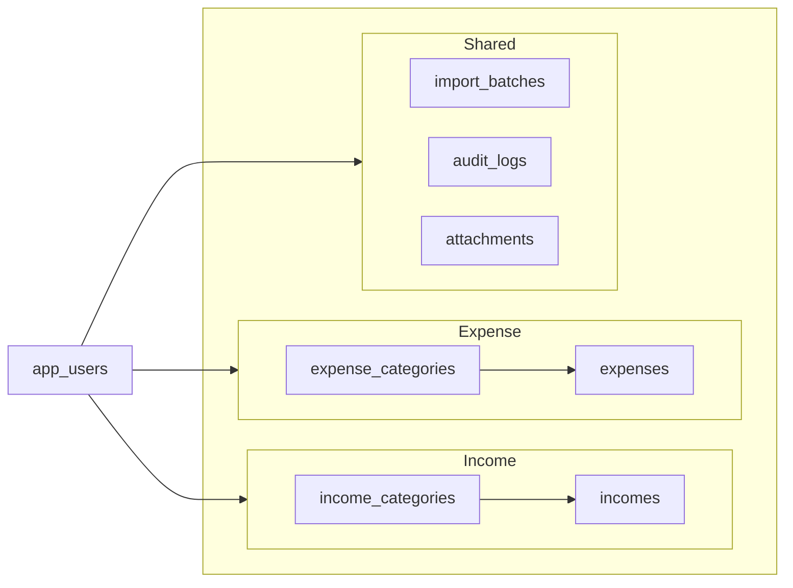
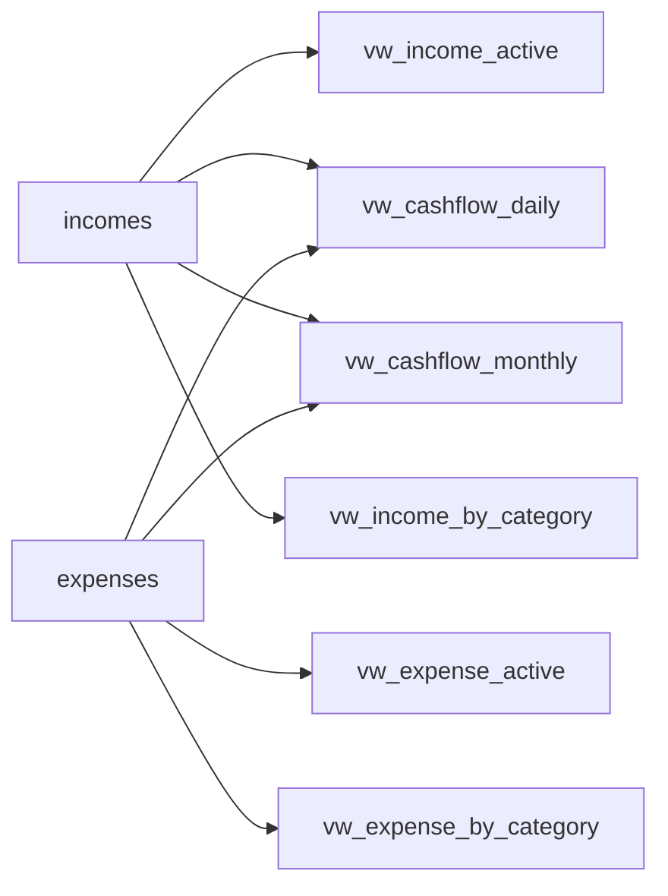
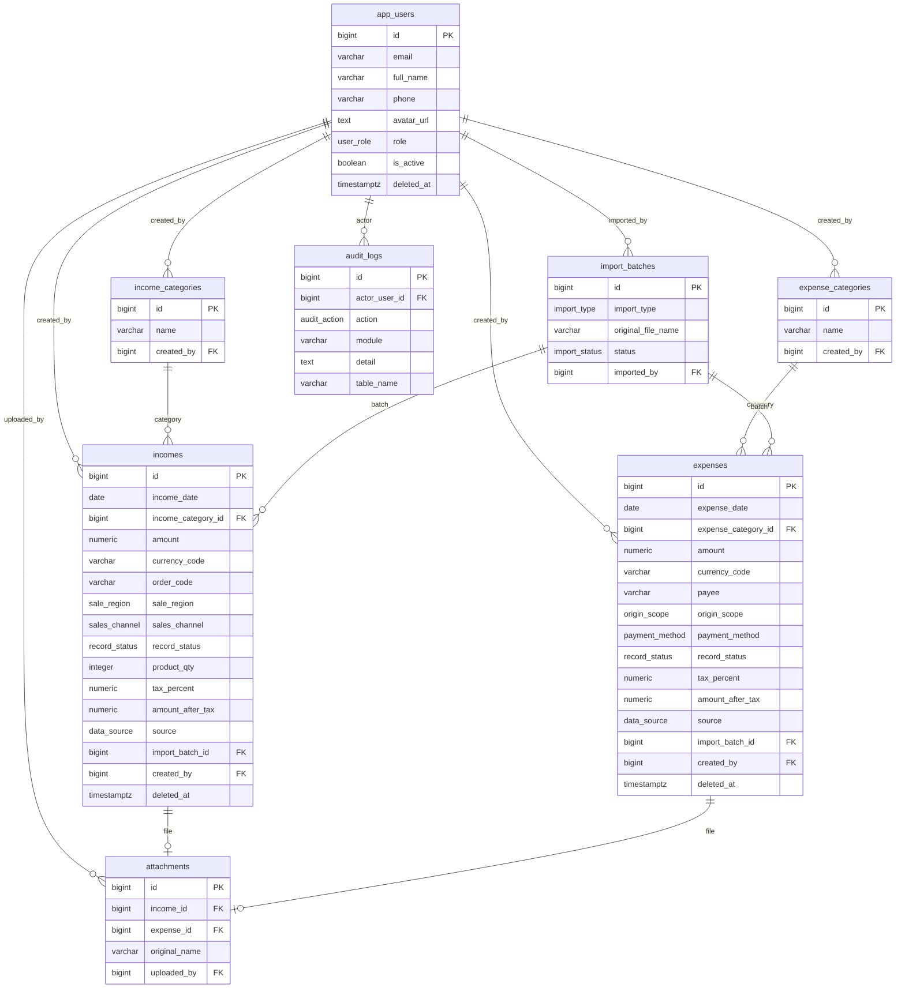

# Data Diagram

PostgreSQL schema `shop_finance` for **HandmadeFinance**.

The interface uses **mock data** aligned with this model (tables, income/expense categories, currency, soft delete, sales channel, payment method, record status). The interface **does not connect** to PostgreSQL.

Design files: [shop_finance.dbml](../database/shop_finance.dbml) · [shop_finance.sql](../database/shop_finance.sql) · [05-data-model.md](05-data-model.md)

## Relationships (tables)

`app_users` is on the left. The three Income / Expense / Shared groups are arranged on the right. Within Income and Expense: category → record. `attachments` is in Shared (an attachment belongs to either an income record or an expense record).

## Enums

| Enum | Values | UI |
|---|---|---|
| `user_role` | ADMIN, SHOP_OWNER, EMPLOYEE, VIEWER | Administrator, Shop Owner, Employee, Viewer |
| `data_source` | MANUAL, EXCEL_IMPORT | Manual / Excel |
| `import_type` | INCOME, EXPENSE | Income / expense |
| `import_status` | PENDING, PROCESSING, COMPLETED, FAILED | Import-batch status |
| `audit_action` | INSERT, UPDATE, DELETE, LOGIN, EXPORT, IMPORT | Audit log |
| `sale_region` | IN_EU, OUTSIDE_EU | Inside EU / Outside EU |
| `origin_scope` | DOMESTIC, INTERNATIONAL | Domestic / International |
| `sales_channel` | ETSY_STORE, WEBSITE_DIRECT, INSTAGRAM_SHOP, LOCAL_MARKET, B2B_WHOLESALE | Sales channel in income detail modal |
| `payment_method` | CREDIT_CARD, BANK_TRANSFER, CASH, PAYPAL | Payment method in expense detail modal |
| `record_status` | DRAFT, PENDING, COMPLETED | Draft / Pending / Completed |

## Views (report aggregates)

Views are **not stored tables**. They read active income/expense records and aggregate by day / month / category. In V1, `currency_code` is always `USD`; EUR conversion happens in the UI.

## Detailed ER diagram (main columns)

