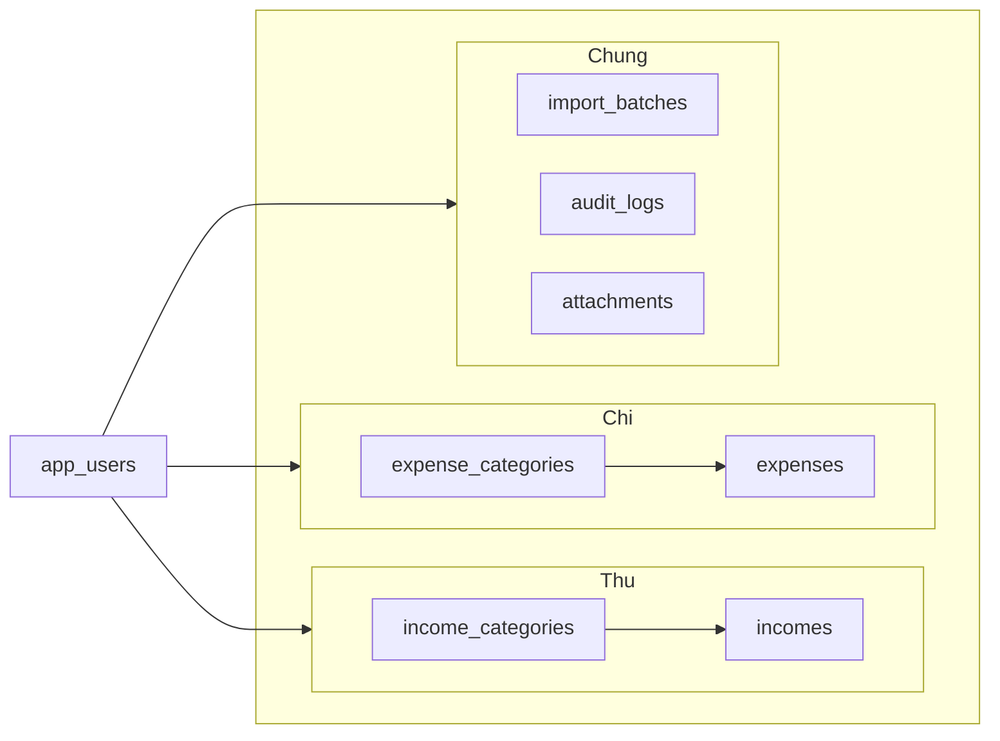
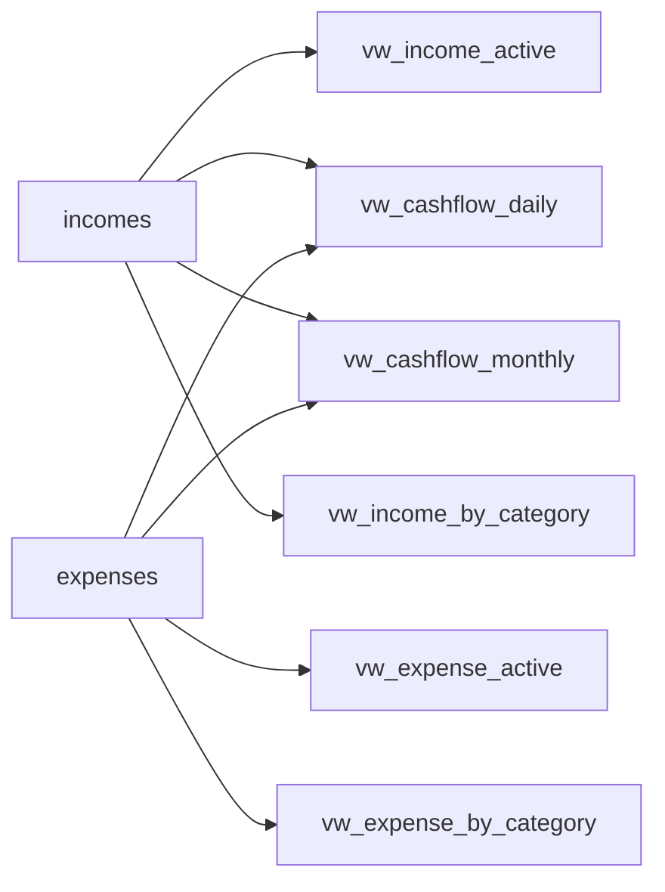
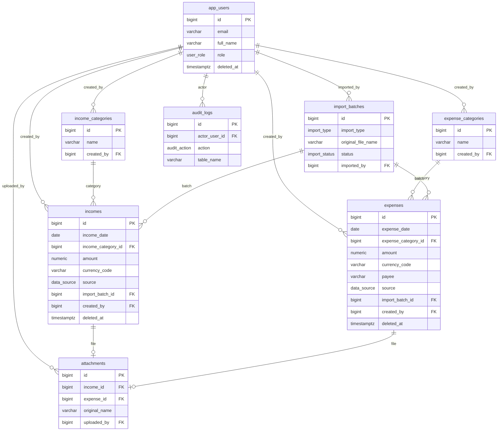

# Sơ đồ dữ liệu

Schema PostgreSQL `shop_finance` cho **Finance Manager**.

Giao diện dùng **dữ liệu giả** bám đúng mô hình này (bảng, loại thu/chi, tiền tệ, xóa mềm). Giao diện **không kết nối** PostgreSQL.

File thiết kế: [shop_finance.dbml](../database/shop_finance.dbml) · [shop_finance.sql](../database/shop_finance.sql) · [05-data-model.md](05-data-model.md)

## Quan hệ (bảng)

`app_users` nằm bên trái. Ba nhóm Thu / Chi / Chung tách cột bên phải. Trong Thu và Chi: loại → khoản. `attachments` nằm ở Chung (chứng từ của khoản thu hoặc khoản chi).

## Enum

| Enum | Giá trị |
|---|---|
| `user_role` | ADMIN, SHOP_OWNER, EMPLOYEE, VIEWER |
| `data_source` | MANUAL, EXCEL_IMPORT |
| `import_type` | INCOME, EXPENSE |
| `import_status` | PENDING, PROCESSING, COMPLETED, FAILED |
| `audit_action` | INSERT, UPDATE, DELETE |

## View (tổng hợp báo cáo)

View **không phải bảng lưu**. Dùng để đọc thu/chi còn hiệu lực và cộng theo ngày / tháng / loại, **tách theo `currency_code`**.

## ER chi tiết (cột chính)

