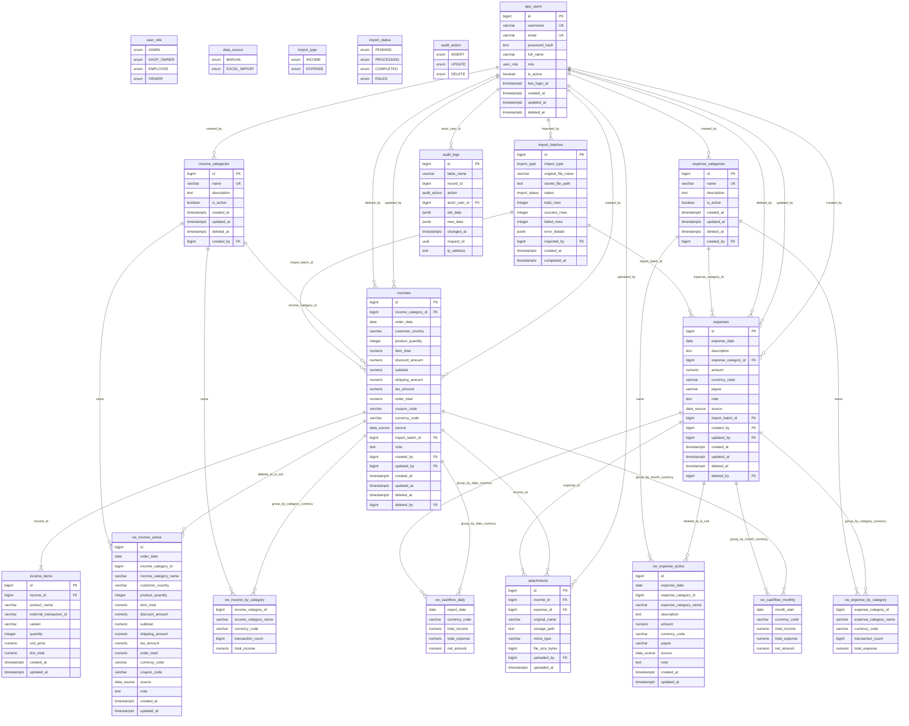

```mermaid
erDiagram
    user_role {
        enum ADMIN
        enum SHOP_OWNER
        enum EMPLOYEE
        enum VIEWER
    }

    data_source {
        enum MANUAL
        enum EXCEL_IMPORT
    }

    import_type {
        enum INCOME
        enum EXPENSE
    }

    import_status {
        enum PENDING
        enum PROCESSING
        enum COMPLETED
        enum FAILED
    }

    audit_action {
        enum INSERT
        enum UPDATE
        enum DELETE
    }

    app_users {
        bigint id PK
        varchar username UK
        varchar email UK
        text password_hash
        varchar full_name
        user_role role
        boolean is_active
        timestamptz last_login_at
        timestamptz created_at
        timestamptz updated_at
        timestamptz deleted_at
    }

    import_batches {
        bigint id PK
        import_type import_type
        varchar original_file_name
        text stored_file_path
        import_status status
        integer total_rows
        integer success_rows
        integer failed_rows
        jsonb error_details
        bigint imported_by FK
        timestamptz created_at
        timestamptz completed_at
    }

    income_categories {
        bigint id PK
        varchar name UK
        text description
        boolean is_active
        timestamptz created_at
        timestamptz updated_at
        timestamptz deleted_at
        bigint created_by FK
    }

    incomes {
        bigint id PK
        bigint income_category_id FK
        date order_date
        varchar customer_country
        integer product_quantity
        numeric item_total
        numeric discount_amount
        numeric subtotal
        numeric shipping_amount
        numeric tax_amount
        numeric order_total
        varchar coupon_code
        varchar currency_code
        data_source source
        bigint import_batch_id FK
        text note
        bigint created_by FK
        bigint updated_by FK
        timestamptz created_at
        timestamptz updated_at
        timestamptz deleted_at
        bigint deleted_by FK
    }

    income_items {
        bigint id PK
        bigint income_id FK
        varchar product_name
        varchar external_transaction_id
        varchar variant
        integer quantity
        numeric unit_price
        numeric line_total
        timestamptz created_at
        timestamptz updated_at
    }

    expense_categories {
        bigint id PK
        varchar name UK
        text description
        boolean is_active
        timestamptz created_at
        timestamptz updated_at
        timestamptz deleted_at
        bigint created_by FK
    }

    expenses {
        bigint id PK
        date expense_date
        text description
        bigint expense_category_id FK
        numeric amount
        varchar currency_code
        varchar payee
        text note
        data_source source
        bigint import_batch_id FK
        bigint created_by FK
        bigint updated_by FK
        timestamptz created_at
        timestamptz updated_at
        timestamptz deleted_at
        bigint deleted_by FK
    }

    attachments {
        bigint id PK
        bigint income_id FK
        bigint expense_id FK
        varchar original_name
        text storage_path
        varchar mime_type
        bigint file_size_bytes
        bigint uploaded_by FK
        timestamptz uploaded_at
    }

    audit_logs {
        bigint id PK
        varchar table_name
        bigint record_id
        audit_action action
        bigint actor_user_id FK
        jsonb old_data
        jsonb new_data
        timestamptz changed_at
        uuid request_id
        inet ip_address
    }

    vw_income_active {
        bigint id
        date order_date
        bigint income_category_id
        varchar income_category_name
        varchar customer_country
        integer product_quantity
        numeric item_total
        numeric discount_amount
        numeric subtotal
        numeric shipping_amount
        numeric tax_amount
        numeric order_total
        varchar currency_code
        varchar coupon_code
        data_source source
        text note
        timestamptz created_at
        timestamptz updated_at
    }

    vw_expense_active {
        bigint id
        date expense_date
        bigint expense_category_id
        varchar expense_category_name
        text description
        numeric amount
        varchar currency_code
        varchar payee
        data_source source
        text note
        timestamptz created_at
        timestamptz updated_at
    }

    vw_cashflow_daily {
        date report_date
        varchar currency_code
        numeric total_income
        numeric total_expense
        numeric net_amount
    }

    vw_cashflow_monthly {
        date month_start
        varchar currency_code
        numeric total_income
        numeric total_expense
        numeric net_amount
    }

    vw_income_by_category {
        bigint income_category_id
        varchar income_category_name
        varchar currency_code
        bigint transaction_count
        numeric total_income
    }

    vw_expense_by_category {
        bigint expense_category_id
        varchar expense_category_name
        varchar currency_code
        bigint transaction_count
        numeric total_expense
    }

    app_users ||--o{ import_batches : imported_by
    app_users ||--o{ income_categories : created_by
    app_users ||--o{ expense_categories : created_by
    app_users ||--o{ incomes : created_by
    app_users ||--o{ incomes : updated_by
    app_users ||--o{ incomes : deleted_by
    app_users ||--o{ expenses : created_by
    app_users ||--o{ expenses : updated_by
    app_users ||--o{ expenses : deleted_by
    app_users ||--o{ attachments : uploaded_by
    app_users ||--o{ audit_logs : actor_user_id

    income_categories ||--o{ incomes : income_category_id
    incomes ||--|{ income_items : income_id
    incomes ||--o{ attachments : income_id
    import_batches ||--o{ incomes : import_batch_id

    expense_categories ||--o{ expenses : expense_category_id
    expenses ||--o{ attachments : expense_id
    import_batches ||--o{ expenses : import_batch_id

    incomes ||--o{ vw_income_active : deleted_at_is_null
    income_categories ||--o{ vw_income_active : name
    expenses ||--o{ vw_expense_active : deleted_at_is_null
    expense_categories ||--o{ vw_expense_active : name
    incomes ||--o{ vw_cashflow_daily : group_by_date_currency
    expenses ||--o{ vw_cashflow_daily : group_by_date_currency
    incomes ||--o{ vw_cashflow_monthly : group_by_month_currency
    expenses ||--o{ vw_cashflow_monthly : group_by_month_currency
    incomes ||--o{ vw_income_by_category : group_by_category_currency
    income_categories ||--o{ vw_income_by_category : name
    expenses ||--o{ vw_expense_by_category : group_by_category_currency
    expense_categories ||--o{ vw_expense_by_category : name
```
