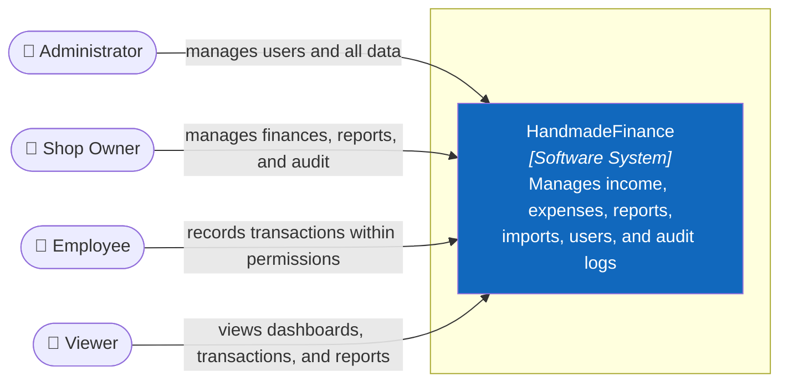

# 3. Context and Scope

## 3.1 Business context — C4 Level 1

For C4 details and conventions, see [C1 — System Context](../c4/01-system-context.md).

## 3.2 Business Scope

| Inside HandmadeFinance | Outside V1 scope |
|---|---|
| Login, RBAC, profiles | Real OAuth/OIDC |
| Income, expenses, categories | Inventory, SKU, CRM |
| Dashboards and reports | Double-entry accounting, tax filing |
| Excel import, attachment metadata | Marketplace/payment integration |
| Users and audit logs | ERP, electronic invoicing |

## 3.3 Business interfaces

| Actor | Input | Output |
|---|---|---|
| Admin | Users, transactions, status configuration | All data and audit records |
| Shop Owner | Transactions, filters, import files | Dashboards, reports, and audit records |
| Employee | Own transactions and import files | Lists and dashboards |
| Viewer | Read-only filters | Dashboards, lists, and reports |

## 3.4 Technical context

In the target architecture, users access React Web over HTTPS; the Web calls the .NET Backend through REST/JSON; the Backend uses the PostgreSQL protocol/SQL. There is no Frontend → Database connection.

## 3.5 Status boundary

The React mock currently keeps data in JavaScript and sessions in Web Storage. The .NET Backend and PostgreSQL connection are target designs, not running components.
