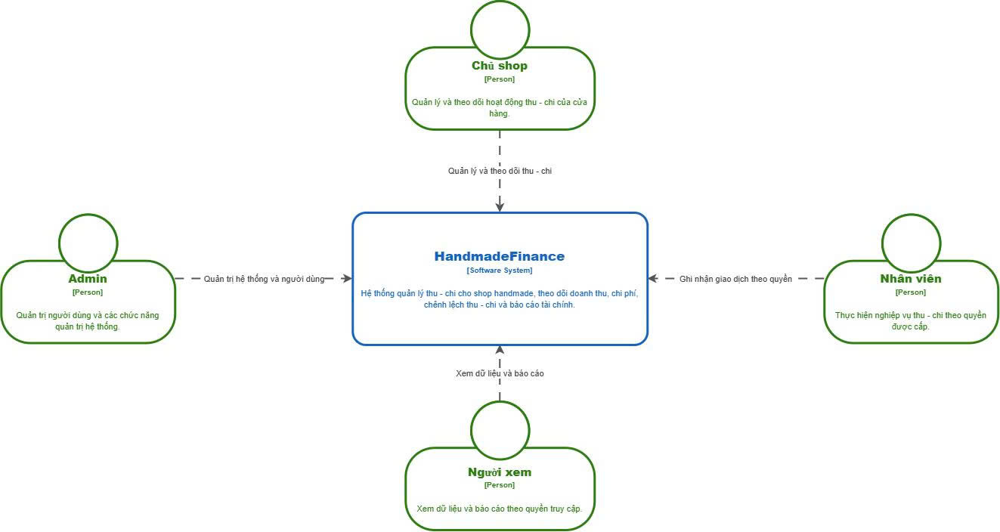
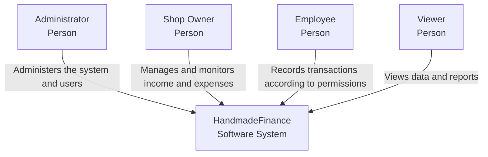

# 3. Context and Scope

Who uses HandmadeFinance, where is the system boundary, and are there any external systems?

## 3.1 Business Context

HandmadeFinance helps a handmade shop record income and expenses and view aggregates. Business boundary: money in / money out / internal reporting. Outside the boundary: inventory, SKUs, payment gateways, e-commerce marketplaces, ERP.

## 3.2 System Context

Four **Persons** use one **Software System**. V1 has no External Software System.





## 3.3 People

| Role | Display name | Relationship |
| ---- | ------------ | ------------ |
| `ADMIN` | Administrator | Administers the system and users |
| `SHOP_OWNER` | Shop Owner | Manages and monitors income and expenses |
| `EMPLOYEE` | Employee | Records transactions according to permissions |
| `VIEWER` | Viewer | Views data and reports |

All users access the system through the **React.js Web Frontend** (Section 5).

## 3.4 System Boundary

**Inside:** login, dashboard, income/expenses, categories, reports, Excel import, attachments (metadata), audit log, users, profile, authorization.

**Outside:** four Persons; manual shop processes; third-party software not included in V1.

## 3.5 External Systems

V1 **does not require** an External Software System.

There is no Etsy API, payment gateway, email service, or ERP in the context.

USD→EUR exchange-rate source: **To Be Determined** ([Section 11](11-risks-and-technical-debt.md)).

Attachment storage: PostgreSQL stores only `storage_path`; the **actual file storage location** is To Be Determined.

## 3.6 Technical Context

```text
User (browser)
  → React.js Web Frontend
  → HTTPS / REST / JSON
  → Go Backend
  → SQL
  → PostgreSQL
```

Runtime building-block details: [05-building-block-view.md](05-building-block-view.md).
