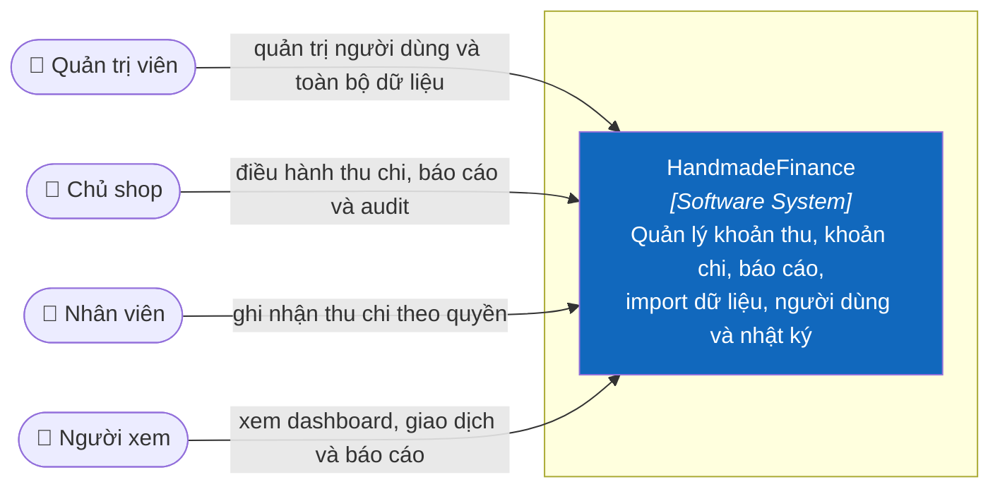

# 3. Context and Scope

## 3.1 Business context — C4 Level 1

Chi tiết và quy ước C4: [C1 — System Context](../c4/01-system-context.md).

## 3.2 Phạm vi nghiệp vụ

| Trong HandmadeFinance | Ngoài phạm vi V1 |
|---|---|
| Đăng nhập, RBAC, hồ sơ | Real OAuth/OIDC |
| Khoản thu, khoản chi, danh mục | Tồn kho, SKU, CRM |
| Dashboard và báo cáo | Kế toán kép, khai thuế |
| Import Excel, attachment metadata | Marketplace/payment integration |
| Người dùng và audit log | ERP, hóa đơn điện tử |

## 3.3 Business interfaces

| Actor | Input | Output |
|---|---|---|
| Admin | Người dùng, giao dịch, cấu hình trạng thái | Toàn bộ dữ liệu và audit |
| Chủ shop | Giao dịch, bộ lọc, file import | Dashboard, báo cáo, audit |
| Nhân viên | Giao dịch của mình, file import | Danh sách và dashboard |
| Người xem | Bộ lọc xem dữ liệu | Dashboard, danh sách, báo cáo |

## 3.4 Technical context

Ở kiến trúc đích, người dùng truy cập React Web qua HTTPS; Web gọi .NET Backend bằng REST/JSON; Backend dùng PostgreSQL protocol/SQL. Không có kết nối Frontend → Database.

## 3.5 Status boundary

React mock hiện giữ dữ liệu trong JavaScript và phiên trong Web Storage. .NET Backend và kết nối PostgreSQL là thiết kế đích, không phải thành phần đã chạy.
