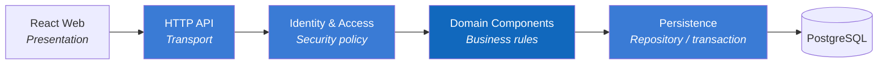

# 4. Solution Strategy

## 4.1 Chiến lược trong một câu

Tách UI, nghiệp vụ và lưu trữ thành `React Web → .NET modular monolith → PostgreSQL`, dùng backend làm trust boundary và dùng một mô hình nghiệp vụ chung cho thao tác tay lẫn import.

## 4.2 Mapping mục tiêu → giải pháp

| Mục tiêu | Chiến lược |
|---|---|
| UI dễ thay đổi | React giữ presentation, routing và client state |
| Dữ liệu tin cậy | .NET Backend kiểm tra input, permission và business rule |
| Triển khai ban đầu đơn giản | Một .NET modular monolith thay vì microservices |
| Báo cáo nhất quán | Reporting đọc cùng nguồn PostgreSQL với giao dịch |
| Truy vết thay đổi | Soft delete và Audit Log component |
| Không nhân đôi quy tắc | Import gọi Income & Expense component |
| Tiền tệ nhất quán | Lưu USD; EUR chỉ quy đổi hiển thị |

## 4.3 Dependency direction

Transport không chứa SQL; Persistence không quyết định quyền; Frontend không phải security boundary.

## 4.4 Quyết định chưa khóa

ASP.NET Core Controllers/Minimal APIs, JWT hay server session, Entity Framework Core, Dapper hoặc ADO.NET, object storage và nền tảng production đều là TBD. Không đưa chúng vào sơ đồ baseline như sự thật đã quyết định.
