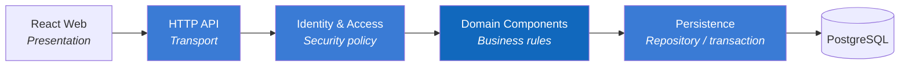

# 4. Solution Strategy

## 4.1 Strategy in One Sentence

Separate UI, business logic, and storage as `React Web → .NET modular monolith → PostgreSQL`, use the backend as the trust boundary, and apply one business model to both manual operations and imports.

## 4.2 Goal-to-Solution Mapping

| Goal | Strategy |
|---|---|
| Changeable UI | React owns presentation, routing, and client state |
| Trustworthy data | The .NET Backend validates input, permissions, and business rules |
| Simple initial deployment | One .NET modular monolith instead of microservices |
| Consistent reporting | Reporting reads the same PostgreSQL source as transactions |
| Traceable changes | Soft deletion and the Audit Log component |
| No duplicated rules | Import calls the Income & Expense component |
| Consistent currency | Store USD; convert to EUR for display only |

## 4.3 Dependency Direction

Transport contains no SQL; Persistence makes no authorization decisions; the Frontend is not a security boundary.

## 4.4 Step 7 Technology Decisions

The API uses ASP.NET Core attribute Controllers, JWT Bearer access tokens, Entity Framework Core with Npgsql, ASP.NET Core password hashing, NPOI for `.xls`/`.xlsx`, and an `IFileStorage` abstraction with local storage for development. Production hosting, managed storage, backups, exchange-rate provider, and centralized monitoring remain deployment decisions.
