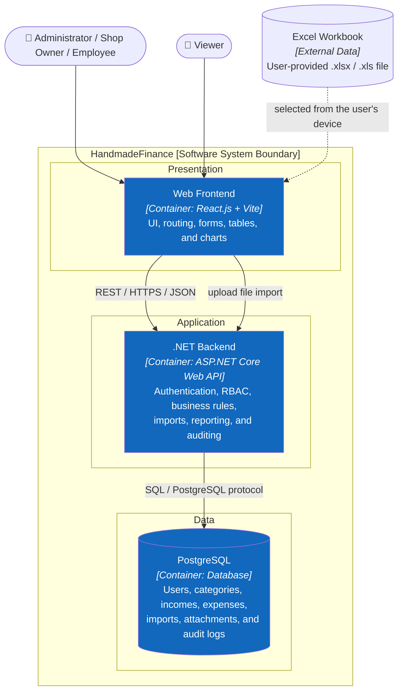
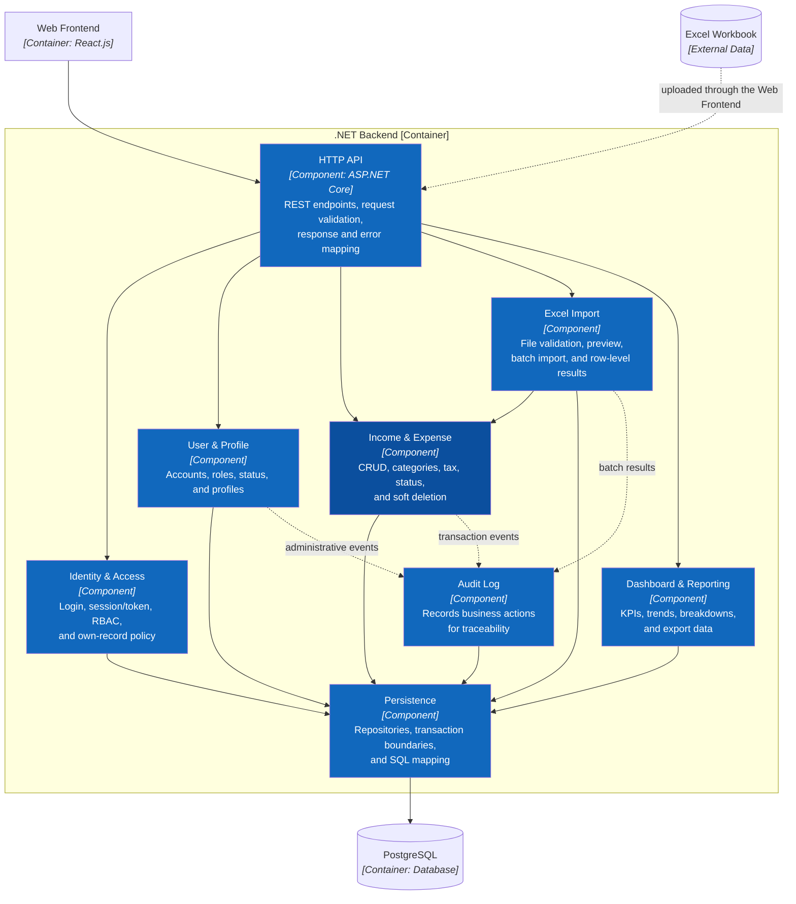

# 5. Building Block View

This section is aligned with C4: Level 1 represents the whole system, Level 2 shows Containers, and Level 3 zooms into the .NET Backend.

## 5.1 Level 1 — HandmadeFinance

HandmadeFinance is a software system serving four roles: Administrator, Shop Owner, Employee, and Viewer. See [C1 System Context](../c4/01-system-context.md).

## 5.2 Level 2 — Containers

| Container | Public surface | Owned data |
|---|---|---|
| Web Frontend | Hash routes, forms, tables, charts | Temporary client/session state |
| .NET Backend | REST/JSON endpoints | Business rules and transaction orchestration |
| PostgreSQL | Backend access only | Users, categories, incomes, expenses, imports, attachments, audits |

## 5.3 Level 3 — .NET Backend Components

| Component | Responsibility | API usage |
|---|---|---|
| HTTP API | Parse/validate requests and map responses/errors | All use-case endpoints |
| Identity & Access | Login, credentials/session, RBAC, own-record policy | Login and every protected endpoint |
| User & Profile | User lifecycle and profile | Users, profile |
| Income & Expense | CRUD, category, tax, status, soft delete | Incomes, expenses |
| Excel Import | Validate/preview/process batch | Import |
| Dashboard & Reporting | KPI, time series, category aggregate, export model | Dashboard, reports |
| Audit Log | Append traceable actions | Audit queries; receives internal events |
| Persistence | Repositories, transactions, and SQL mapping | Used internally by other components |

## 5.4 UI-to-Component Mapping

| UI | Primary component |
|---|---|
| Login and route permissions | Identity & Access |
| User and profile management | User & Profile |
| Income and expense management | Income & Expense |
| Import Excel | Excel Import + Income & Expense |
| Dashboard and reports | Dashboard & Reporting |
| Activity log | Audit Log |

## 5.5 Dependency Rules

1. The HTTP API orchestrates only and writes no SQL.
2. Import does not bypass Income & Expense validation.
3. Audit records are written in the same business transaction when consistency is required.
4. Reporting does not modify transactions.
5. Only Persistence communicates with PostgreSQL.

Complete C3 diagram: [C3 — Component](../c4/03-component.md).

## 5.6 Level 4 — Two Core Features

The code-level target for `Income Management` and `Expense Management` is described with ASP.NET Core Controllers, Services, Policies, Validators, Domain Entities, and Repositories in [C4 Level 4](../c4/04-code.md). This is a target design; no C# source exists yet for implementation comparison.
