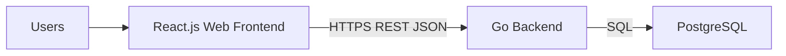
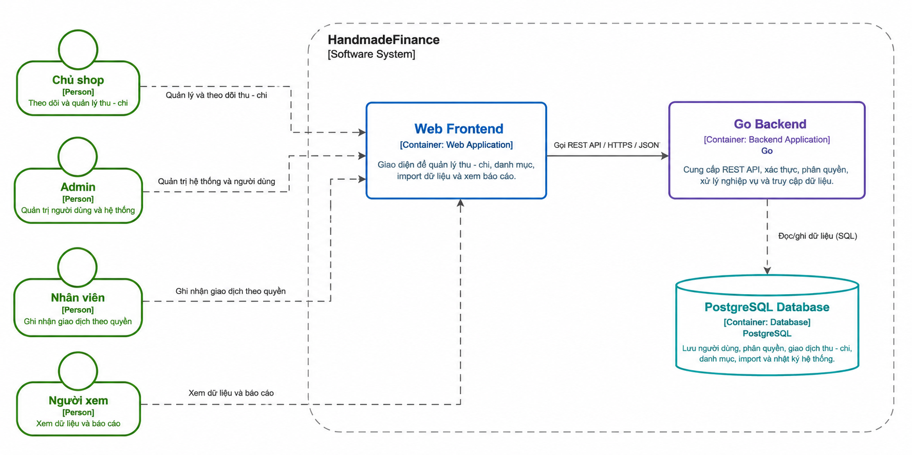
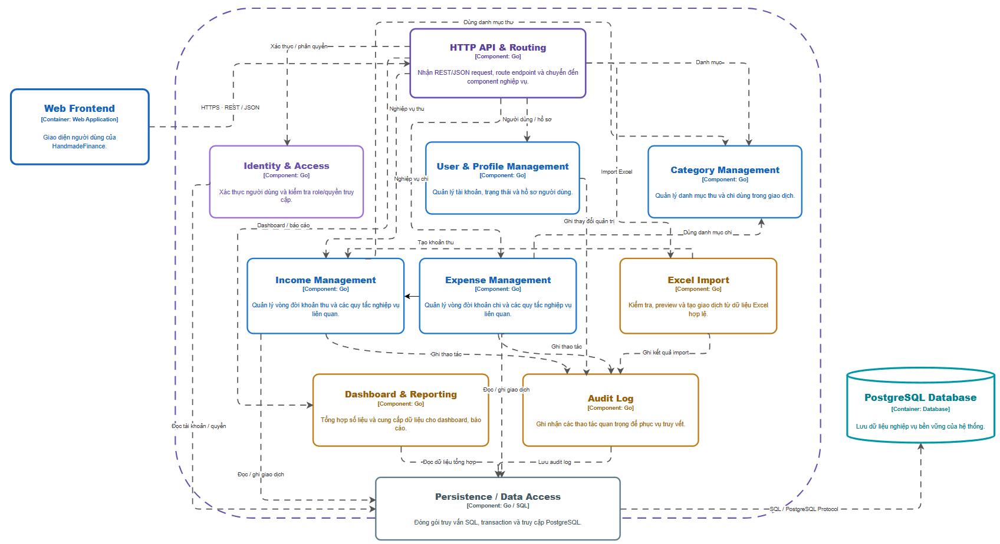
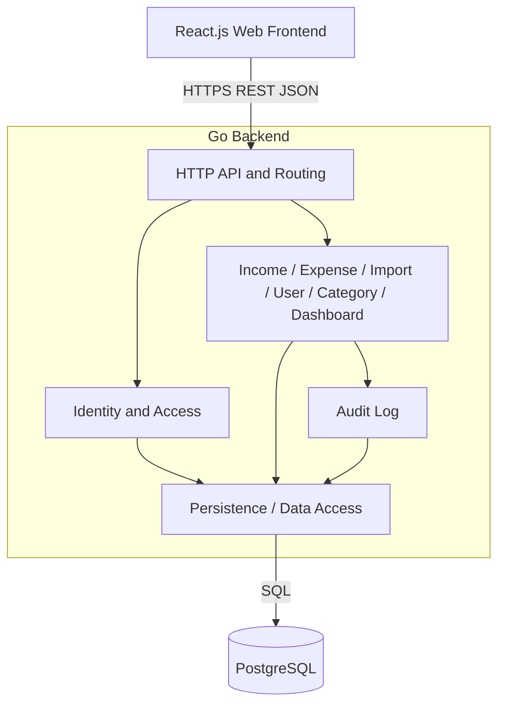

# 5. Building Block View

HandmadeFinance is decomposed into runtime building blocks (Containers), then the Go Backend is zoomed into logical modules (Components). Separate C4 documentation is not required to understand this section.

## 5.1 Level 1 — Whitebox HandmadeFinance

```text
HandmadeFinance
├── React.js Web Frontend
├── Go Backend
└── PostgreSQL
```

Users interact only with the Frontend. The Frontend calls only Go. Only Persistence issues SQL.






## 5.2 Level 2 — Containers


### React.js Web Frontend


|                      |                                                                                                                                        |
| -------------------- | -------------------------------------------------------------------------------------------------------------------------------------- |
| **Purpose**          | UI for income, expenses, dashboard, reports, import, users, and profile                                                                |
| **Responsibilities** | Render screens according to the information architecture; hide menus/buttons by role; send REST requests; convert USD to EUR for display only (do not store EUR) |
| **Interfaces**       | HTTPS REST JSON to HTTP API & Routing                                                                                                  |
| **Dependencies**     | Go Backend                                                                                                                             |
| **Technology**       | React.js                                                                                                                               |


UI authorization **does not** replace backend 403 enforcement.

### Go Backend


|                      |                                                                      |
| -------------------- | -------------------------------------------------------------------- |
| **Purpose**          | REST API, business logic, authentication, authorization, data access |
| **Responsibilities** | Validation, role-based access control, transactions, import, report aggregation, audit    |
| **Interfaces**       | REST inbound; SQL outbound through Persistence                       |
| **Dependencies**     | PostgreSQL                                                           |
| **Technology**       | Go — Modular Monolith                                                |


### PostgreSQL


|                      |                                                                      |
| -------------------- | -------------------------------------------------------------------- |
| **Purpose**          | Persistent business data storage                                     |
| **Responsibilities** | Tables, enums, `vw_`* views, audit triggers for INSERT/UPDATE/DELETE |
| **Interfaces**       | PostgreSQL protocol / SQL                                            |
| **Dependencies**     | Does not call the application                                        |
| **Technology**       | PostgreSQL (`postgres:16` locally)                                   |


The browser is **not** modeled as a separate Container.

## 5.3 Level 3 — Go Backend Components

```text
Go Backend
├── HTTP API & Routing
├── Identity & Access
├── User & Profile Management
├── Category Management
├── Income Management
├── Expense Management
├── Excel Import
├── Dashboard & Reporting
├── Audit Log
└── Persistence / Data Access
```






### HTTP API & Routing


|              |                                                                        |
| ------------ | ---------------------------------------------------------------------- |
| Purpose      | Receive REST/JSON, route requests, and dispatch to business components |
| Interfaces   | REST from React                                                        |
| Dependencies | Identity & Access; all business modules                                |


Every business request enters here and passes through Identity before reaching a domain module.

### Identity & Access


|                  |                                                                                                                                    |
| ---------------- | ---------------------------------------------------------------------------------------------------------------------------------- |
| Purpose          | Authenticate session/credentials (**detailed mechanism To Be Determined**) and check roles/permissions                                          |
| Responsibilities | Reject VIEWER create/update/delete; Employee cannot report/audit/delete; Employee may update only when `created_by` = current user |
| Dependencies     | Persistence (read user, role, `is_active`)                                                                                         |


**FACT permission matrix** (`ROLE_PERMISSIONS` / UC matrix):


| Permission                   | ADMIN | SHOP_OWNER | EMPLOYEE    | VIEWER |
| ---------------------------- | ----- | ---------- | ----------- | ------ |
| dashboard                    | ✓     | ✓          | ✓           | ✓      |
| incomeRead / expenseRead     | ✓     | ✓          | ✓           | ✓      |
| incomeCreate / expenseCreate | ✓     | ✓          | ✓           |        |
| incomeUpdate / expenseUpdate | ✓     | ✓          | Own records |        |
| incomeDelete / expenseDelete | ✓     | ✓          |             |        |
| importData                   | ✓     | ✓          | ✓           |        |
| reportRead                   | ✓     | ✓          |             | ✓      |
| auditRead                    | ✓     | ✓          |             |        |
| userManagement               | ✓     |            |             |        |


Example: VIEWER `POST /api/incomes` → 403 even when calling the API directly.

### User & Profile Management

Manages accounts, `is_active`, and profile fields (`full_name`, `phone`, `avatar_url`). User listing is Admin-only. Users cannot change their own role from Profile.

### Category Management

`income_categories`, `expense_categories`. Income/Expense/Import **use categories**; they do not INSERT categories themselves except through an explicit category-management flow.

### Income Management

Income lifecycle: create with `source=MANUAL`, update, soft delete, read list where `deleted_at IS NULL`. Calls Category, Dashboard (aggregation impact), Audit, and Persistence.

### Expense Management

Same as Income, plus `payee`, `origin_scope`, `payment_method`, `amount_after_tax`.

### Excel Import

Validate file → parse → validate rows → preview → confirm → `import_batches` → create Income/Expense with `EXCEL_IMPORT` → Audit → `COMPLETED` or `FAILED`.

### Dashboard & Reporting

Aggregates active records (SQL views or equivalent queries). No separate statistics table. Exporting a report = EXPORT action + audit; it is not an electronic invoice.

### Audit Log

Records LOGIN, EXPORT, IMPORT and works alongside database triggers for DELETE/INSERT/UPDATE. Never records password / hash / token. Reading the audit log requires `auditRead`.

### Persistence / Data Access

Encapsulates SQL, transactions, and PostgreSQL access. **All** Identity, User, Category, Income, Expense, Import, Dashboard, and Audit components **must not** bypass this layer.

## 5.4 Mapping UI → Component


| Information architecture area | Component |
| ------------------------- | --------------------- |
| Login                     | Identity & Access     |
| Users, profile            | User & Profile        |
| Income/expense categories | Category              |
| Income                    | Income                |
| Expenses                  | Expense               |
| Excel Import              | Excel Import          |
| Dashboard, reports        | Dashboard & Reporting |
| Activity log              | Audit Log             |


