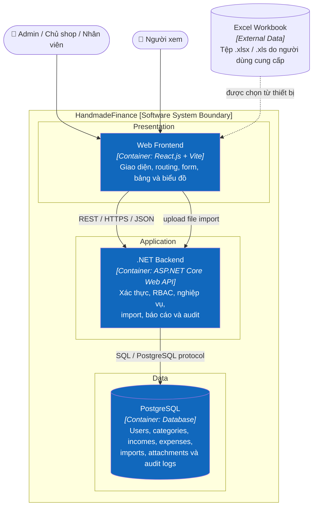
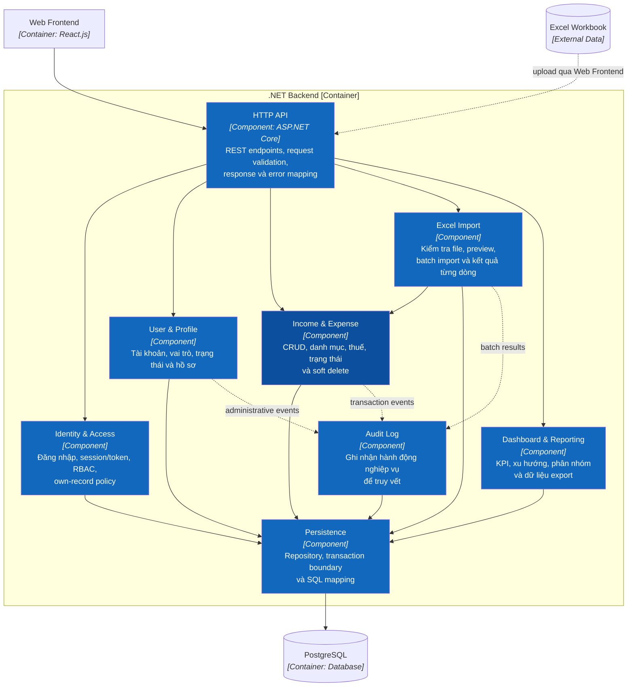

# 5. Building Block View

Phần này đồng bộ với C4: Level 1 là toàn hệ thống, Level 2 là Container, Level 3 zoom vào .NET Backend.

## 5.1 Level 1 — HandmadeFinance

HandmadeFinance là một software system phục vụ bốn vai trò: Admin, Chủ shop, Nhân viên và Người xem. Chi tiết: [C1 System Context](../c4/01-system-context.md).

## 5.2 Level 2 — Containers

| Container | Public surface | Dữ liệu sở hữu |
|---|---|---|
| Web Frontend | Hash routes, forms, tables, charts | Client/session state tạm thời |
| .NET Backend | REST/JSON endpoints | Business rules và transaction orchestration |
| PostgreSQL | Chỉ backend được truy cập | Users, categories, incomes, expenses, imports, attachments, audits |

## 5.3 Level 3 — .NET Backend Components

| Component | Chức năng | API gọi đến |
|---|---|---|
| HTTP API | Parse/validate request, map response/error | Tất cả use case endpoint |
| Identity & Access | Login, credential/session, RBAC, own-record policy | Login và mọi endpoint bảo vệ |
| User & Profile | User lifecycle và profile | Users, profile |
| Income & Expense | CRUD, category, tax, status, soft delete | Incomes, expenses |
| Excel Import | Validate/preview/process batch | Import |
| Dashboard & Reporting | KPI, time series, category aggregate, export model | Dashboard, reports |
| Audit Log | Append hành động cần truy vết | Audit query; nhận event nội bộ |
| Persistence | Repository, transaction và SQL mapping | Được các component khác dùng nội bộ |

## 5.4 Mapping giao diện → component

| UI | Component chính |
|---|---|
| Login và route permission | Identity & Access |
| Quản lý người dùng, hồ sơ | User & Profile |
| Quản lý thu và chi | Income & Expense |
| Import Excel | Excel Import + Income & Expense |
| Dashboard, báo cáo | Dashboard & Reporting |
| Nhật ký | Audit Log |

## 5.5 Quy tắc dependency

1. HTTP API chỉ điều phối, không viết SQL.
2. Import không bỏ qua validation của Income & Expense.
3. Audit được ghi trong cùng transaction nghiệp vụ khi cần tính nhất quán.
4. Reporting không thay đổi giao dịch.
5. Chỉ Persistence giao tiếp PostgreSQL.

Sơ đồ C3 đầy đủ: [C3 — Component](../c4/03-component.md).

## 5.6 Level 4 — Hai feature chính

Code-level target cho `Income Management` và `Expense Management` được mô tả bằng ASP.NET Core Controller, Service, Policy, Validator, Domain Entity và Repository tại [C4 Level 4](../c4/04-code.md). Đây là thiết kế đích; chưa có C# source để đối chiếu implementation.
