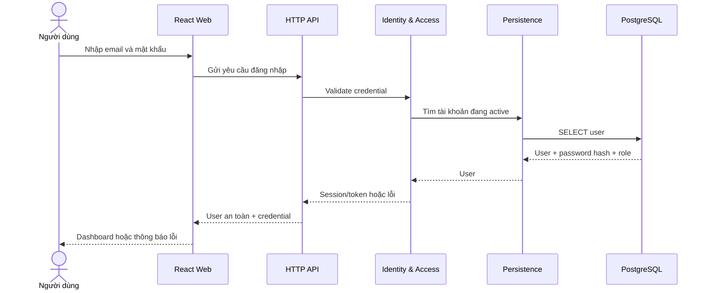
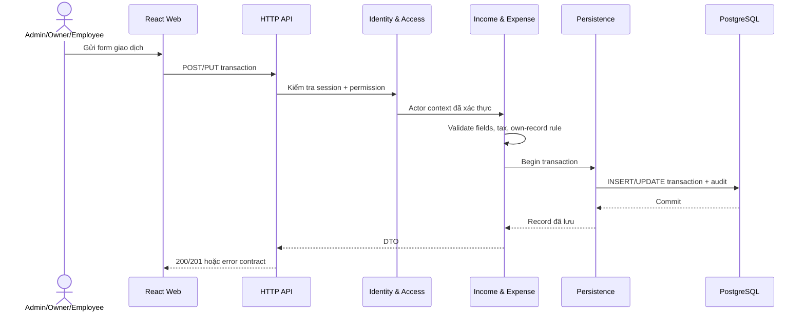
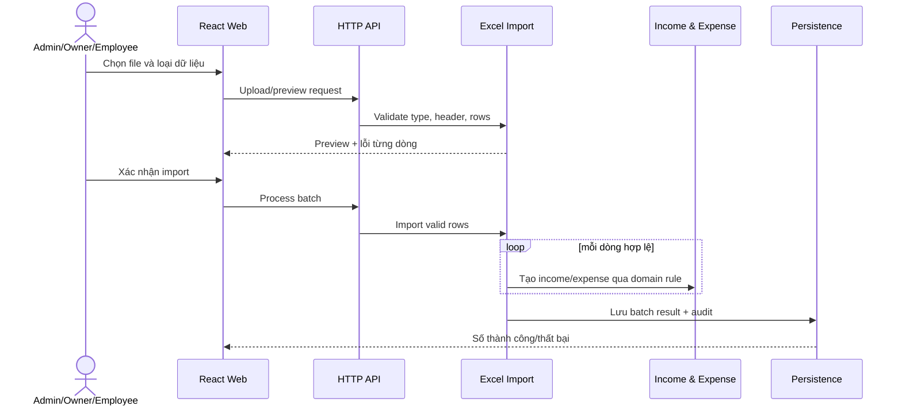

# 6. Runtime View

Các sequence dưới đây mô tả kiến trúc đích. Endpoint cụ thể và cơ chế token/session vẫn TBD.

## 6.1 Đăng nhập



## 6.2 Tạo hoặc sửa khoản thu/chi



Nhân viên chỉ sửa record có `createdBy` bằng user hiện tại. Admin và Chủ shop mới được soft delete.

## 6.3 Import Excel



## 6.4 Dashboard và báo cáo

```mermaid
sequenceDiagram
    actor U as Người có quyền
    participant W as React Web
    participant A as HTTP API
    participant Q as Dashboard & Reporting
    participant R as Persistence
    participant D as PostgreSQL
    U->>W: Chọn kỳ, loại, nguồn, danh mục
    W->>A: GET report query
    A->>Q: Filter + actor context
    Q->>R: Aggregate query
    R->>D: SELECT/SUM/GROUP BY active records
    D-->>Q: Aggregate rows
    Q-->>W: KPI, series, category breakdown
    W-->>U: Chart/table; quy đổi USD→EUR nếu chọn
```

## 6.5 Lỗi chung

| Tình huống | Kết quả mong đợi |
|---|---|
| Chưa đăng nhập | `401` và điều hướng login |
| Không đủ quyền | `403`; không dựa vào việc nút đã ẩn |
| Dữ liệu sai | `400/422` với lỗi theo field |
| Record không tồn tại/đã xóa | `404` |
| Database lỗi | Transaction rollback; trả error id, không lộ SQL |

Các sequence code-level (mức lớp) cho Auth, Income và Expense được mô tả tại [UML Sequence Diagrams](../uml/02-sequence-diagrams.md). Endpoint trong tài liệu đó là provisional contract cho tới khi OpenAPI 3.0 được hoàn thành.
