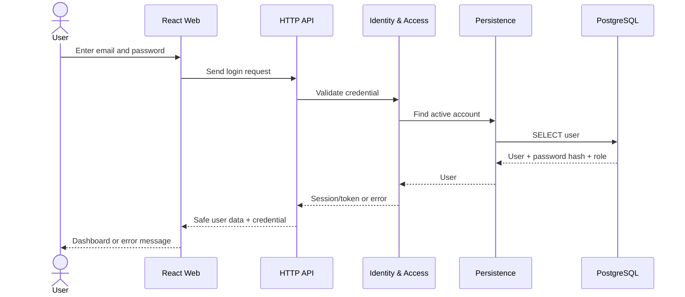
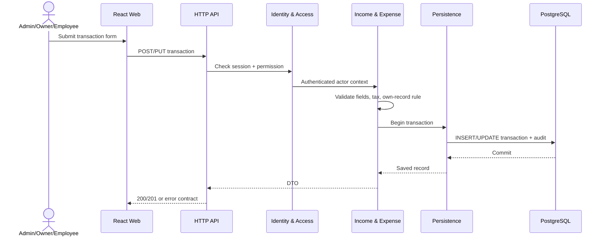
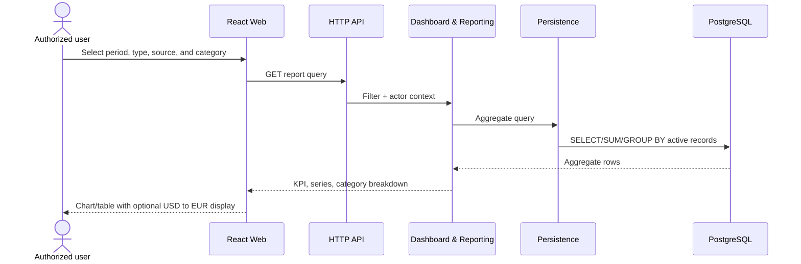

# 6. Runtime View

The sequences below describe the target architecture. Exact endpoints and Bearer JWT security are defined in the OpenAPI contract.

## 6.1 Login



## 6.2 Create or Update Income/Expense



Employees can update only records whose `createdBy` matches the current user. Only Administrators and Shop Owners can soft-delete records.

## 6.3 Import Excel

```mermaid
sequenceDiagram
    actor U as Admin/Owner/Employee
    participant W as React Web
    participant A as HTTP API
    participant X as Excel Import
    participant L as Income & Expense
    participant R as Persistence
    U->>W: Select file and data type
    W->>A: Upload/preview request
    A->>X: Validate type, header, rows
    X-->>W: Preview + row-level errors
    U->>W: Confirm import
    W->>A: POST import (<=10 MB, <=5,000 rows)
    A->>X: Parse and validate every row synchronously
    alt Any row invalid
        X->>R: Save FAILED batch with row errors
        R-->>W: 200 final summary; importedRows=0
    else Every row valid
        X->>R: Begin one database transaction
        loop each validated row
            X->>L: Build income/expense through domain rules
            L->>R: Insert with batch ID
        end
        X->>R: Mark COMPLETED + audit, then commit
        R-->>W: 200 final summary; importedRows=totalRows
    end
```

## 6.4 Dashboard and Reporting



## 6.5 Common Errors

| Situation | Expected result |
|---|---|
| Unauthenticated | `401` and redirect to login |
| Forbidden | `403`; independent of hidden UI controls |
| Invalid data | `400/422` with field-level errors |
| Record missing or soft-deleted | `404` |
| Database failure | Roll back the transaction; return an error ID without exposing SQL |

Code-level sequences for Authentication, Income, and Expense are documented in [UML Sequence Diagrams](../uml/02-sequence-diagrams.md). Their HTTP contracts are defined by the [OpenAPI 3.0.4 specification](../../api/openapi.yaml).
