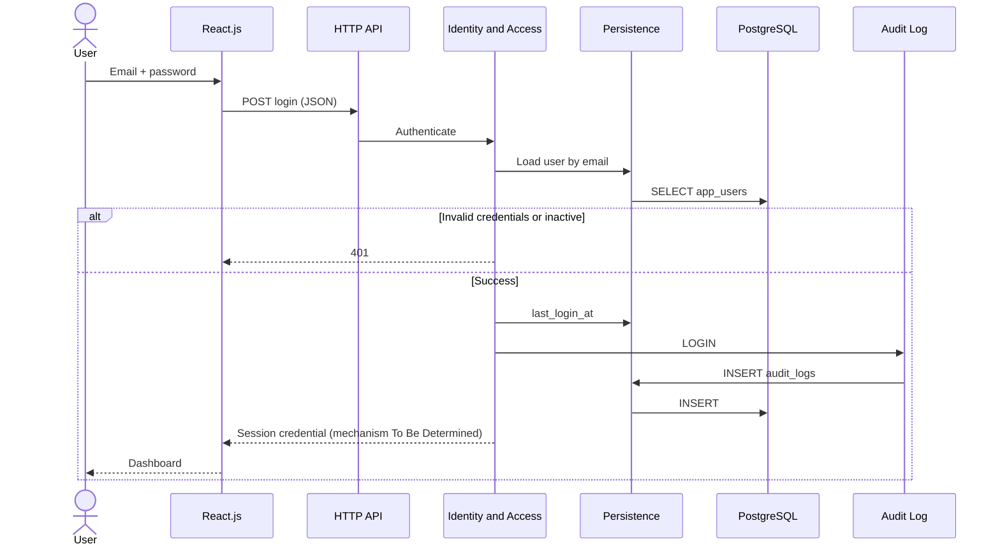
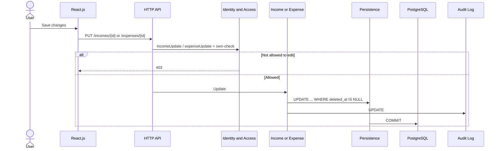
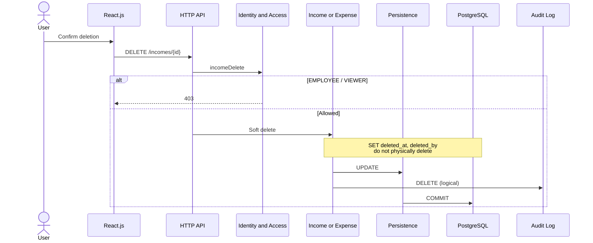
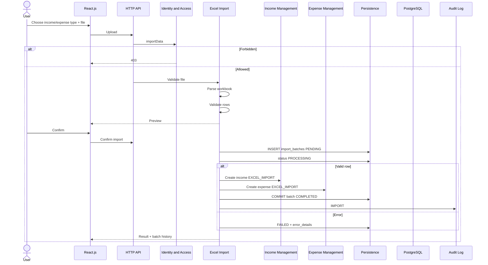

# 6. Runtime View

Every participant must exist in [Section 5](05-building-block-view.md). React hides buttons, but **every write operation** passes through Identity.

The REST paths below are **logical** (the OpenAPI specification is not finalized yet).

## 6.1 Scenario — Login

Actor: any role. User must have `is_active`. Audit action: `LOGIN`. Never return password/hash.



## 6.2 Scenario — Create Income

Actor: ADMIN, SHOP_OWNER, EMPLOYEE. `source = MANUAL`. `currency_code = USD`.

```mermaid
sequenceDiagram
  actor User
  participant React as React.js
  participant API as HTTP API
  participant Id as Identity and Access
  participant Inc as Income Management
  participant Cat as Category Management
  participant P as Persistence
  participant DB as PostgreSQL
  participant Aud as Audit Log
  participant Rep as Dashboard and Reporting

  User->>React: Submit income form
  React->>API: POST /incomes
  API->>Id: Authorize incomeCreate
  alt VIEWER or permission missing
    Id-->>React: 403 Forbidden
  else Allowed
    API->>Inc: Create
    Inc->>Cat: Use income category
    Inc->>P: BEGIN; INSERT incomes
    opt Attachment provided
      Inc->>P: INSERT attachments (metadata + storage_path)
    end
    Inc->>Aud: INSERT
    Inc->>Rep: Record change / invalidate aggregate
    P->>DB: COMMIT
    Inc-->>React: 201 + body
  end
```

Expense create uses Expense Management, `expenseCreate`, with `amount_after_tax` calculated according to the tax rule.

## 6.3 Scenario — Update Income or Expense

ADMIN/SHOP_OWNER: any record. EMPLOYEE: only when `created_by = current user`. VIEWER: 403.



## 6.4 Scenario — Soft Delete

ADMIN and SHOP_OWNER only. EMPLOYEE does not have `*Delete`.



Subsequent lists use `deleted_at IS NULL`. Audit data remains.

## 6.5 Scenario — Excel Import

Actor: ADMIN, SHOP_OWNER, EMPLOYEE. VIEWER: 403. Files `.xlsx` / `.xls` (the mock information architecture may still mention `.csv`; the architecture follows feature F06 for Excel import).

Parser library: **To Be Determined**.



SQL constraint: `EXCEL_IMPORT` requires `import_batch_id`.

## 6.6 Scenario — Dashboard / Report

Dashboard: all roles. Reports: ADMIN, SHOP_OWNER, VIEWER. EMPLOYEE has `reportRead = false` → 403.

Aggregates use records that are **not** soft-deleted. USD is stored; React (or an API query parameter) converts to EUR for display — EUR is **not** written to the database.

```mermaid
sequenceDiagram
  actor User
  participant React as React.js
  participant API as HTTP API
  participant Id as Identity and Access
  participant Rep as Dashboard and Reporting
  participant P as Persistence
  participant DB as PostgreSQL

  User->>React: Open dashboard or report + USD/EUR + date range
  React->>API: GET reports or dashboard
  API->>Id: dashboard and/or reportRead
  alt EMPLOYEE requests report
    Id-->>React: 403
  else Allowed
    API->>Rep: Query
    Rep->>P: vw_income_active / vw_expense_active / cashflow views
    P->>DB: SELECT
    Rep-->>React: JSON USD
    React-->>User: Display; EUR = conversion
  end
```

Report export uses the same `reportRead` permission and creates audit action `EXPORT`.
