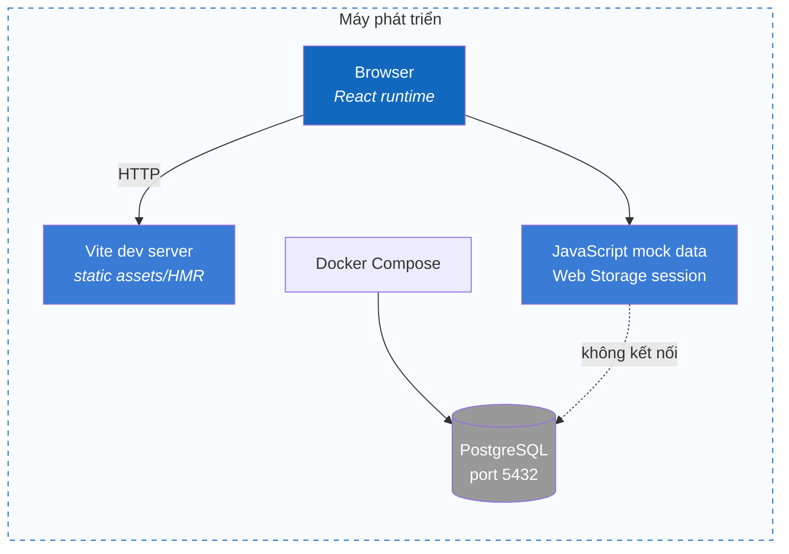
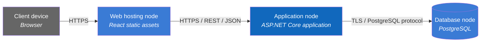

# 7. Deployment View

## 7.1 Hiện tại — mock local

Frontend chạy bằng `npm run dev`; PostgreSQL có thể chạy độc lập bằng Docker Compose nhưng frontend không gọi database.

## 7.2 Kiến trúc đích — topology logic

Đây là topology logic, không khẳng định cloud provider, container orchestrator, reverse proxy hay CDN.

## 7.3 Mapping container → node

| Container | Local hiện tại | Production đích |
|---|---|---|
| React Web | Vite dev server + browser | Static web hosting, TBD |
| .NET Backend | Chưa có | Một hoặc nhiều ASP.NET Core application instances, TBD |
| PostgreSQL | Docker Compose | Managed/self-hosted PostgreSQL, TBD |

## 7.4 Deployment requirements

- Chỉ public HTTPS endpoints cần thiết; PostgreSQL không public Internet.
- Secret không commit vào Git; dùng environment/secret manager phù hợp.
- Database migration chạy có kiểm soát trước phiên bản backend cần schema mới.
- Health check cần tách liveness và readiness khi backend được triển khai.
- Backup/restore, TLS termination, scaling và observability phải được quyết định trước production.
