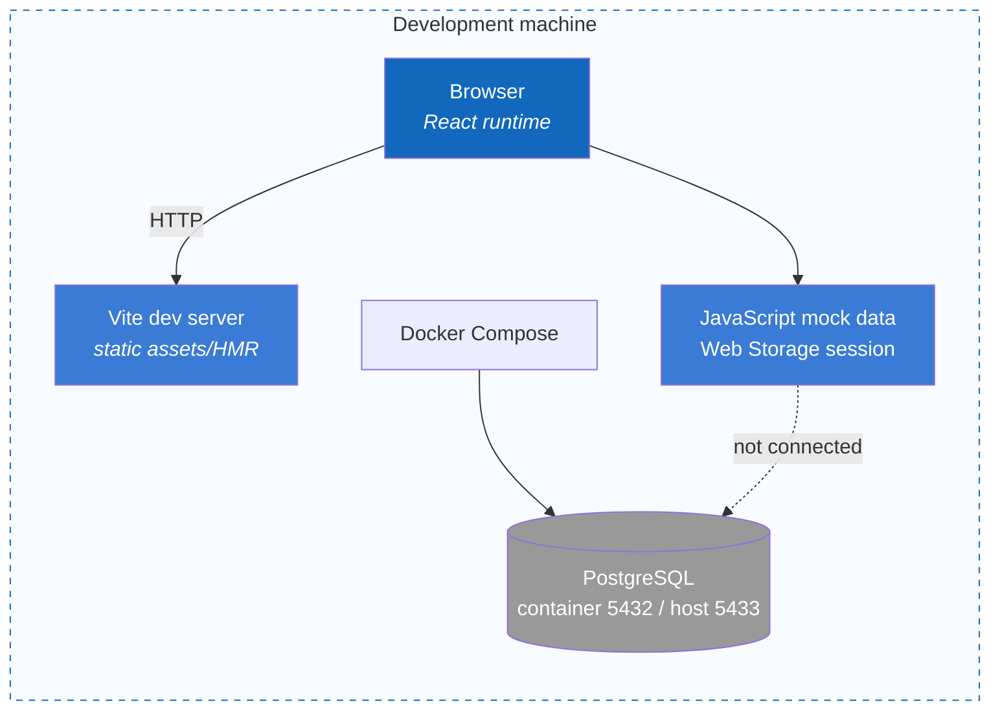
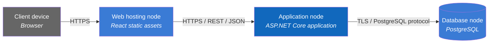

# 7. Deployment View

## 7.1 Current State — Local Mock

The frontend runs with `npm run dev`; PostgreSQL can run independently through Docker Compose, but the frontend does not call the database.

## 7.2 Target Architecture — Logical Topology

This is a logical topology and does not select a cloud provider, container orchestrator, reverse proxy, or CDN.

## 7.3 Container-to-Node Mapping

| Container | Current local state | Target production state |
|---|---|---|
| React Web | Vite dev server + browser | Static web hosting provider: OPEN, operator-owned before go-live |
| .NET Backend | Implementation status assessed separately | One or more ASP.NET Core instances; host/topology OPEN before go-live |
| PostgreSQL | Docker Compose | Managed or self-hosted PostgreSQL; provider OPEN before go-live |

## 7.4 Deployment requirements

- Expose only required public HTTPS endpoints; PostgreSQL is not public on the Internet.
- Do not commit secrets to Git; use an appropriate environment or secret manager.
- Run controlled database migrations before deploying a backend version that requires the new schema.
- Separate liveness and readiness health checks when the backend is implemented.
- Backup/restore, TLS termination, scaling, and observability must be decided before production.
