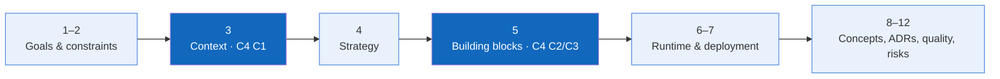

# HandmadeFinance — arc42 Architecture Documentation

> **Status:** Baseline · **Audience:** developers, reviewers, and maintainers

This documentation uses arc42 to explain goals, constraints, decisions, and runtime scenarios. C4 Mermaid diagrams provide the primary structural views; arc42 does not define a separate architecture.

## Contents

| Section | Content |
|---|---|
| 1 | [Introduction and Goals](01-introduction-and-goals.md) |
| 2 | [Architecture Constraints](02-architecture-constraints.md) |
| 3 | [Context and Scope](03-context-and-scope.md) |
| 4 | [Solution Strategy](04-solution-strategy.md) |
| 5 | [Building Block View](05-building-block-view.md) |
| 6 | [Runtime View](06-runtime-view.md) |
| 7 | [Deployment View](07-deployment-view.md) |
| 8 | [Cross-cutting Concepts](08-crosscutting-concepts.md) |
| 9 | [Architecture Decisions](09-architecture-decisions.md) |
| 10 | [Quality Requirements](10-quality-requirements.md) |
| 11 | [Risks and Technical Debt](11-risks-and-technical-debt.md) |
| 12 | [Glossary](12-glossary.md) |

## Baseline

- **Current:** the React/Vite mock runs entirely in the browser.
- **Target:** React Web → ASP.NET Core Web API → PostgreSQL.
- **Principle:** the backend is the trust boundary; the domain does not depend on transport or SQL details.
- **Not decided:** ASP.NET Core Controllers versus Minimal APIs, token versus server-side session, data-access library, file storage, and production infrastructure.

Related: [C4 C1 → C2 → C3 → C4](../c4/README.md) · [C4 Code for two core features](../c4/04-code.md) · [Use Case Diagram](../../03-use-cases.md#use-case-diagram).
