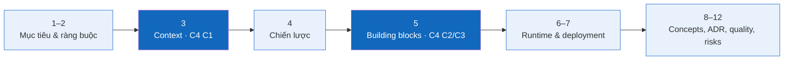

# HandmadeFinance — Tài liệu kiến trúc arc42

> **Trạng thái:** Baseline · **Đối tượng đọc:** developer, reviewer, người bảo trì

Tài liệu này dùng arc42 để giải thích mục tiêu, ràng buộc, quyết định và các kịch bản chạy. Các sơ đồ C4 Mermaid là góc nhìn cấu trúc chính; arc42 không tạo một kiến trúc khác.

## Mục lục

| Phần | Nội dung |
|---|---|
| 1 | [Giới thiệu và mục tiêu](01-introduction-and-goals.md) |
| 2 | [Ràng buộc kiến trúc](02-architecture-constraints.md) |
| 3 | [Context và scope](03-context-and-scope.md) |
| 4 | [Chiến lược giải pháp](04-solution-strategy.md) |
| 5 | [Building Block View](05-building-block-view.md) |
| 6 | [Runtime View](06-runtime-view.md) |
| 7 | [Deployment View](07-deployment-view.md) |
| 8 | [Cross-cutting Concepts](08-crosscutting-concepts.md) |
| 9 | [Architecture Decisions](09-architecture-decisions.md) |
| 10 | [Quality Requirements](10-quality-requirements.md) |
| 11 | [Risks và Technical Debt](11-risks-and-technical-debt.md) |
| 12 | [Glossary](12-glossary.md) |

## Baseline

- **Hiện tại:** React/Vite mock chạy hoàn toàn trong trình duyệt.
- **Đích:** React Web → ASP.NET Core Web API → PostgreSQL.
- **Nguyên tắc:** backend là trust boundary; domain không phụ thuộc transport hoặc SQL chi tiết.
- **Chưa quyết định:** ASP.NET Core Controllers hay Minimal APIs, token/session server-side, thư viện truy cập dữ liệu, nơi lưu file và hạ tầng production.

Liên quan: [C4 C1 → C2 → C3 → C4](../c4/README.md) · [C4 Code cho hai tính năng chính](../c4/04-code.md) · [Use Case Diagram](../../03-use-cases.md#use-case-diagram).
