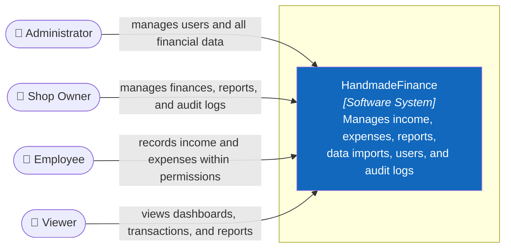

# C1 — System Context

> **Purpose:** show who uses HandmadeFinance and what the system is responsible for, without implementation technology.

## System Boundary

HandmadeFinance is responsible for login, authorization, dashboards, income, expenses, reports, Excel import, audit logs, user management, and personal profiles.

Outside V1 scope: inventory/SKU, CRM, double-entry accounting, electronic invoicing, online payments, the Etsy API, and ERP. Because no real external-system integration exists, C1 does not show a marketplace or payment gateway.

## Users and Primary Permissions

| Person | Primary permissions |
|---|---|
| Administrator | Full access, including user management |
| Shop Owner | Manages finances, imports, reports, and audit logs |
| Employee | Creates transactions, edits own records only, and imports data |
| Viewer | Read-only access to dashboards, transactions, reports, and profile |

**Next:** zoom into the Software System → [C2 — Container](02-container.md).

**Sources of truth:** `src/frontend/src/lib/auth.js`, `docs/01-scope.md`, `docs/03-use-cases.md`.
