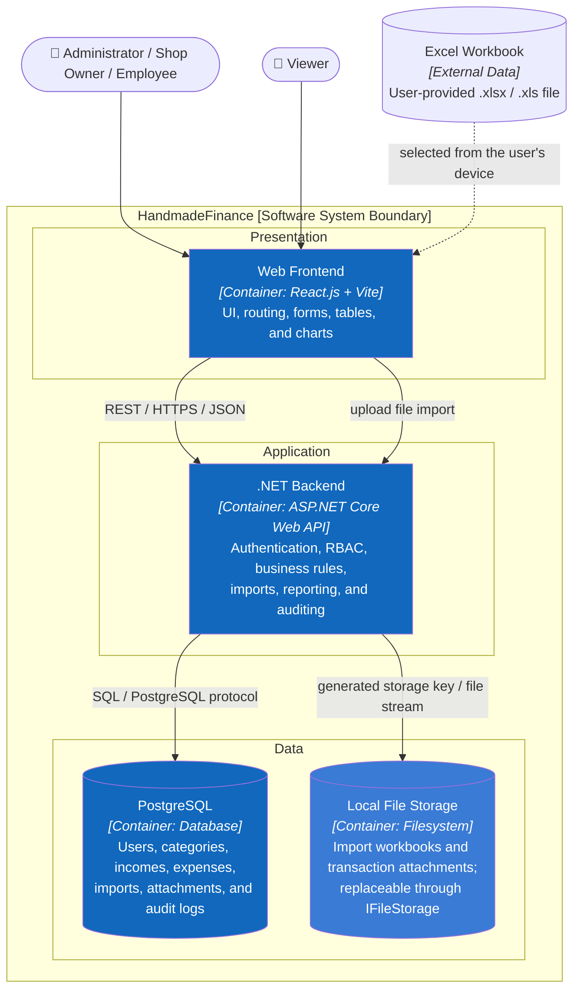

# C2 — Container

> **Purpose:** zoom into HandmadeFinance and describe runtime and storage units in the target architecture.

## Responsibilities

| Container | Technology | Responsibility | Status |
|---|---|---|---|
| Web Frontend | React.js, Vite | UI, route guards, charts, forms, and data tables | Mock implemented |
| .NET Backend | C#, ASP.NET Core Web API, REST/JSON | Trust boundary for authentication, RBAC, business rules, and data access | Not implemented |
| PostgreSQL | PostgreSQL | Persistent data and business relationships | Schema exists; not connected |
| Local File Storage | Filesystem outside the web root | Binary imports and attachments addressed by generated storage keys | Target for local Step 7 implementation |

## Architecture Rules

1. The browser never accesses PostgreSQL directly.
2. Hiding frontend controls is UX only; the .NET Backend must authorize every request.
3. Money is stored in USD; EUR is a display-only conversion.
4. Transaction deletion is soft deletion to preserve history and auditability.
5. PostgreSQL stores file metadata only. Binary files use `IFileStorage`; the local implementation writes outside the web root and production may replace it.

## Current State

**Previous:** [C1 — System Context](01-system-context.md) · **Next:** zoom into the .NET Backend → [C3 — Component](03-component.md).
