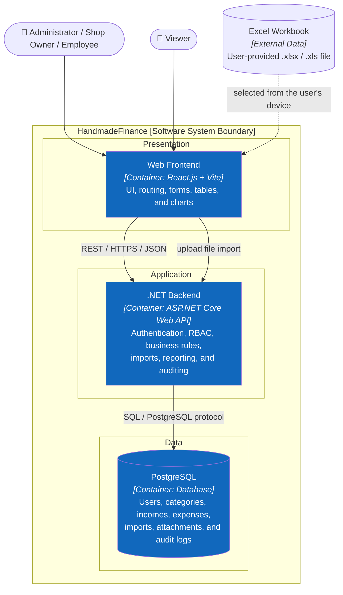
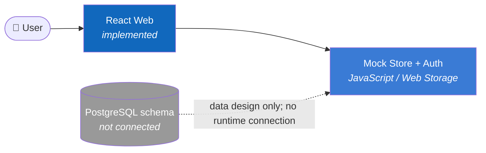

# C2 — Container

> **Mục tiêu:** zoom vào HandmadeFinance và mô tả các khối chạy/lưu trữ ở kiến trúc đích.

## Trách nhiệm

| Container | Công nghệ | Trách nhiệm | Trạng thái |
|---|---|---|---|
| Web Frontend | React.js, Vite | UI, route guard, biểu đồ, form và bảng dữ liệu | Đã có bản mock |
| .NET Backend | C#, ASP.NET Core Web API, REST/JSON | Điểm tin cậy cho xác thực, RBAC, nghiệp vụ và truy cập dữ liệu | Chưa triển khai |
| PostgreSQL | PostgreSQL | Dữ liệu bền vững và quan hệ nghiệp vụ | Đã có schema, chưa kết nối |

## Quy tắc kiến trúc

1. Trình duyệt không truy cập PostgreSQL trực tiếp.
2. Ẩn nút ở frontend chỉ là UX; .NET Backend phải kiểm tra quyền cho mọi request.
3. Tiền được lưu theo USD; EUR chỉ là giá trị quy đổi để hiển thị.
4. Xóa giao dịch là soft delete để giữ lịch sử và audit.
5. Attachment hiện chỉ có metadata; chiến lược lưu binary ở backend chưa được quyết định.

## Trạng thái hiện tại

**Trước:** [C1 — System Context](01-system-context.md) · **Tiếp theo:** zoom vào .NET Backend → [C3 — Component](03-component.md).
