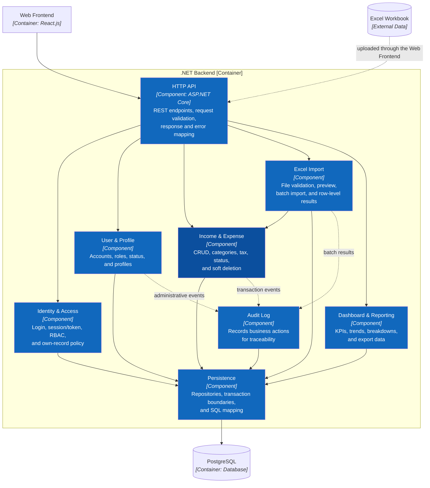

# C3 — Component — .NET Backend

> **Trạng thái:** kiến trúc đích. Các component dưới đây chưa có mã C#/.NET trong repository.

## Component catalog

| Component | Sở hữu trách nhiệm | Không chịu trách nhiệm |
|---|---|---|
| HTTP API | Transport, validation, error contract | SQL và quyết định nghiệp vụ |
| Identity & Access | Authentication, RBAC, own-record rule | Ẩn/hiện giao diện |
| User & Profile | Vòng đời tài khoản và hồ sơ | Giao dịch tài chính |
| Income & Expense | Quy tắc thu/chi, thuế, trạng thái, soft delete | Render báo cáo |
| Excel Import | Parse/validate batch và điều phối nhập | Ghi bảng giao dịch bỏ qua domain |
| Dashboard & Reporting | Query tổng hợp, KPI, export | Thay đổi giao dịch |
| Audit Log | Nhật ký hành động nghiệp vụ | Dữ liệu vận hành chính |
| Persistence | Repository, SQL, transaction | HTTP và UI authorization |

## Luồng phụ thuộc

`HTTP API → Identity & Access → domain component → Persistence → PostgreSQL`.

Import gọi Income & Expense để dùng chung validation. Reporting chỉ đọc qua Persistence. Không component nghiệp vụ nào mở kết nối PostgreSQL riêng.

**Trước:** [C2 — Container](02-container.md) · **Tiếp theo:** [C4 — Code cho khoản thu và khoản chi](04-code.md) · **Liên quan:** [arc42 Building Block View](../arc42/05-building-block-view.md).

**Nguồn sự thật:** `docs/02-features.md`, `docs/03-use-cases.md`, `database/shop_finance.sql`, `app/src/lib/store.jsx`.
