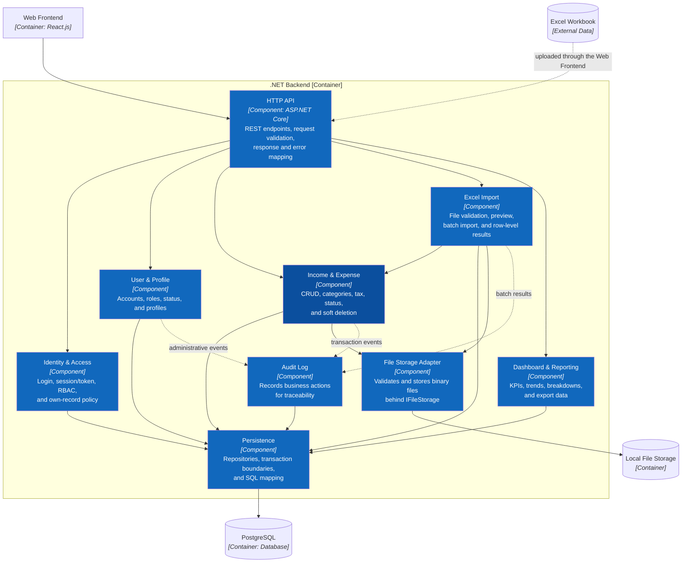

# C3 — Component — .NET Backend

> **Status:** target architecture. The components below do not yet have C#/.NET source code in the repository.

## Component catalog

| Component | Owns | Does not own |
|---|---|---|
| HTTP API | Transport, validation, error contract | SQL and business decisions |
| Identity & Access | Authentication, RBAC, own-record rule | UI visibility |
| User & Profile | Account lifecycle and profiles | Financial transactions |
| Income & Expense | Income/expense, tax, status, and soft-delete rules | Report rendering |
| Excel Import | Batch parsing, validation, and import orchestration | Bypassing the domain to write transaction tables |
| Dashboard & Reporting | Aggregate queries, KPIs, and export | Modifying transactions |
| Audit Log | Business-action history | Primary operational data |
| File Storage Adapter | File validation, generated keys, binary persistence | Business metadata or authorization |
| Persistence | Repositories, SQL, and transactions | HTTP and UI authorization |

## Dependency Flow

`HTTP API → Identity & Access → domain component → Persistence → PostgreSQL`.

Import calls Income & Expense to reuse validation. Reporting reads only through Persistence. No business component opens its own PostgreSQL connection.

## Import Domain Validation Strategy

**Status:** ACCEPTED

### Confirmed requirement

Import must not duplicate or bypass critical income/expense validation and authorization rules.

Import orchestrates the existing Application income/expense validators and business-rule abstractions. It may batch persistence for efficiency, but it must not duplicate rules or write through a bypass that accepts data rejected by manual entry. `ARCH-013` and `INT-IMPORT-003` verify parity.

**Previous:** [C2 — Container](02-container.md) · **Next:** [C4 — Code for Income and Expense](04-code.md) · **Related:** [arc42 Building Block View](../arc42/05-building-block-view.md).

**Sources of truth:** `docs/02-features.md`, `docs/03-use-cases.md`, `src/database/shop_finance.sql`, `src/frontend/src/lib/store.jsx`.
