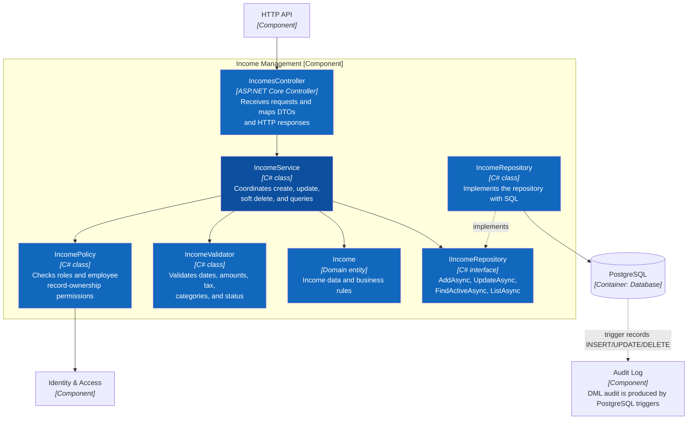

# C4 Level 4 — Code — Two Core Features

> **Status:** target code-level design for the .NET Backend; the repository currently has no C#/.NET source code.

Level 4 zooms into the **Income & Expense** component from [C3](03-component.md). The diagrams define intended responsibilities and dependency directions without selecting an HTTP framework style or SQL library.

## L4.1 Income Management

Primary flow: `IncomesController → IncomeService → Policy/Validator/Domain → IIncomeRepository`. The Persistence Unit of Work sets the actor context with `SET LOCAL app.current_user_id`; PostgreSQL triggers create audit entries in the same transaction, and the Service does not insert duplicate DML audit records.

## L4.2 Expense Management

Expenses use the same pattern as income, with additional rules for payee, domestic/international scope, payment method, and post-tax amount.

## Shared Rules for Both Features

1. Controllers contain neither SQL nor business rules.
2. Services depend on repository interfaces, not directly on the PostgreSQL driver.
3. Policies are always enforced by the backend; frontend control visibility serves UX only.
4. Validators are reused for manual forms and Excel Import.
5. Soft deletion updates `deleted_at` and `deleted_by`; transactions are not physically deleted.
6. The domain stores USD; EUR is a display-only conversion.

**Previous:** [C3 — Component](03-component.md) · **Detailed UML:** [Auth/Income/Expense class and sequence diagrams](../uml/README.md) · **Folder structure:** [Frontend and three-tier backend](../../07-folder-structure.md) · **Related:** [Use cases](../../03-use-cases.md).
