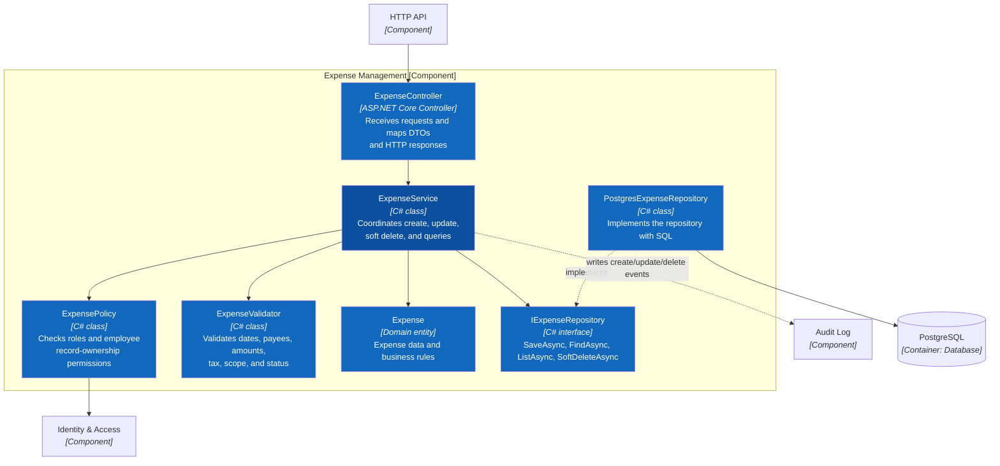

# C4 Level 4 — Code — Hai tính năng chính

> **Trạng thái:** thiết kế code-level mục tiêu cho .NET Backend; repository hiện chưa có mã C#/.NET.

Level 4 zoom từ component **Income & Expense** ở [C3](03-component.md). Hai sơ đồ chỉ định trách nhiệm và hướng phụ thuộc mong muốn, không khóa framework HTTP hoặc thư viện SQL.

## L4.1 Quản lý khoản thu

Luồng chính: `IncomeController → IncomeService → Policy/Validator/Domain → IIncomeRepository`. Mọi thay đổi thành công phải tạo audit entry trong cùng transaction nghiệp vụ khi triển khai.

## L4.2 Quản lý khoản chi

Khoản chi dùng cùng pattern với khoản thu nhưng có rule riêng cho người nhận, phạm vi nội địa/quốc tế, phương thức thanh toán và số tiền sau thuế.

## Quy tắc chung cho hai feature

1. Controller không chứa SQL hoặc business rule.
2. Service phụ thuộc repository interface, không phụ thuộc trực tiếp PostgreSQL driver.
3. Policy luôn được thực thi ở backend; việc frontend ẩn nút chỉ phục vụ UX.
4. Validator được tái sử dụng cho form nhập tay và Excel Import.
5. Soft delete cập nhật `deleted_at`, `deleted_by`; không xóa vật lý giao dịch.
6. Domain dùng USD làm đơn vị lưu trữ; EUR chỉ là phép quy đổi hiển thị.

**Trước:** [C3 — Component](03-component.md) · **Liên quan:** [Use cases](../../03-use-cases.md).
