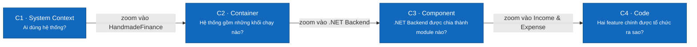

# Mô hình C4 — HandmadeFinance

> **Trạng thái:** Baseline kiến trúc · **Đối tượng đọc:** developer, reviewer, người bảo trì

Bộ tài liệu đi từ ngoài vào trong. Mỗi nút có **tên**, **loại** (`Person`, `Software System`, `Container`, `Component`), công nghệ khi cần và mô tả ngắn.

| Cấp | Tài liệu | Phạm vi |
|---|---|---|
| C1 | [System Context](01-system-context.md) | Bốn vai trò và ranh giới HandmadeFinance |
| C2 | [Container](02-container.md) | React Web, .NET Backend, PostgreSQL |
| C3 | [Component](03-component.md) | Các component bên trong .NET Backend |
| C4 | [Code — hai tính năng chính](04-code.md) | C# classes/interfaces cho quản lý khoản thu và khoản chi |

## Trạng thái triển khai

| Khối | Trạng thái thực tế |
|---|---|
| React Web | Đã có giao diện mock trong `app/` |
| Mock store/auth | Đang chạy trong trình duyệt; dùng dữ liệu JavaScript và Web Storage |
| .NET Backend | Kiến trúc đích, chưa được triển khai |
| PostgreSQL | Đã thiết kế schema, chưa nối với ứng dụng |

Các sơ đồ mô tả **kiến trúc đích**, đồng thời ghi rõ trạng thái hiện tại để không nhầm thiết kế với mã nguồn đã triển khai. Level 4 là code-level target vì .NET Backend chưa được triển khai.

## Quy ước màu

- Xanh đậm: khối chính đang được mô tả.
- Xanh nhạt: thành phần lân cận trong cùng hệ thống.
- Xám: người dùng hoặc thành phần nằm ngoài boundary đang zoom.
- Nét đứt: boundary của Software System hoặc Container.

Xem thêm: [Use Case Diagram](../../03-use-cases.md#use-case-diagram) · [arc42](../arc42/README.md).
