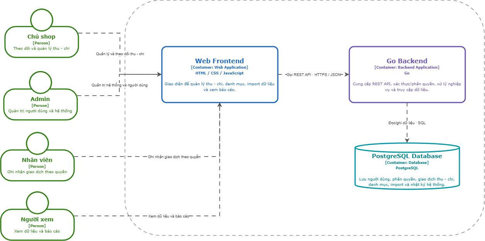

# C4 Model — HandmadeFinance

Read this documentation **from outside to inside**. Each level zooms into one building block from the previous level.

```text
C1  System Context
    Users  →  HandmadeFinance
      │
      │  zoom into Software System
      ▼
C2  Container
    Users  →  Web Frontend  →  Go Backend  →  PostgreSQL
      │
      │  zoom into Go Backend
      ▼
C3  Component
    Web Frontend  →  HTTP API  →  Identity / business modules  →  Persistence  →  PostgreSQL
```

Level 4 Code is not documented yet.

## Reading flow

| Step | Level | Question | Zoom from | Zoom into |
| ---- | ----- | -------- | --------- | --------- |
| 1 | [C1 System Context](01-system-context.md) | Who uses the system? Where is the boundary? | Shop context | HandmadeFinance |
| 2 | [C2 Container](02-container.md) | Which runtime building blocks make up the system? | HandmadeFinance | Frontend, Go Backend, PostgreSQL |
| 3 | [C3 Component](03-component.md) | How is the Go Backend divided into modules? | Go Backend | HTTP API, Identity, income/expense, import, reporting, audit, persistence |

## C1 — System Context


Four **Persons** use one **Software System**. There are no external systems.

→ Next: [C2 Container](02-container.md)

## C2 — Container



Zoom from C1: inside HandmadeFinance are Web Frontend (React.js) → REST/HTTPS/JSON → Go Backend → SQL → PostgreSQL.

→ Previous: [C1](01-system-context.md) · Next: [C3 Component](03-component.md)

## C3 — Component


Zoom from C2: inside the **Go Backend** (Planned). Frontend and PostgreSQL remain Containers. Requests flow HTTP API → authentication → business modules → Persistence → database.

→ Previous: [C2](02-container.md)

## Architecture status

| Level | Status | Notes |
| ----- | ------ | ----- |
| C1 | Defined | Four roles; no External System |
| C2 | Target | React.js frontend; Go Backend Planned; PostgreSQL schema designed |
| C3 | Target | Components are logical modules of the Go Backend; no Go code yet |
| C4 Code | Not documented | |

Current State: mock frontend (`frontend/js/data.js`, `frontend/js/auth.js`). No API `fetch`. PostgreSQL runs independently through Docker; the app is not connected to it.

## Current Architecture Decisions

1. Frontend target technology is React.js.
2. Backend target technology is Go (modular monolith).
3. PostgreSQL is the primary relational database.
4. Frontend must not connect directly to PostgreSQL.
5. Every business request goes through HTTP API and then Identity & Access before entering a domain module.
6. Persistence / Data Access is the only layer that communicates with PostgreSQL through SQL.
7. C4 documentation currently stops at Level 3.
