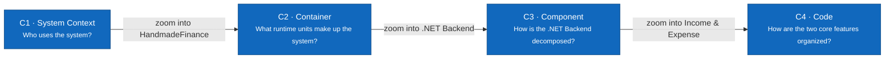

# C4 Model — HandmadeFinance

> **Status:** Architecture baseline · **Audience:** developers, reviewers, and maintainers

The documentation proceeds from the outside in. Every node has a **name**, **type** (`Person`, `Software System`, `Container`, `Component`), technology where relevant, and a short description.

| Level | Document | Scope |
|---|---|---|
| C1 | [System Context](01-system-context.md) | Four roles and the HandmadeFinance boundary |
| C2 | [Container](02-container.md) | React Web, .NET Backend, PostgreSQL, local file storage |
| C3 | [Component](03-component.md) | Components inside the .NET Backend |
| C4 | [Code — two core features](04-code.md) | C# classes/interfaces for Income and Expense management |

## Implementation Status

| Unit | Actual status |
|---|---|
| React Web | Mock UI exists in `src/frontend/` |
| Mock store/auth | Runs in the browser using JavaScript data and Web Storage |
| .NET Backend | Target architecture; not implemented |
| PostgreSQL | Schema designed; not connected to the application |
| Local file storage | Target adapter and location designed; not implemented |

The diagrams describe the **target architecture** and state the current implementation status so that design is not mistaken for working source code. Level 4 is a code-level target because the .NET Backend has not been implemented.

## Color Conventions

- Dark blue: the primary unit being described.
- Light blue: a neighboring element in the same system.
- Gray: a user or element outside the boundary being zoomed.
- Dashed line: a Software System or Container boundary.

See also: [Use Case Diagram](../../03-use-cases.md#use-case-diagram) · [arc42](../arc42/README.md).
