# Sơ đồ lớp — Auth, Income và Expense

Sơ đồ lớp (class diagram) dùng đúng tên class dự kiến trong ba tầng. DTO (Data Transfer Object — đối tượng truyền dữ liệu) thuộc tầng API; entity, service, policy, validator và repository interface thuộc Application; repository implementation thuộc Infrastructure.

Các sơ đồ dùng bố cục từ trên xuống (`direction TB`) để tránh kéo ngang trên màn hình. Cách đọc chung: **Presentation → Application → Infrastructure**; đường nét đứt biểu thị lớp triển khai interface.

## 1. Xác thực — Authentication

```mermaid
classDiagram
    direction TB

    class AuthController {
        +LoginAsync(LoginRequest, CancellationToken) Task
    }

    class LoginRequest {
        +string Email
        +string Password
    }

    class LoginResponse {
        +string AccessToken
        +DateTimeOffset ExpiresAt
        +UserResponse User
    }

    class UserResponse {
        +long Id
        +string FullName
        +string Email
        +UserRole Role
    }

    class IAuthService {
        <<interface>>
        +LoginAsync(string, string, CancellationToken) Task
    }

    class AuthService {
        +LoginAsync(string, string, CancellationToken) Task
    }

    class AuthResult {
        +string AccessToken
        +DateTimeOffset ExpiresAt
        +AppUser User
    }

    class AppUser {
        +long Id
        +string Username
        +string? Email
        +string PasswordHash
        +string FullName
        +UserRole Role
        +bool IsActive
        +DateTimeOffset? LastLoginAt
        +DateTimeOffset? DeletedAt
    }

    class IUserRepository {
        <<interface>>
        +FindActiveByEmailAsync(string, CancellationToken) Task
        +UpdateLastLoginAsync(long, DateTimeOffset, CancellationToken) Task
    }

    class IPasswordHasher {
        <<interface>>
        +Verify(string, string) bool
    }

    class ITokenIssuer {
        <<interface>>
        +Issue(AppUser) TokenResult
    }

    class IAuditLogRepository {
        <<interface>>
        +AddAsync(AuditEntry, CancellationToken) Task
    }

    class IUnitOfWork {
        <<interface>>
        +ExecuteAsync(long actorUserId, Func, CancellationToken) Task
    }

    class UserRepository {
        +FindActiveByEmailAsync(string, CancellationToken) Task
        +UpdateLastLoginAsync(long, DateTimeOffset, CancellationToken) Task
    }

    class PasswordHasher
    class JwtTokenIssuer
    class AuditLogRepository
    class EfUnitOfWork

    AuthController --> LoginRequest
    AuthController --> LoginResponse
    AuthController --> IAuthService
    AuthService ..|> IAuthService
    AuthService --> IUserRepository
    AuthService --> IPasswordHasher
    AuthService --> ITokenIssuer
    AuthService --> IAuditLogRepository
    AuthService --> IUnitOfWork
    AuthService --> AuthResult
    AuthResult --> AppUser
    UserRepository ..|> IUserRepository
    PasswordHasher ..|> IPasswordHasher
    JwtTokenIssuer ..|> ITokenIssuer
    AuditLogRepository ..|> IAuditLogRepository
    EfUnitOfWork ..|> IUnitOfWork
```

Quy tắc:

- Chỉ tài khoản `is_active = true` và `deleted_at IS NULL` được đăng nhập.
- API không trả `PasswordHash`.
- Đăng nhập thành công dùng `IUnitOfWork` đặt actor context, cập nhật `last_login_at` và ghi audit action `LOGIN` trong cùng transaction.
- Cách phát hành JWT là implementation detail (chi tiết triển khai); OpenAPI bước 4 sẽ chốt security scheme (cơ chế bảo mật).

## 2. Khoản thu — Income

Quy tắc:

- `ADMIN`, `SHOP_OWNER`, `EMPLOYEE` được tạo; `VIEWER` chỉ đọc.
- `EMPLOYEE` chỉ được sửa bản ghi do chính mình tạo.
- Chỉ `ADMIN` và `SHOP_OWNER` được soft delete (xóa mềm).
- Soft delete cập nhật `deleted_at`, `deleted_by`, không xóa vật lý.
- `IUnitOfWork` đặt `SET LOCAL app.current_user_id`; trigger PostgreSQL tạo `audit_logs` trong cùng transaction (giao dịch cơ sở dữ liệu).

## 3. Khoản chi — Expense

Khoản chi dùng cùng dependency pattern (mẫu phụ thuộc) với khoản thu, nhưng validator kiểm tra thêm `Payee`, `OriginScope`, `PaymentMethod` và `AmountAfterTax`.

## 4. Enum dùng chung

Tên và giá trị phải trùng với PostgreSQL:

| C# enum | PostgreSQL enum | Giá trị |
|---|---|---|
| `UserRole` | `user_role` | `ADMIN`, `SHOP_OWNER`, `EMPLOYEE`, `VIEWER` |
| `RecordStatus` | `record_status` | `DRAFT`, `PENDING`, `COMPLETED` |
| `DataSource` | `data_source` | `MANUAL`, `EXCEL_IMPORT` |
| `SaleRegion` | `sale_region` | `IN_EU`, `OUTSIDE_EU` |
| `SalesChannel` | `sales_channel` | `ETSY_STORE`, `WEBSITE_DIRECT`, `INSTAGRAM_SHOP`, `LOCAL_MARKET`, `B2B_WHOLESALE` |
| `OriginScope` | `origin_scope` | `DOMESTIC`, `INTERNATIONAL` |
| `PaymentMethod` | `payment_method` | `CREDIT_CARD`, `BANK_TRANSFER`, `CASH`, `PAYPAL` |

## 5. Ranh giới mapping

- `UpdateIncomeRequest` và `UpdateExpenseRequest` chứa toàn bộ trường mutable (có thể thay đổi) tương ứng với create contract, không làm mất order/fee hoặc payment data.
- API DTO ↔ Application command/query được map trong `HandmadeFinance.Api/Mapping`.
- Application entity ↔ database model được map trong `HandmadeFinance.Infrastructure/Persistence`.
- Không truyền trực tiếp EF Core entity hoặc `DbContext` ra Controller.
- `IncomeResponse` và `ExpenseResponse` không trả `DeletedAt`/`DeletedBy` trong danh sách active trừ khi OpenAPI sau này yêu cầu.

**Liên quan:** [C4 Level 4](../c4/04-code.md) · [Database](../../DATABASE.md) · [Sequence diagrams](02-sequence-diagrams.md)
