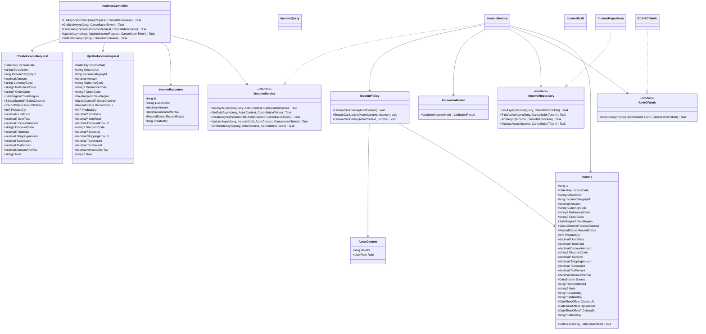

# Class Diagrams — Authentication, Income, and Expense

> Design status: TARGET V1
>
> Implementation status: TARGET DESIGN with executable backend baseline; class consolidation may differ

The class diagrams use the intended class names across the three tiers. DTOs belong to the API tier; entities, services, policies, validators, and repository interfaces belong to Application; repository implementations belong to Infrastructure.

The diagrams use a top-to-bottom layout (`direction TB`) to avoid excessive horizontal width. Read them as **Presentation → Application → Infrastructure**; dashed realization arrows indicate interface implementations.

## 1. Authentication

```mermaid
classDiagram
    direction TB

    class AuthController {
        +LoginAsync(LoginRequest, CancellationToken) Task
        +LogoutAsync(CancellationToken) Task
    }

    class LoginRequest {
        +string Email
        +string Password
    }

    class LoginResponse {
        +string AccessToken
        +string TokenType
        +DateTimeOffset ExpiresAt
        +UserResponse User
    }

    class UserResponse {
        +long Id
        +string Username
        +string FullName
        +string? Email
        +string? Phone
        +string? AvatarUrl
        +string Timezone
        +UserRole Role
        +bool IsActive
        +DateTimeOffset? LastLoginAt
        +DateTimeOffset CreatedAt
        +DateTimeOffset UpdatedAt
    }

    class IAuthService {
        <<interface>>
        +LoginAsync(string, string, CancellationToken) Task
        +LogoutAsync(ActorContext, CancellationToken) Task
    }

    class AuthService {
        +LoginAsync(string, string, CancellationToken) Task
        +LogoutAsync(ActorContext, CancellationToken) Task
    }

    class AuthResult {
        +string AccessToken
        +DateTimeOffset ExpiresAt
        +AppUser User
    }

    class AppUser {
        +long Id
        +string Username
        +string? Email
        +string PasswordHash
        +string FullName
        +UserRole Role
        +bool IsActive
        +DateTimeOffset? LastLoginAt
        +DateTimeOffset? DeletedAt
    }

    class IUserRepository {
        <<interface>>
        +FindActiveByEmailAsync(string, CancellationToken) Task
        +UpdateLastLoginAsync(long, DateTimeOffset, CancellationToken) Task
    }

    class IPasswordHasher {
        <<interface>>
        +Verify(string, string) bool
    }

    class ITokenIssuer {
        <<interface>>
        +Issue(AppUser) TokenResult
    }

    class IAuditLogRepository {
        <<interface>>
        +AddAsync(AuditEntry, CancellationToken) Task
    }

    class IUnitOfWork {
        <<interface>>
        +ExecuteAsync(long actorUserId, Func, CancellationToken) Task
    }

    class UserRepository {
        +FindActiveByEmailAsync(string, CancellationToken) Task
        +UpdateLastLoginAsync(long, DateTimeOffset, CancellationToken) Task
    }

    class PasswordHasher
    class JwtTokenIssuer
    class AuditLogRepository
    class EfUnitOfWork

    AuthController --> LoginRequest
    AuthController --> LoginResponse
    AuthController --> IAuthService
    AuthService ..|> IAuthService
    AuthService --> IUserRepository
    AuthService --> IPasswordHasher
    AuthService --> ITokenIssuer
    AuthService --> IAuditLogRepository
    AuthService --> IUnitOfWork
    AuthService --> AuthResult
    AuthResult --> AppUser
    UserRepository ..|> IUserRepository
    PasswordHasher ..|> IPasswordHasher
    JwtTokenIssuer ..|> ITokenIssuer
    AuditLogRepository ..|> IAuditLogRepository
    EfUnitOfWork ..|> IUnitOfWork
```

Rules:

- Only accounts with `is_active = true` and `deleted_at IS NULL` may log in.
- The API never returns `PasswordHash`.
- A successful login uses `IUnitOfWork` to set actor context, update `last_login_at`, and write the `LOGIN` audit action in the same transaction.
- JWT issuance is an implementation detail; the Bearer security scheme is defined in the [OpenAPI contract](../../api/openapi.yaml).

## 2. Income

Rules:

- `ADMIN`, `SHOP_OWNER`, and `EMPLOYEE` may create records; `VIEWER` is read-only.
- An `EMPLOYEE` may update only records they created.
- Only `ADMIN` and `SHOP_OWNER` may soft-delete records.
- Soft deletion updates `deleted_at` and `deleted_by`; it does not physically delete data.
- `IUnitOfWork` executes `SET LOCAL app.current_user_id`; PostgreSQL triggers create `audit_logs` records in the same database transaction.

## 3. Expense

```mermaid
classDiagram
    direction TB

    class ExpensesController {
        +ListAsync(ExpenseQueryRequest, CancellationToken) Task
        +GetByIdAsync(long, CancellationToken) Task
        +CreateAsync(CreateExpenseRequest, CancellationToken) Task
        +UpdateAsync(long, UpdateExpenseRequest, CancellationToken) Task
        +SoftDeleteAsync(long, CancellationToken) Task
    }

    class CreateExpenseRequest {
        +DateOnly ExpenseDate
        +string Description
        +long ExpenseCategoryId
        +decimal Amount
        +string CurrencyCode
        +string? Payee
        +OriginScope OriginScope
        +PaymentMethod? PaymentMethod
        +RecordStatus RecordStatus
        +decimal TaxPercent
        +decimal AmountAfterTax
        +string? Note
    }

    class UpdateExpenseRequest {
        +DateOnly ExpenseDate
        +string Description
        +long ExpenseCategoryId
        +decimal Amount
        +string CurrencyCode
        +string? Payee
        +OriginScope OriginScope
        +PaymentMethod? PaymentMethod
        +RecordStatus RecordStatus
        +decimal TaxPercent
        +decimal AmountAfterTax
        +string? Note
    }

    class ExpenseResponse {
        +long Id
        +string Description
        +decimal Amount
        +decimal AmountAfterTax
        +RecordStatus RecordStatus
        +long CreatedBy
    }

    class ExpenseQuery

    class IExpenseService {
        <<interface>>
        +ListAsync(ExpenseQuery, ActorContext, CancellationToken) Task
        +GetByIdAsync(long, ActorContext, CancellationToken) Task
        +CreateAsync(ExpenseDraft, ActorContext, CancellationToken) Task
        +UpdateAsync(long, ExpenseDraft, ActorContext, CancellationToken) Task
        +SoftDeleteAsync(long, ActorContext, CancellationToken) Task
    }

    class ExpenseService

    class ExpensePolicy {
        +EnsureCanCreate(ActorContext) void
        +EnsureCanUpdate(ActorContext, Expense) void
        +EnsureCanDelete(ActorContext, Expense) void
    }

    class ExpenseValidator {
        +Validate(ExpenseDraft) ValidationResult
    }

    class Expense {
        +long Id
        +DateOnly ExpenseDate
        +string Description
        +long ExpenseCategoryId
        +decimal Amount
        +string CurrencyCode
        +string? Payee
        +OriginScope OriginScope
        +PaymentMethod? PaymentMethod
        +RecordStatus RecordStatus
        +decimal TaxPercent
        +decimal AmountAfterTax
        +DataSource Source
        +long? ImportBatchId
        +string? Note
        +long? CreatedBy
        +long? UpdatedBy
        +DateTimeOffset CreatedAt
        +DateTimeOffset UpdatedAt
        +DateTimeOffset? DeletedAt
        +long? DeletedBy
        +SoftDelete(long, DateTimeOffset) void
    }

    class ExpenseDraft

    class ActorContext {
        +long UserId
        +UserRole Role
    }

    class IExpenseRepository {
        <<interface>>
        +ListAsync(ExpenseQuery, CancellationToken) Task
        +FindActiveAsync(long, CancellationToken) Task
        +AddAsync(Expense, CancellationToken) Task
        +UpdateAsync(Expense, CancellationToken) Task
    }

    class ExpenseRepository
    class EfUnitOfWork

    class IUnitOfWork {
        <<interface>>
        +ExecuteAsync(long actorUserId, Func, CancellationToken) Task
    }

    ExpensesController --> CreateExpenseRequest
    ExpensesController --> UpdateExpenseRequest
    ExpensesController --> ExpenseResponse
    ExpensesController --> IExpenseService
    ExpenseService ..|> IExpenseService
    ExpenseService --> ExpensePolicy
    ExpenseService --> ExpenseValidator
    ExpenseService --> IExpenseRepository
    ExpenseService --> IUnitOfWork
    ExpenseService --> Expense
    ExpensePolicy --> ActorContext
    ExpensePolicy --> Expense
    ExpenseRepository ..|> IExpenseRepository
    EfUnitOfWork ..|> IUnitOfWork
```

Expense uses the same dependency pattern as Income, but its validator additionally checks `Payee`, `OriginScope`, `PaymentMethod`, and `AmountAfterTax`.

## 4. Shared Enums

Names and values must match PostgreSQL:

| C# enum | PostgreSQL enum | Values |
|---|---|---|
| `UserRole` | `user_role` | `ADMIN`, `SHOP_OWNER`, `EMPLOYEE`, `VIEWER` |
| `RecordStatus` | `record_status` | `DRAFT`, `PENDING`, `COMPLETED` |
| `DataSource` | `data_source` | `MANUAL`, `EXCEL_IMPORT` |
| `SaleRegion` | `sale_region` | `IN_EU`, `OUTSIDE_EU` |
| `SalesChannel` | `sales_channel` | `ETSY_STORE`, `WEBSITE_DIRECT`, `INSTAGRAM_SHOP`, `LOCAL_MARKET`, `B2B_WHOLESALE` |
| `OriginScope` | `origin_scope` | `DOMESTIC`, `INTERNATIONAL` |
| `PaymentMethod` | `payment_method` | `CREDIT_CARD`, `BANK_TRANSFER`, `CASH`, `PAYPAL` |

## 5. Mapping Boundaries

- `UpdateIncomeRequest` and `UpdateExpenseRequest` contain every mutable field from their corresponding create contracts, preserving order/fee and payment data.
- API DTO ↔ Application command/query mapping occurs in `HandmadeFinance.Api/Mapping`.
- Application entity ↔ database model mapping occurs in `HandmadeFinance.Infrastructure/Persistence`.
- EF Core entities and `DbContext` are never passed directly to Controllers.
- `IncomeResponse` and `ExpenseResponse` omit `DeletedAt`/`DeletedBy` from active lists, consistent with the [OpenAPI contract](../../api/openapi.yaml).

## 6. DTO Naming Convention

**Status:** ACCEPTED

The OpenAPI contract currently reuses `IncomeWriteRequest` and `ExpenseWriteRequest` for create and update operations. The class design uses explicit `CreateIncomeRequest` / `UpdateIncomeRequest` and `CreateExpenseRequest` / `UpdateExpenseRequest` types.

Use separate create/update C# DTO names to make intent explicit; both map to the shared OpenAPI write schema while their fields remain identical. OpenAPI field names and required/nullable semantics remain authoritative.

**Related:** [C4 Level 4](../c4/04-code.md) · [Database](../../DATABASE.md) · [Sequence diagrams](02-sequence-diagrams.md)
