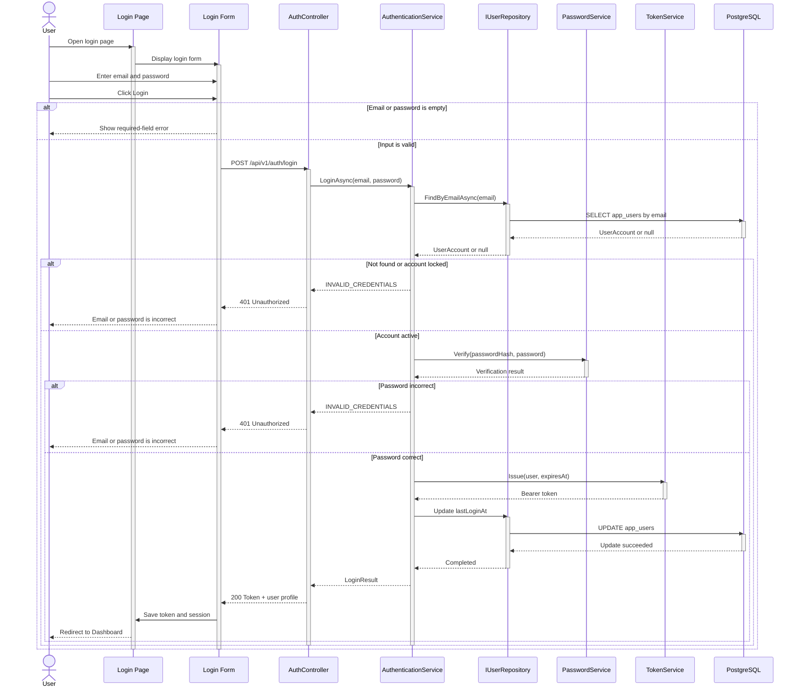
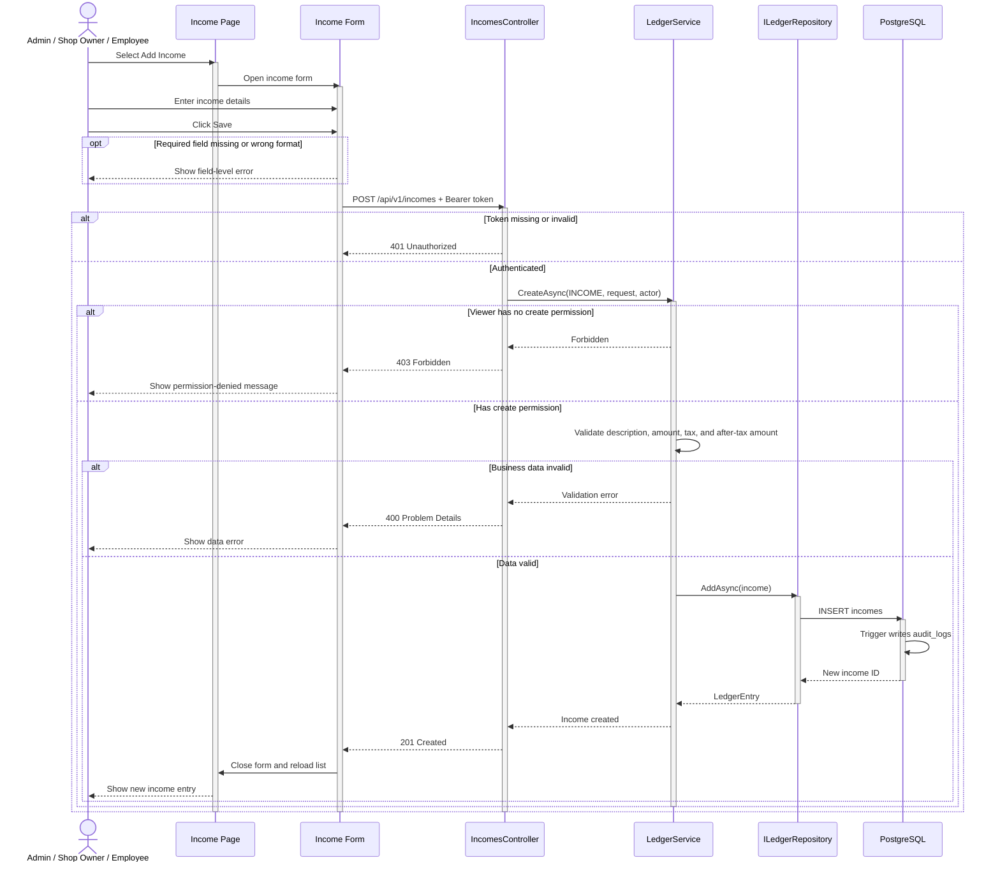
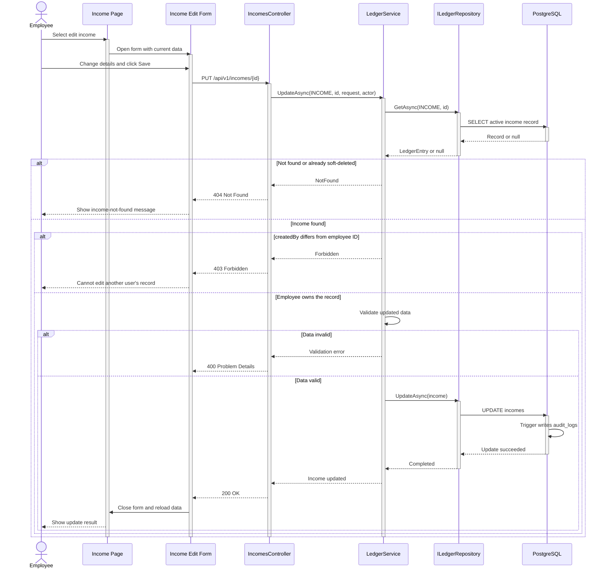
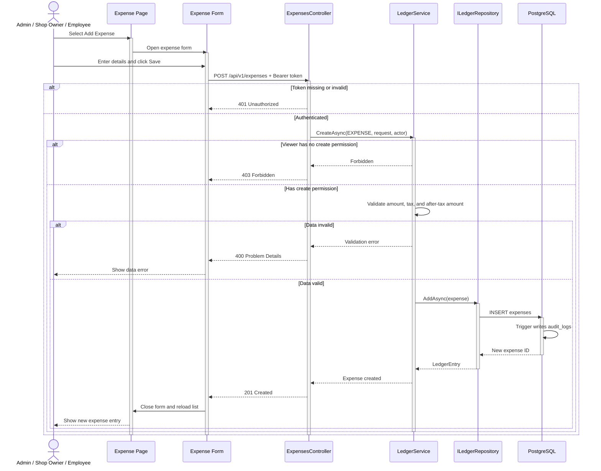
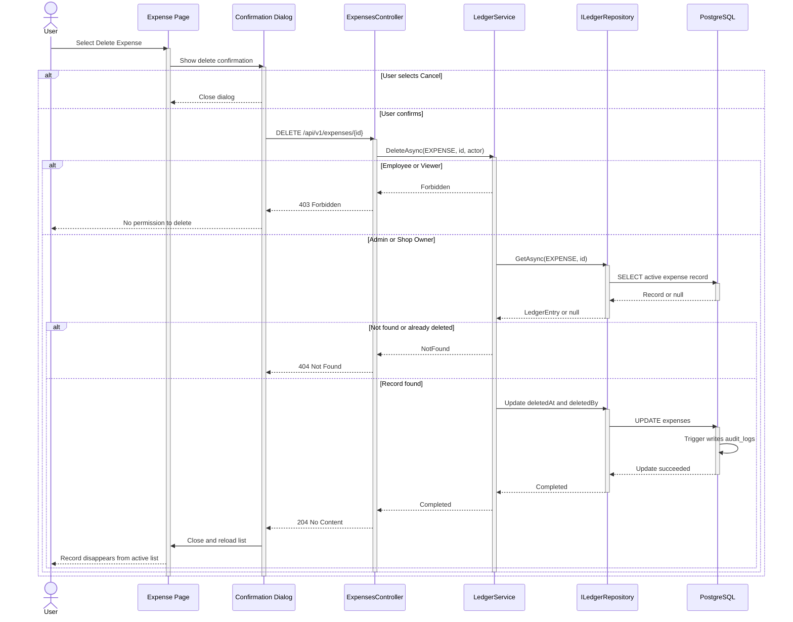

# Sequence Diagrams — Authentication, Income, and Expense

> **Scope:** Step 6 · **Status:** Executable baseline implemented  
> The `/api/v1/...` endpoints follow [OpenAPI 3.0.4](../../api/openapi.yaml).

The diagrams share one presentation pattern: **Actor → Page → Form → Controller → Application Service → Repository → PostgreSQL**. Requests use solid arrows, responses use dashed arrows; `alt` describes mutually exclusive outcomes and `opt` describes optional processing.

## 1. Login — `POST /api/v1/auth/login`

The API intentionally returns the same `401` error for a non-existent email, a locked account, and a wrong password to prevent account enumeration.

## 2. Add income — `POST /api/v1/incomes`

## 3. Employee edits income — `PUT /api/v1/incomes/{id}`

Admin and Shop Owner can edit any record; Employee can only edit records they created.

## 4. Add expense — `POST /api/v1/expenses`

## 5. Soft-delete expense — `DELETE /api/v1/expenses/{id}`

The endpoint uses HTTP `DELETE`, but the database only updates `deleted_at` and `deleted_by`; the record is not physically deleted.

## 6. Common error conventions

| HTTP | Meaning | Use case |
|---|---|---|
| `400` | Bad Request | Request or business data is invalid |
| `401` | Unauthorized | Token missing, invalid, or expired |
| `403` | Forbidden | Authenticated but lacks permission |
| `404` | Not Found | Does not exist or has been soft-deleted |
| `409` | Conflict | Duplicate data or business conflict |
| `500` | Internal Server Error | Unexpected error, returned with a trace ID |

Error responses use the RFC 7807 structure defined in the [OpenAPI contract](../../api/openapi.yaml).

**Related:** [Class diagrams](01-class-diagrams.md) · [General Runtime View](../arc42/06-runtime-view.md) · [Folder structure](../../07-folder-structure.md)
