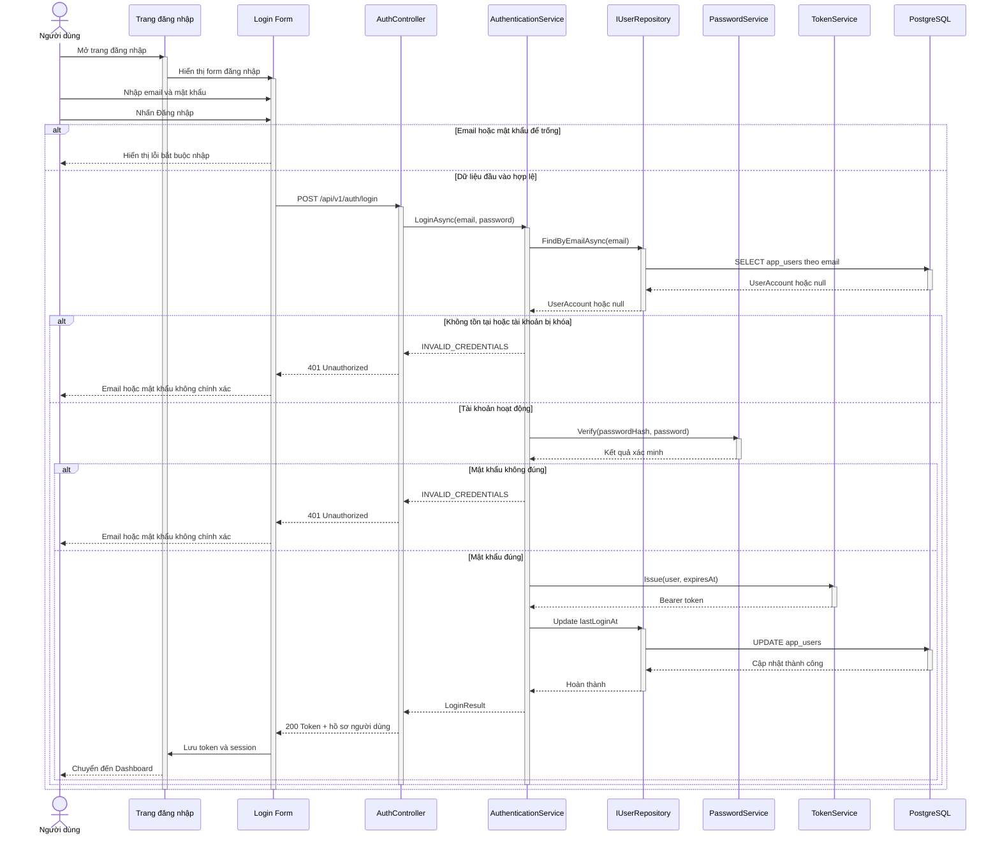
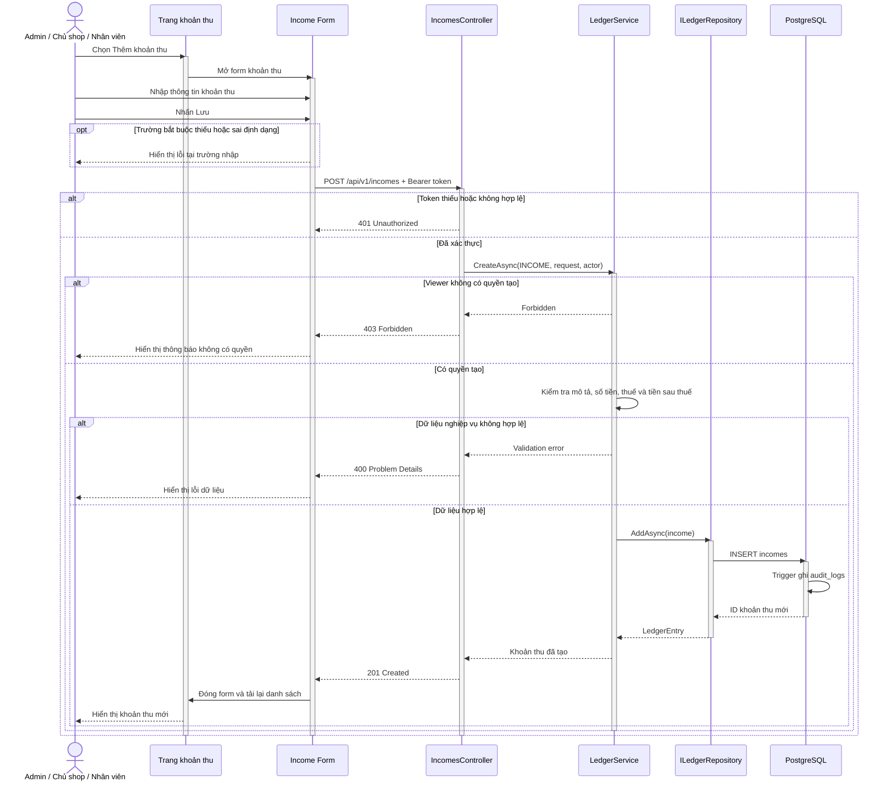
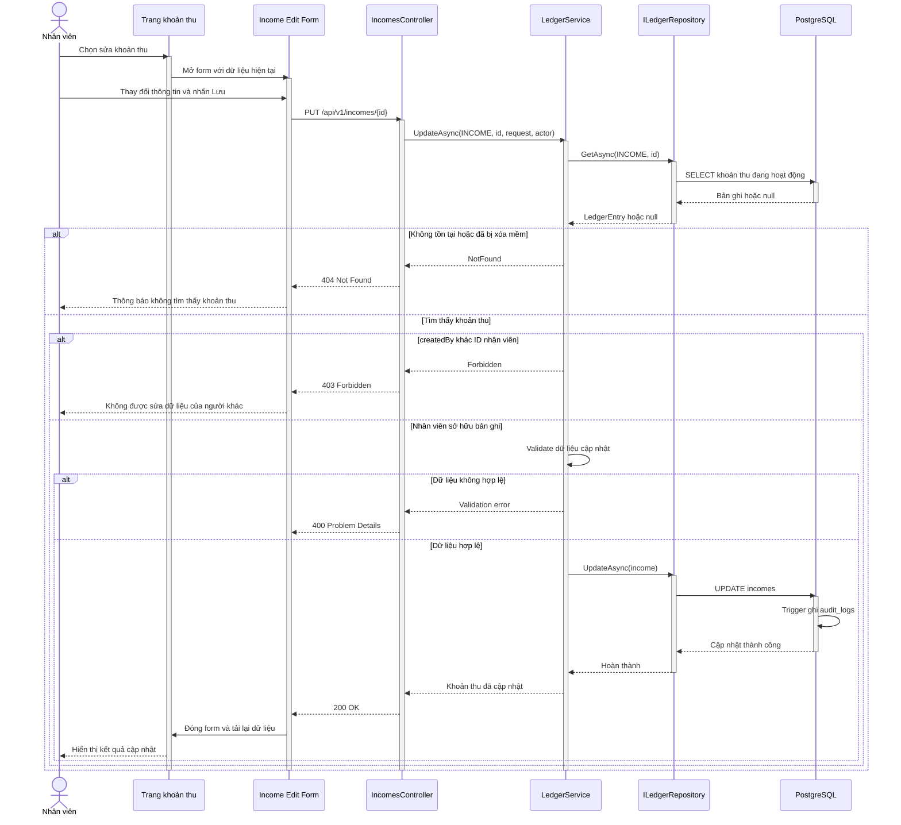
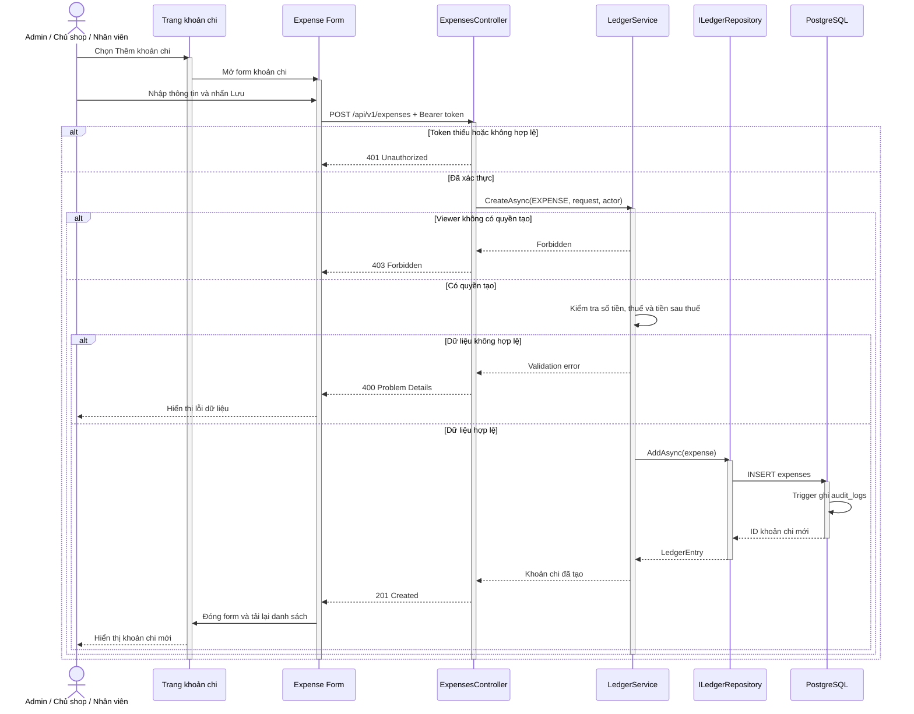
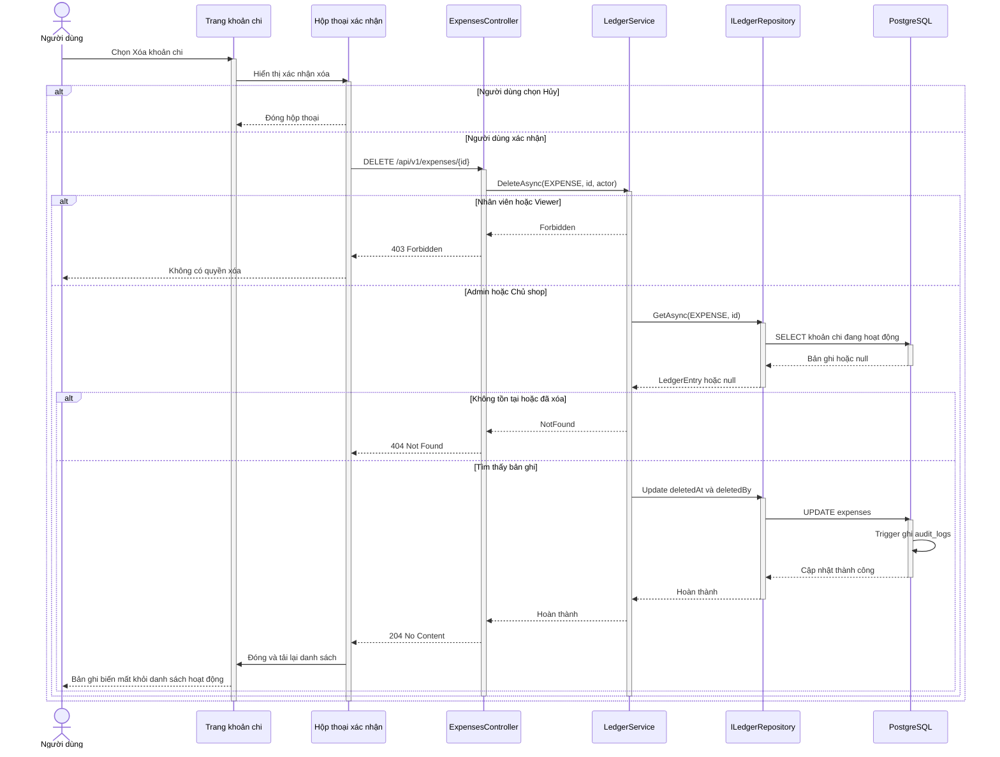

# Sequence Diagrams — Authentication, Income, and Expense

> **Scope:** Step 6 · **Status:** Executable baseline implemented  
> Các endpoint `/api/v1/...` tuân theo [OpenAPI 3.0.4](../../api/openapi.yaml).

Các sơ đồ dùng cùng một mẫu trình bày: **Actor → Page → Form → Controller → Application Service → Repository → PostgreSQL**. Request dùng mũi tên liền, response dùng mũi tên nét đứt; `alt` mô tả các kết quả loại trừ nhau và `opt` mô tả xử lý tùy chọn.

## 1. Đăng nhập — `POST /api/v1/auth/login`

API cố ý trả cùng một lỗi `401` cho email không tồn tại, tài khoản bị khóa và mật khẩu sai để tránh dò tìm tài khoản.

## 2. Thêm khoản thu — `POST /api/v1/incomes`

## 3. Nhân viên sửa khoản thu — `PUT /api/v1/incomes/{id}`

Admin và Chủ shop có thể sửa mọi bản ghi; Nhân viên chỉ được sửa bản ghi do mình tạo.

## 4. Thêm khoản chi — `POST /api/v1/expenses`

## 5. Xóa mềm khoản chi — `DELETE /api/v1/expenses/{id}`

Endpoint dùng HTTP `DELETE`, nhưng database chỉ cập nhật `deleted_at` và `deleted_by`; bản ghi không bị xóa vật lý.

## 6. Quy ước lỗi chung

| HTTP | Ý nghĩa | Trường hợp sử dụng |
|---|---|---|
| `400` | Bad Request | Request hoặc dữ liệu nghiệp vụ không hợp lệ |
| `401` | Unauthorized | Thiếu token, token sai hoặc hết hạn |
| `403` | Forbidden | Đã đăng nhập nhưng không có quyền |
| `404` | Not Found | Không tồn tại hoặc đã bị xóa mềm |
| `409` | Conflict | Trùng dữ liệu hoặc xung đột nghiệp vụ |
| `500` | Internal Server Error | Lỗi ngoài dự kiến, trả kèm trace ID |

Response lỗi sử dụng cấu trúc RFC 7807 trong [OpenAPI contract](../../api/openapi.yaml).

**Related:** [Class diagrams](01-class-diagrams.md) · [General Runtime View](../arc42/06-runtime-view.md) · [Folder structure](../../07-folder-structure.md)
