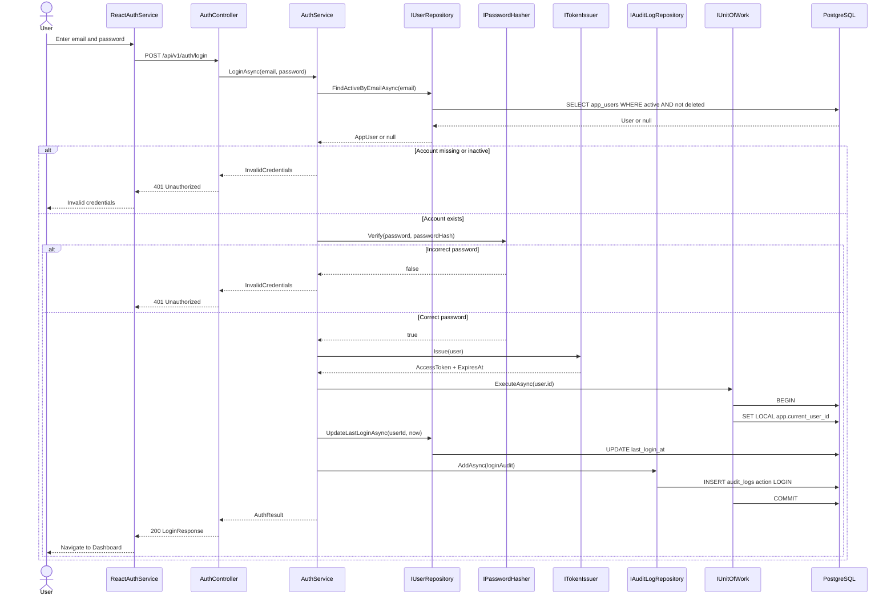
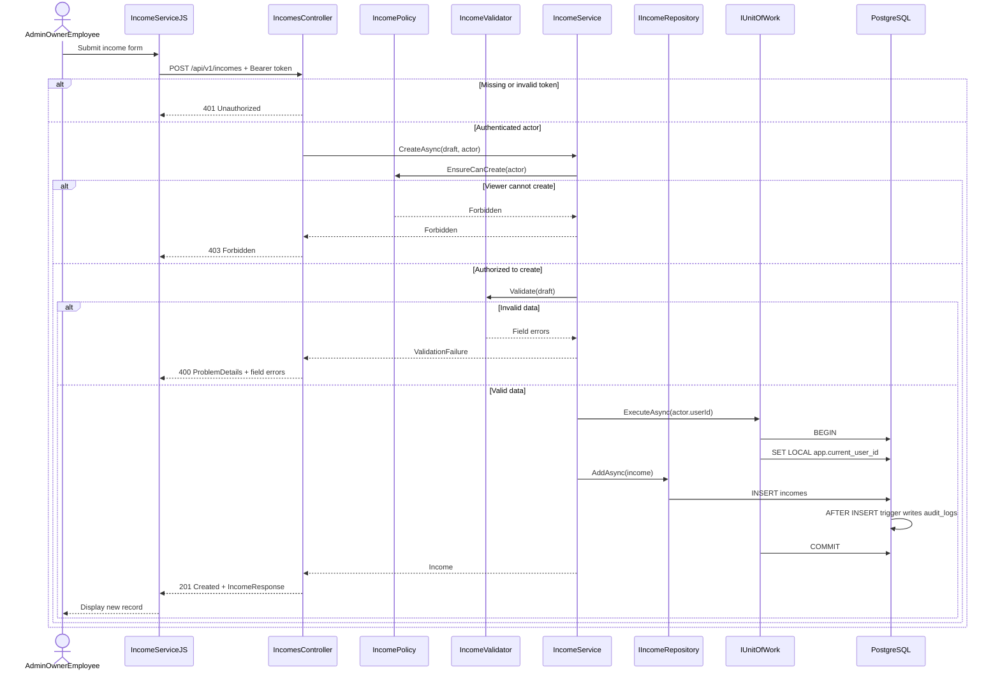
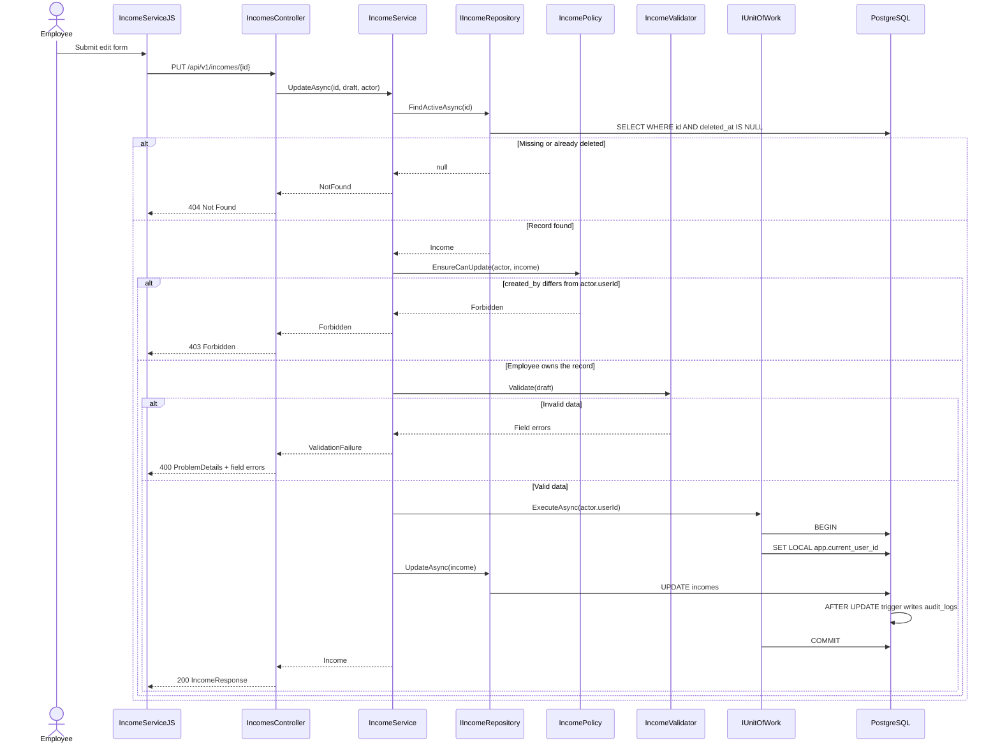
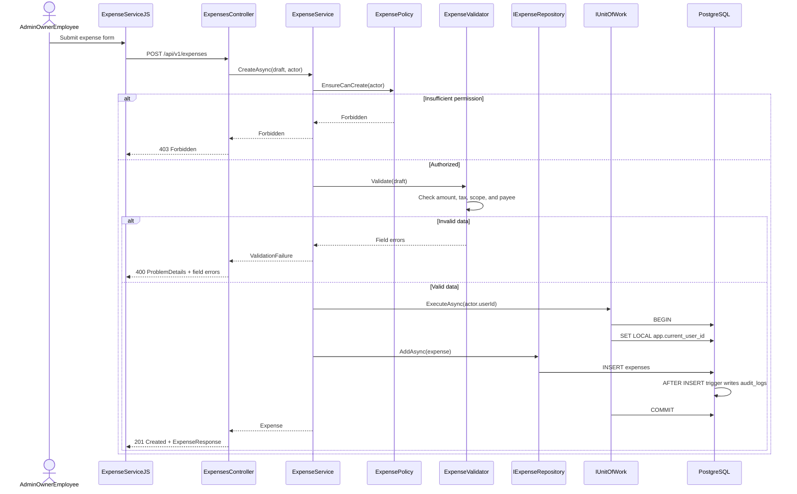
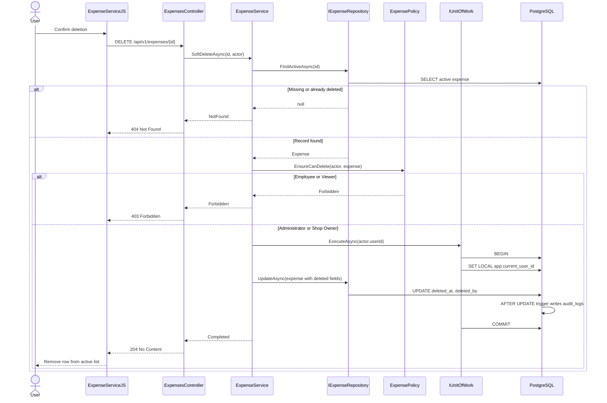

# Sequence Diagrams — Authentication, Income, and Expense

> **Scope:** Step 6 · **Status:** Design only; no working API  
> The `/api/v1/...` endpoints are a provisional contract until the Step 4 OpenAPI 3.0 specification is approved.

The sequence diagrams describe calls between React, Presentation, Application, and Data. Every authorization path is checked by the backend; hiding frontend controls is UX only.

## 1. Login — `POST /api/v1/auth/login`

The API returns the same `401` response for an unknown email and an incorrect password to reduce account-enumeration risk.

## 2. Create Income — `POST /api/v1/incomes`

If the income insert or audit trigger fails, `IUnitOfWork` rolls back the entire transaction. The Service does not insert a second DML audit record.

## 3. Employee Updates Income — `PUT /api/v1/incomes/{id}`

Administrators and Shop Owners are not restricted by `created_by`; Employees may update only their own records.

## 4. Create Expense — `POST /api/v1/expenses`

`ExpenseValidator` checks `AmountAfterTax` against the rule agreed in requirements/OpenAPI; the client is not the authoritative source.

## 5. Soft-Delete Expense — `DELETE /api/v1/expenses/{id}`

The endpoint uses HTTP `DELETE`, but persistence performs a soft deletion; data is not physically deleted.

## 6. Common Error Conventions

| HTTP | Term | Usage |
|---|---|---|
| `400` | Bad Request | Invalid request or field |
| `401` | Unauthorized | Unauthenticated or invalid token |
| `403` | Forbidden | Authenticated but not authorized |
| `404` | Not Found | Record missing or soft-deleted |
| `409` | Conflict | Unique or business conflict, when applicable |
| `500` | Internal Server Error | Unexpected failure; roll back and return a request/error ID |

Error bodies are expected to use RFC 7807 Problem Details; Step 4 OpenAPI will define the exact structure.

**Related:** [Class diagrams](01-class-diagrams.md) · [General Runtime View](../arc42/06-runtime-view.md) · [Folder structure](../../07-folder-structure.md)
