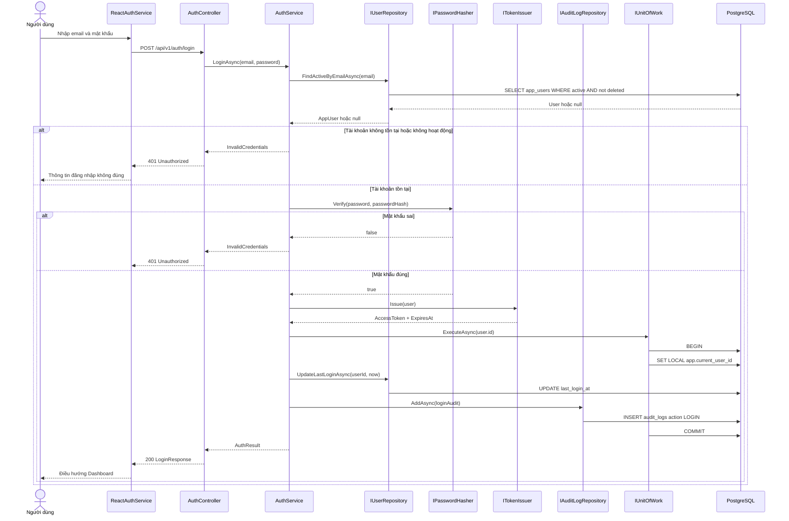
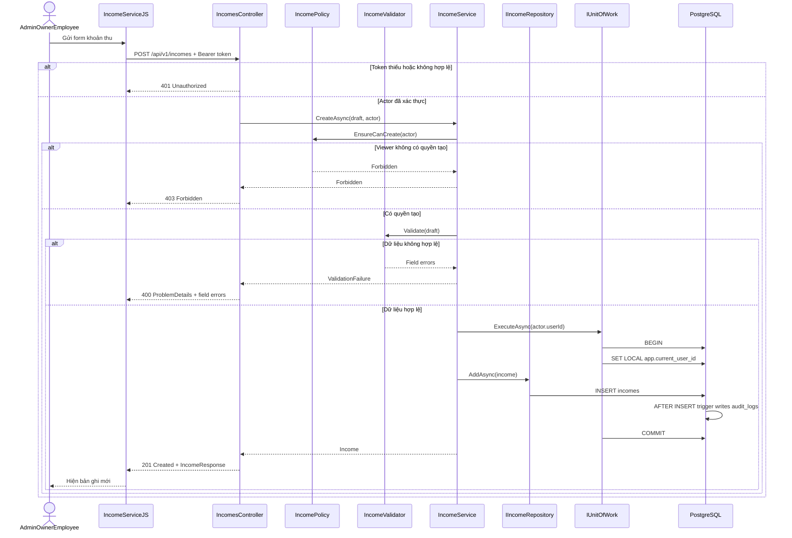
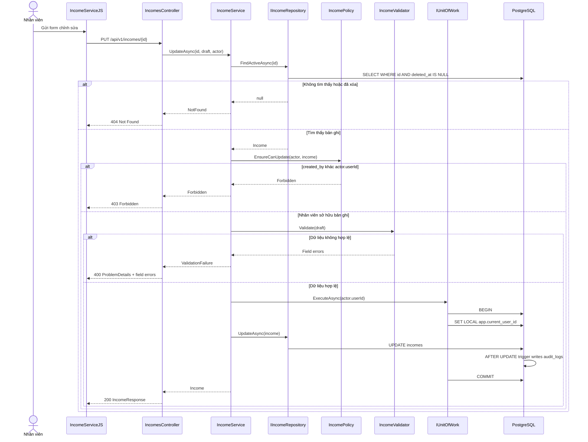
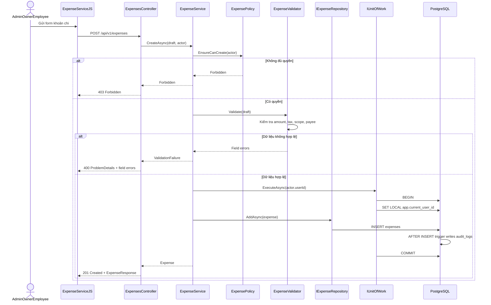
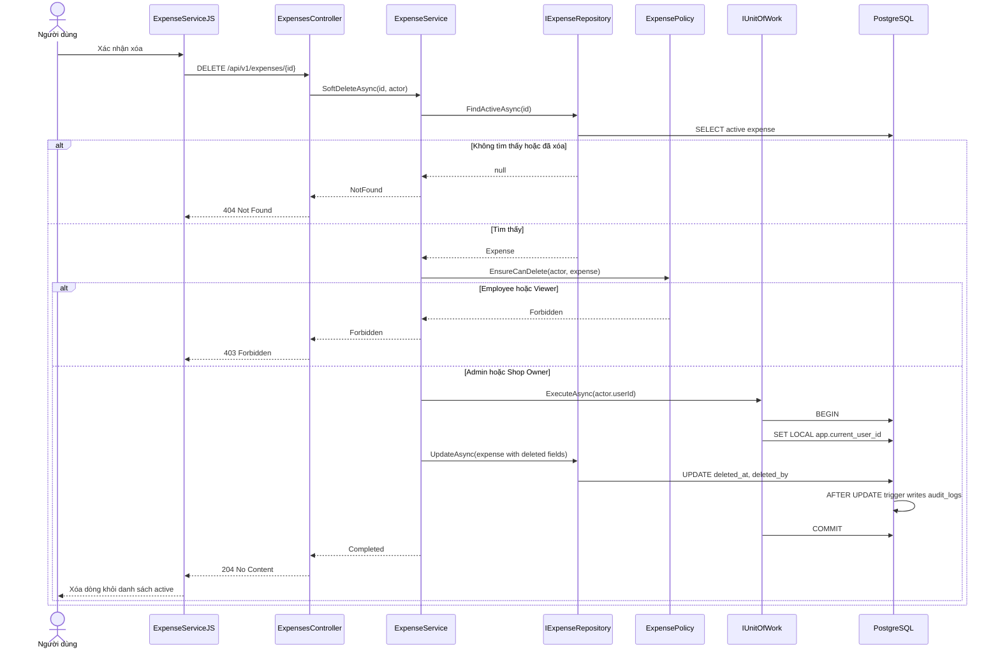

# Sơ đồ tuần tự — Auth, Income và Expense

> **Phạm vi:** Bước 6 · **Trạng thái:** Thiết kế, chưa có API chạy thật  
> Các endpoint `/api/v1/...` là provisional contract (hợp đồng tạm thời) cho tới khi bước 4 OpenAPI 3.0 được duyệt.

Sơ đồ tuần tự (sequence diagram) mô tả thứ tự gọi giữa React, tầng Presentation, tầng Application và tầng Data. Mọi nhánh phân quyền đều được kiểm tra ở backend; việc frontend ẩn nút chỉ là UX.

## 1. Đăng nhập — `POST /api/v1/auth/login`

API dùng cùng thông báo `401` cho email không tồn tại và mật khẩu sai để hạn chế account enumeration (dò tài khoản).

## 2. Tạo khoản thu — `POST /api/v1/incomes`

Nếu insert khoản thu hoặc audit trigger thất bại, `IUnitOfWork` rollback (hoàn tác) toàn bộ transaction. Service không chèn audit DML lần thứ hai.

## 3. Nhân viên sửa khoản thu — `PUT /api/v1/incomes/{id}`

Admin và Shop Owner không bị giới hạn `created_by`; Employee chỉ sửa bản ghi của chính mình.

## 4. Tạo khoản chi — `POST /api/v1/expenses`

`ExpenseValidator` đối chiếu `AmountAfterTax` với quy tắc đã thống nhất trong requirements/OpenAPI; client không phải nguồn quyết định cuối cùng.

## 5. Xóa mềm khoản chi — `DELETE /api/v1/expenses/{id}`

Endpoint dùng HTTP `DELETE`, nhưng persistence thực hiện soft delete; dữ liệu không bị xóa vật lý.

## 6. Quy ước lỗi chung

| HTTP | Thuật ngữ | Khi dùng |
|---|---|---|
| `400` | Bad Request | Request/field không hợp lệ |
| `401` | Unauthorized | Chưa xác thực hoặc token không hợp lệ |
| `403` | Forbidden | Đã xác thực nhưng thiếu quyền |
| `404` | Not Found | Bản ghi không tồn tại hoặc đã soft delete |
| `409` | Conflict | Vi phạm unique/business conflict nếu có |
| `500` | Internal Server Error | Lỗi không dự kiến; rollback và trả request/error id |

Error body dự kiến dùng RFC 7807 Problem Details; cấu trúc chính xác sẽ do OpenAPI bước 4 quyết định.

**Liên quan:** [Class diagrams](01-class-diagrams.md) · [Runtime View tổng quát](../arc42/06-runtime-view.md) · [Cấu trúc thư mục](../../07-folder-structure.md)
