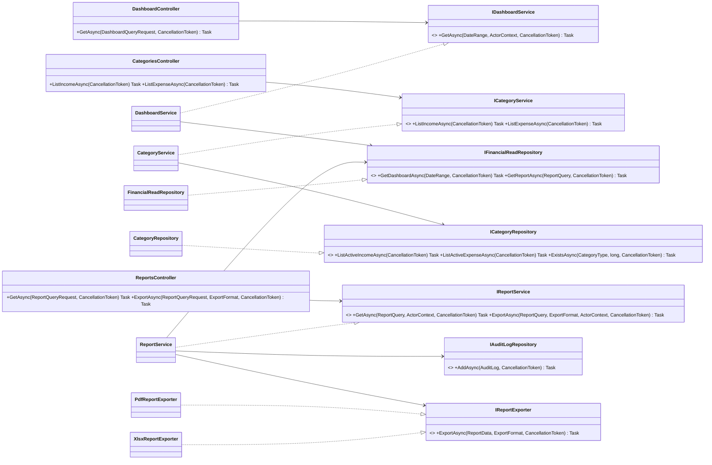
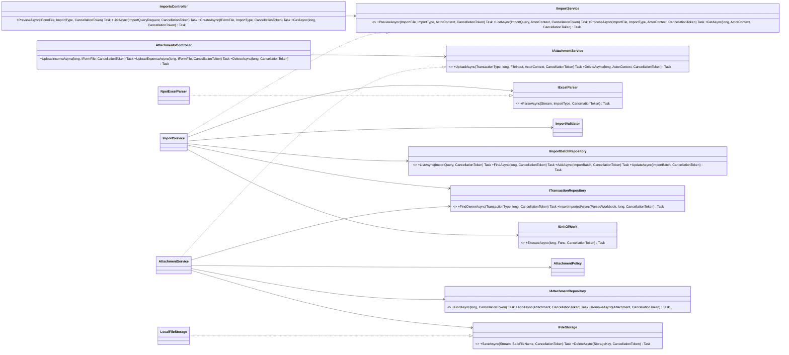
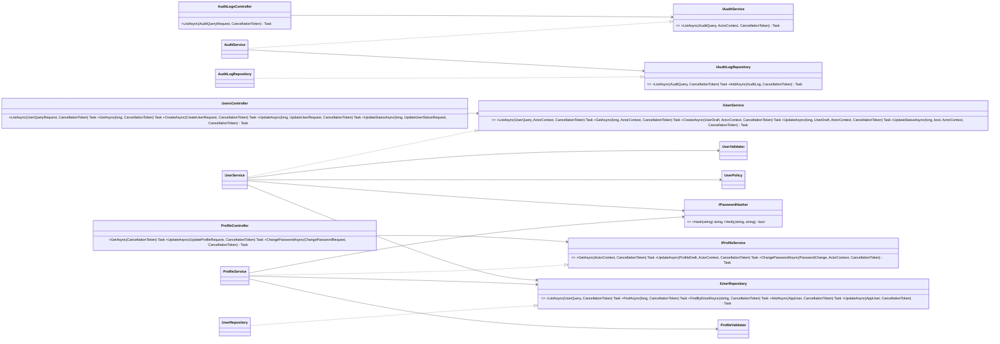

# Class Diagrams — Remaining V1 Modules

> Design status: TARGET V1
>
> Implementation status: NOT IMPLEMENTED

These diagrams complete the class-level design beyond Authentication, Income, and Expense. Names map directly to the target folders and OpenAPI `operationId` values.

## Dashboard, Categories, and Reports

Dashboard and reports query only active USD records. Export first obtains the same `ReportData` used by the JSON report, then selects the requested exporter and writes an `EXPORT` audit event.

## Imports and Attachments

The import service parses before the write transaction and commits every validated transaction plus the completed batch atomically. A failed batch stores errors but no imported transactions. Attachment metadata and file operations are coordinated so failed metadata writes remove newly stored files.

### Import validation collaboration

**Status:** TBD

`ImportService → ITransactionRepository` is provisional orchestration notation, not permission to bypass ledger rules. Import must reuse approved income/expense validation and business rules through validators, policies, a shared application/domain layer, or another owner-approved approach. The final method-level dependency must be selected before implementation.

## Audit, Users, and Profile

`UserPolicy` permits only `ADMIN`. Profile mapping exposes no role/status mutation. Password hashes are write-only infrastructure values and never appear in an API response.

**Related:** [Core class diagrams](01-class-diagrams.md) · [OpenAPI](../../api/openapi.yaml) · [Folder structure](../../07-folder-structure.md)
