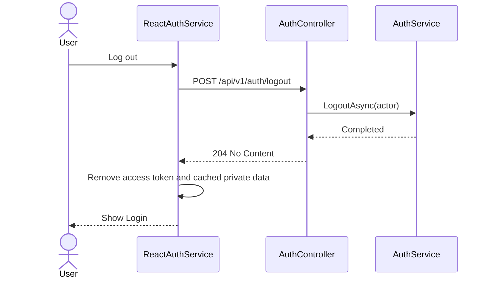
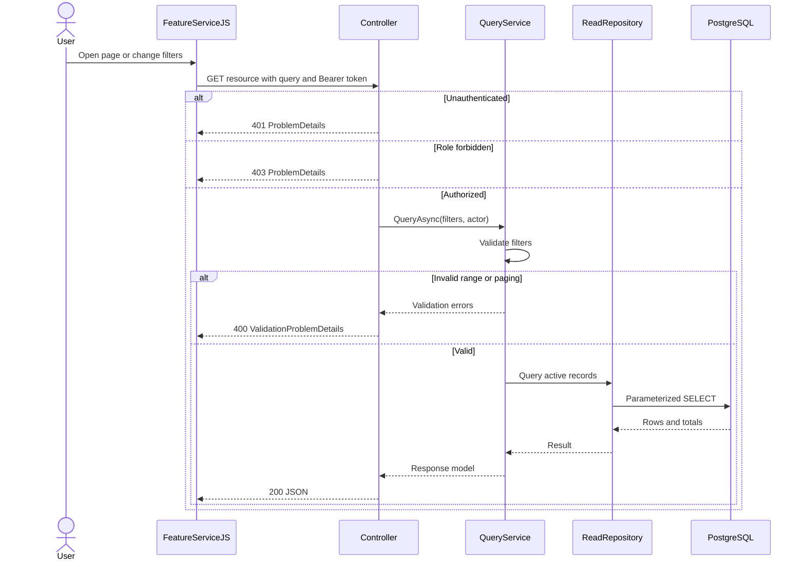
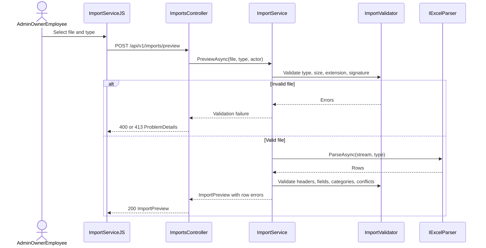
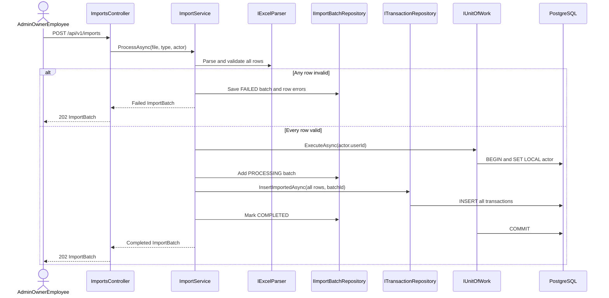
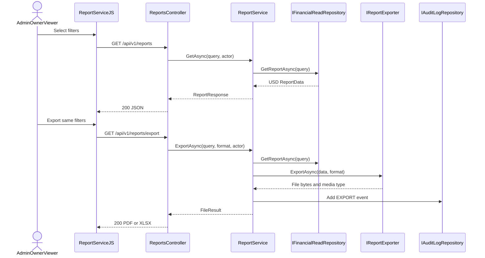
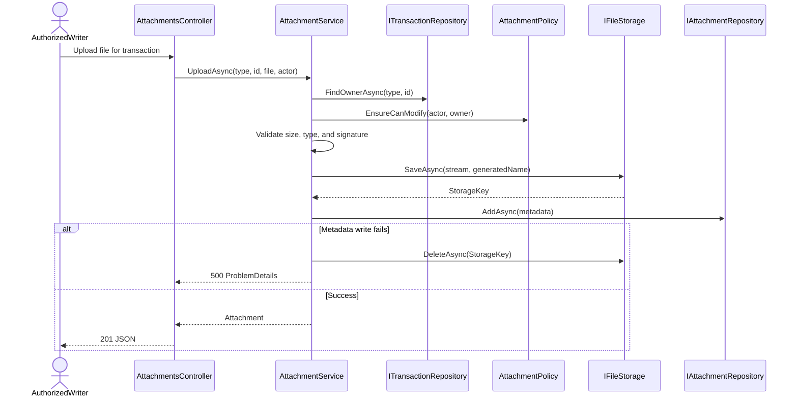
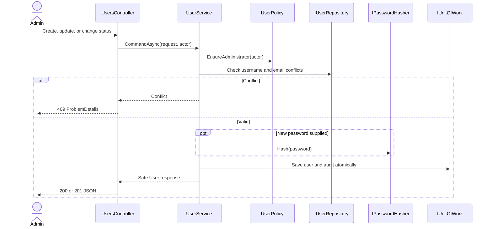
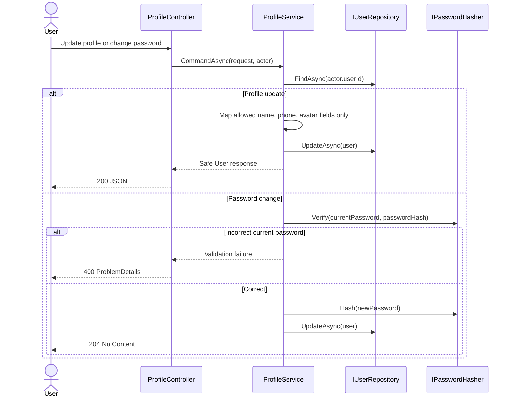

# API Design Traceability

Every OpenAPI operation maps to an owning module, Application service, authorization rule, and sequence pattern. This is the implementation index for Step 7.

| OpenAPI operation | Use case | Application owner | Authorization | Sequence |
|---|---|---|---|---|
| `login`, `logout` | UC01–02 | `IAuthService` | Public / authenticated | S01, S02 |
| `getDashboard` | UC03 | `IDashboardService` | All roles | S03 |
| `listIncomeCategories`, `listExpenseCategories` | UC04, UC08 | `ICategoryService` | All roles | S03 read pattern |
| `listIncomes`, `getIncome` | UC04 | `IIncomeService` | All roles | S03 read pattern |
| `createIncome`, `updateIncome`, `softDeleteIncome` | UC05–07 | `IIncomeService` | Write matrix + Employee ownership | Core sequences 2–3 and delete pattern |
| `listExpenses`, `getExpense` | UC08 | `IExpenseService` | All roles | S03 read pattern |
| `createExpense`, `updateExpense`, `softDeleteExpense` | UC09–11 | `IExpenseService` | Write matrix + Employee ownership | Core sequences 4–5 and update pattern |
| `previewImport`, `createImport`, `listImports`, `getImport` | UC12 | `IImportService` | Admin, Owner, Employee | S04–S05 |
| `getReport`, `exportReport` | UC13–14 | `IReportService` | Admin, Owner, Viewer | S06–S07 |
| `uploadIncomeAttachment`, `uploadExpenseAttachment`, `deleteAttachment` | UC05–06, UC09–10 | `IAttachmentService` | Transaction write + Employee ownership | S08 |
| `listAuditLogs` | UC15 | `IAuditService` | Admin, Owner | S03 read pattern |
| `listUsers`, `getUser`, `createUser`, `updateUser`, `updateUserStatus` | UC16 | `IUserService` | Admin | S09 |
| `getProfile`, `updateProfile`, `changePassword` | UC17 | `IProfileService` | All roles; self only | S10 |

## S01–S03 — Session and read-query patterns

S01 Login is defined in [core sequence diagrams](02-sequence-diagrams.md#1-login--post-apiv1authlogin).

The read pattern applies to Dashboard, Categories, transaction lists/details, report JSON, import history, audit log, users, and profile. A missing detail record maps to `404`.

## S04–S05 — Import preview and atomic processing

## S06–S07 — Report and export

## S08 — Attachment upload/delete

Delete performs the same ownership policy, removes metadata transactionally, then removes the stored object. A retry-safe cleanup job handles a storage deletion failure.

## S09 — Administrator user mutation

## S10 — Self-service profile/password

**Related:** [Core sequences](02-sequence-diagrams.md) · [All class diagrams](03-additional-class-diagrams.md) · [OpenAPI](../../api/openapi.yaml)
