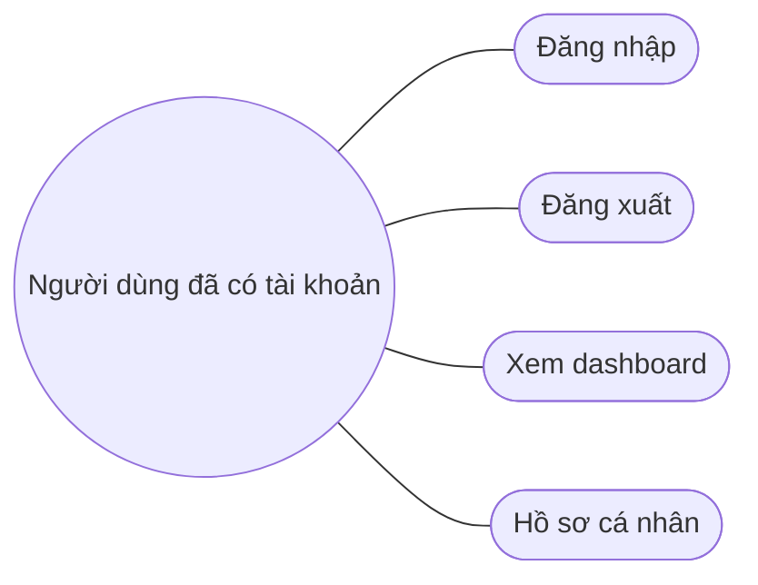
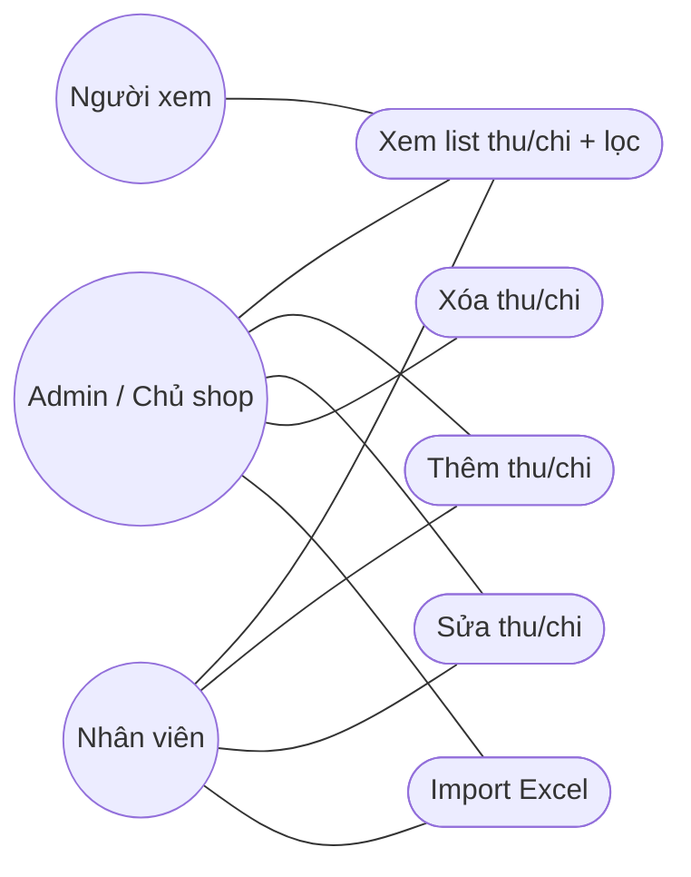
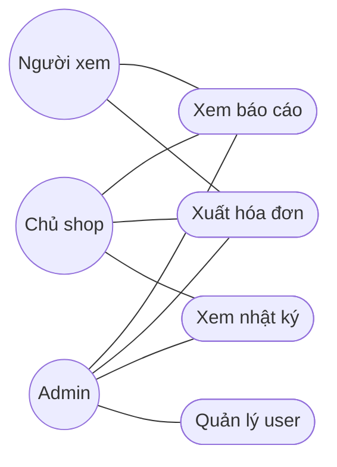

# Use case — Finance Manager

Hệ thống: web thu – chi shop handmade (prototype mock, chưa backend).

## Actor

| Actor | Role |
|---|---|
| Quản trị | `ADMIN` |
| Chủ shop | `SHOP_OWNER` |
| Nhân viên | `EMPLOYEE` |
| Người xem | `VIEWER` |

## Sơ đồ tổng

```mermaid
flowchart TB
  Admin((Quản trị))
  Owner((Chủ shop))
  Staff((Nhân viên))
  Viewer((Người xem))

  UC01([UC01 Đăng nhập])
  UC02([UC02 Đăng xuất])
  UC03([UC03 Xem dashboard])
  UC04([UC04 Xem khoản thu])
  UC05([UC05 Thêm khoản thu])
  UC06([UC06 Sửa khoản thu])
  UC07([UC07 Xóa khoản thu])
  UC08([UC08 Xem khoản chi])
  UC09([UC09 Thêm khoản chi])
  UC10([UC10 Sửa khoản chi])
  UC11([UC11 Xóa khoản chi])
  UC12([UC12 Import Excel])
  UC13([UC13 Xem báo cáo])
  UC14([UC14 Xuất hóa đơn])
  UC15([UC15 Xem nhật ký])
  UC16([UC16 Quản lý người dùng])
  UC17([UC17 Hồ sơ cá nhân])

  Admin --- UC01 & UC02 & UC03 & UC04 & UC05 & UC06 & UC07
  Admin --- UC08 & UC09 & UC10 & UC11 & UC12 & UC13 & UC14 & UC15 & UC16 & UC17

  Owner --- UC01 & UC02 & UC03 & UC04 & UC05 & UC06 & UC07
  Owner --- UC08 & UC09 & UC10 & UC11 & UC12 & UC13 & UC14 & UC15 & UC17

  Staff --- UC01 & UC02 & UC03 & UC04 & UC05 & UC06
  Staff --- UC08 & UC09 & UC10 & UC12 & UC17

  Viewer --- UC01 & UC02 & UC03 & UC04 & UC08 & UC13 & UC14 & UC17
```

Nhân viên **UC06 / UC10**: chỉ bản ghi `createdBy` = chính mình. Không **UC07 / UC11**.

## Sơ đồ theo cụm

### Auth và tổng quan

### Thu – chi

### Báo cáo, nhật ký, user

## Mô tả ngắn từng use case

| ID | Tên | Actor | Mô tả |
|---|---|---|---|
| UC01 | Đăng nhập | Tất cả | Email + mật khẩu mock. Sai → lỗi. Đúng → dashboard. |
| UC02 | Đăng xuất | Tất cả | Xóa session → login. |
| UC03 | Xem dashboard | Tất cả | KPI, biểu đồ, giao dịch gần đây theo 1 loại tiền. |
| UC04 | Xem khoản thu | Tất cả | List + lọc. Viewer không cột thao tác. |
| UC05 | Thêm khoản thu | Admin, Owner, Employee | Form; nguồn mặc định Nhập tay. |
| UC06 | Sửa khoản thu | Admin, Owner; Employee (của mình) | Form; lưu vẫn là Nhập tay. |
| UC07 | Xóa khoản thu | Admin, Owner | Confirm modal, xóa mềm (mock). |
| UC08 | Xem khoản chi | Tất cả | Như thu + người nhận. |
| UC09 | Thêm khoản chi | Admin, Owner, Employee | Form; nguồn Nhập tay. |
| UC10 | Sửa khoản chi | Admin, Owner; Employee (của mình) | Form. |
| UC11 | Xóa khoản chi | Admin, Owner | Confirm modal. |
| UC12 | Import Excel | Admin, Owner, Employee | Chọn thu/chi, chọn file, mock import. |
| UC13 | Xem báo cáo | Admin, Owner, Viewer | Tab + lọc tiền tệ/ngày. Employee không vào (403). |
| UC14 | Xuất hóa đơn | Admin, Owner, Viewer | In mock theo bộ lọc báo cáo. |
| UC15 | Xem nhật ký | Admin, Owner | Bảng audit mock. |
| UC16 | Quản lý người dùng | Admin | Thêm (popup + mật khẩu), role, bật/tắt. |
| UC17 | Hồ sơ cá nhân | Tất cả | Xem; sửa tên/avatar mock. |

Chưa đăng nhập mà vào trang nội bộ → **UC01**. Có login nhưng sai quyền → trang **403**.
